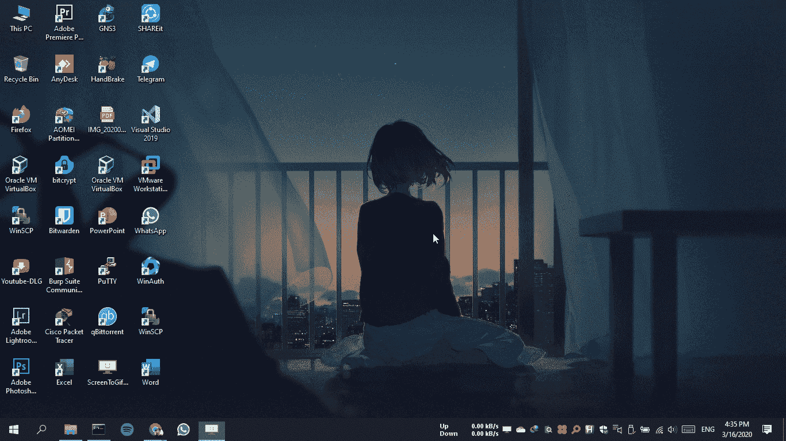

# InstaSave:从 Instagram 下载图片、视频和个人资料图片的 Python 脚本

> 原文：<https://kalilinuxtutorials.com/instasave/>

**InstaSave** 是一个 python 脚本，可以从 Instagram 下载图片、视频&个人资料图片，无需任何 API 访问。

**也读作——[Pypykatz:Mimikatz 在纯 Python 中的实现](https://kalilinuxtutorials.com/pypykatz/)**

**特性**

*   下载 Instagram 照片
*   下载 Instagram 视频
*   下载 Instagram 个人资料图片

**Git 安装**

**#克隆回购**
$ git 克隆 https://github.com/sameera-madushan/InstaSave.git

**#将工作目录改为 insta save**
$ CD insta save

**#安装需求**
$ pip 3 install-r requirements . txt

**用途**

**python 实例保存. py**

**敬请关注**

如果您正在下载受版权保护的内容，您应该尊重作者的权利，并在获得作者适当提及和授权的情况下，将内容用于个人目的或非商业需求。

[**Download**](https://github.com/sameera-madushan/InstaSave)