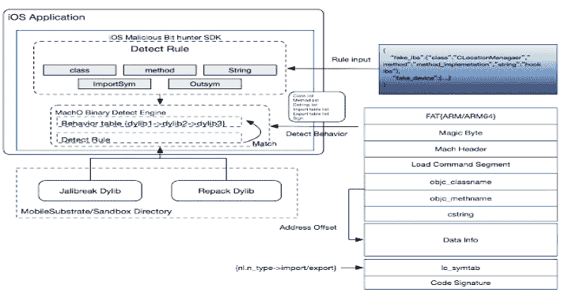

# iOS 恶意位猎人:一个用于 iOS 应用程序的恶意插件检测引擎

> 原文：<https://kalilinuxtutorials.com/ios-malicious-bit-hunter/>

**iOS 恶意位猎人**是一款针对 iOS 应用的恶意插件检测引擎。它可以基于运行时分析注入的 dylib 动态库的 macho 文件头，可以通过接口输入特征进行行为分析，确定动态库特征的行为。该程序不依赖于越狱环境，可以在 AppStore 上使用。

**有什么新功能**

这是一种准确识别 iOS 恶意代码行为的新方法。基于 App 中基于 Mach-O 格式分析内存中运行的恶意代码的方法，可以进行灵活的行为识别进行分析和持续跟踪。这是一种非常精准的反插件防御方法，包括行为、变量、高度混淆的代码(包括 ollvm)，在我们的防御过程中取得了非常好的效果。

**如何使用**

*   使用 XCode 打开。xcodeproj 文件或创建新的静态库项目。
*   构建阶段->编译源代码，添加所有*。c / *。mm 文件。
*   command + B 构建。

IOs-恶意-bithunter 只有一个 API:sec info * Security _ core foundation(void)；

调用示例:

**info =(sec info *)malloc(sizeof(sec info))；
info->scan _ result =(unsigned char *)malloc(1024*1024)；memset(info- > scan_result，0，1024*1024)；
if(info = = NULL)
{
goto RETURN；
}
info->is _ plugs can = security _ scan engine((unsigned char *)info->scan _ result)；**

**逻辑原理**

该工具提供了一个 API 接口，用于获取外部匹配规则。它会在运行时分析越狱和重新打包动态库的行为，主要是通过静态分析 MachO 文件格式，通过 Load 命令和不同的段获取导入表、导出表、类名、函数名、字符串等信息，并在运行时通过内存映射判断动态库是否已经加载到内存中。

**检测演示结果**

我们用我们的 SDK 分析了上万个越狱动态库。这些资源来自一些公共越狱插件。以下是我们目前的测试结果:

文件名，规则

ALS.dylib，FAKEDEV_H

-伊甸园字幕组=-翻译

法基德夫·卡拉希斯特·迪利布

-伊甸园字幕组=-翻译

Lynx.dylib 假证件

nzt.dylib 但是 fn 微软雅黑 nzt.dylib，但是 fn 微软雅黑 but

SystemInfo.dylib，FAKEDEV_H

YOY.dylib，FAKEDEV_H

fakephonelib.dylib，FAKEDEV_H

法利德(法利德)法利德(fakid.dylib)

狄伦，你好吗

-伊甸园字幕组=-翻译

1 个羽毛，dylib，假书

ATTweak.dylib，假证件

BTC-跳板

Callofdutygarena.dylib，FAKETOUCH

Cercube.dylib，FAKETOUCH

EASimulateTower.dylib，FAKETOUCH

EPEventTweak.dylib，FAKETOUCH

EvilHunterTycoon.dylib，FAKETOUCH

FlyBirdRemoteControl.dylib，FAKETOUCH

GamePlayerUI.dylib，FAKETOUCH

HAWK.dylib，FAKETOUCH

honkaiimpacttw . dylib，假证件

HookedInc.dylib，faketouch 公司

IdleFitnessGymTycoon.dylib，FAKETOUCH

-伊甸园字幕组=-翻译

-伊甸园字幕组=-翻译

P4UTweak.dylib，假证件

PUBGMOBILEFREEiOSGodsCom.dylib，FAKETOUCH

假神匠 dylib 假神匠

SimulateTouch.dylib，FAKETOUCH

TSEventTweak.dylib，FAKETOUCH

TSTweak.dylib，假书

WildRift.dylib，FAKETOUCH

bitcoinminer.dylib，FAKETOUCH

角落 dylib faketoch

dls2019.dylib，FAKETOUCH

dq2.dylib，FAKETOUCH

杜根公司

2.dylib，FAKETOUCH

freefire.dylib，FAKETOUCH

gameisbugged.dylib，FAKETOUCH

hid 跳板. dylib，FAKETOUCH

MYFF dylib 假证件

raidthedungeon.dylib，FAKETOUCH

royaldice.dylib，FAKETOUCH

拉希萝，迪莉布，法蒂托

tetweak.dylib .假证件

tkasmtouch.dylib，FAKETOUCH

1.dylib，假 _ 磅

AliDt.dylib，FAKE_LBS

CyDown.dylib，FAKE_LBS

杜杜，迪 lib，假磅

GpsHookLibrary.dylib，FAKE_LBS

Lamo.dylib，假 _ 磅

LamoClient.dylib，FAKE_LBS

其他位置. dylib，fake _ lbs

WeChatHookPro.dylib，假 _ 磅

abcd.dylib，FAKE_LBS

appstoreplusUI.dylib，FAKE_LBS

eassimulatetower . client . dylib，FAKE_LBS

kfc.dylib，假 _LBS

lk.dylib，假 _ 磅

m.dylib，假 _ 磅

mmm.dylib，假 _ 磅

pbyy.dylib，假 _ 磅

phonetweak.dylib，FAKE_LBS

tou111.dylib，FAKE_LBS

txytweak.dylib，FAKE_LBS

小七. dylib，假 _LBS

xin.dylib，FAKE_LBS

佐罗. dylib，假 _LBS

zzzzLiberty.dylib，FAKE_LBS

[**Download**](https://github.com/alipay/ios-malicious-bithunter)