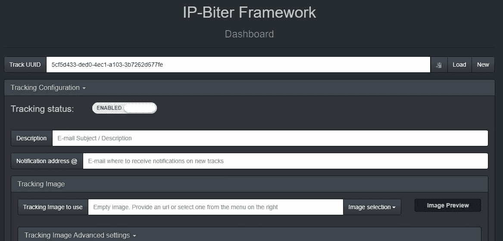
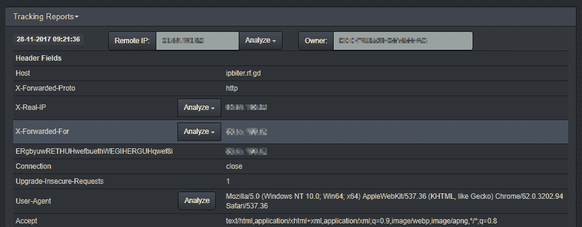

# IP-Biter:黑客友好的电子邮件跟踪框架

> 原文：<https://kalilinuxtutorials.com/ip-biter-hacker-e-mail-tracking/>

IP-Biter 是一个开源、易于部署的跟踪框架，可生成高度可配置的独特跟踪图像和链接，嵌入到电子邮件、网站或聊天系统中，并在一个黑客友好的仪表板中可视化显示图像或打开链接的被跟踪用户的详细报告。



## **IP-Biter 特性**

*   非常高的可配置跟踪图像生成
*   跟踪链接生成
*   跟踪是隐藏的，从目标的角度看是不可识别的
*   集成仪表板
*   自动跟踪预防
*   可以随时停止和开始跟踪
*   可以隐藏仪表板，并用密码保护其访问
*   仪表板中的实时跟踪报告
*   跟踪报告实时发送到可配置的邮件地址
*   不同的 IP 分析服务
*   用户代理分析服务
*   集成 URL 缩短服务
*   AllInOne PHP 文件
*   不需要数据库
*   开放源码

**也读 [URH:万能无线电黑客像老板一样调查无线协议](https://kalilinuxtutorials.com/urh-universal-radio-hacker/)**

试试看！



## **入门**

#### **部署 IP-Biter**

0.  将 ipb.php 复制到您的 PHP 服务器中，并有选择地创建一个. htaccess 文件，这将在下一篇安全说明中介绍
    *   一些可配置的参数在 ipb.php 文件的第一个未注释的 PHP 行中可用，由注释“START CONFIGURATION SECTION”标识

#### **进入仪表盘**

1.  通过 ipb.php 访问仪表板？op=$dashboardPage(如果$dashboardPage== "，则通过 ipb.php)
    *   If $dashboardPageSecret！= "然后会出现一个登录页面，询问 dashboardPageSecret 值

#### **创建新的配置**

2.  打开不带参数的仪表板时，会创建一个新配置
    *   单击“新建”按钮可以生成另一个空的新配置
3.  如果需要，配置跟踪图像和高级设置
    *   可以将原始图像 url 留空。在这种情况下，将使用空图像。
4.  如果需要，添加跟踪链接
    *   可以将原始链接留空。在这种情况下，链接将生成一个 404 页面。
5.  **保存配置**
6.  分发生成的图像或链接以开始跟踪
    *   你可以点击复制按钮，然后粘贴到一个 html 格式的电子邮件编辑器中，比如 gmail
    *   注意:如果您尝试打开生成的图像或链接，但在同一浏览器中打开并加载了仪表板页面，您的请求将不会被跟踪(防止自动跟踪功能)

#### **加载现有配置**

7.  当使用参数“uuid”打开仪表板时，会加载相关的配置
    *   另一种配置可以通过粘贴仪表板相关字段中的“跟踪 UUID”并单击“加载”按钮来加载
8.  这些报告将自动显示在控制面板的“跟踪报告”部分

## **安全提示**

*   在配置部分更改文件夹名称和仪表板页面，以提高安全性
*   将下列行添加到。htaccess 文件，以拒绝对“配置”和“报告”文件夹的访问:

```
DirectoryIndex ipb.php
<IfModule mod_rewrite.c>
    RewriteEngine On
    RewriteRule ^(configs/|reports/) - [F]
</IfModule>
```

[](https://github.com/damianofalcioni/IP-Biter)