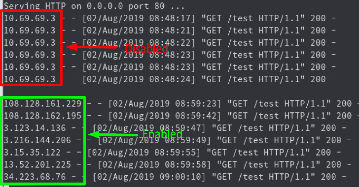
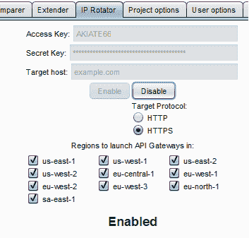
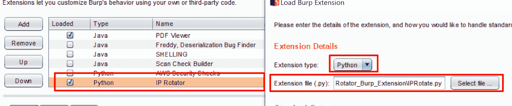

# IPRotate:对 Burp Suite 的扩展，它使用 AWS API Gateway 在每次请求时轮换您的 IP

> 原文：<https://kalilinuxtutorials.com/iprotate-burp-suite-aws-api-gateway/>

IPRotate 是一个用于 Burp Suite 的工具，它使用 AWS API Gateway 根据每个请求更改您的 IP。这个扩展允许您轻松地跨多个地区部署 API 网关。

然后，目标主机的所有 Burp 套件流量都通过 API 网关端点进行路由，这导致每个请求的 IP 都不同。(有回收 IP 的机会，但这种机会很低，你使用的地区越多，机会就越少。)

这有助于绕过不同类型的 IP 阻止，如基于 IP 阻止的暴力保护、基于 IP 的 API 速率限制或基于 IP 的 WAF 阻止等。

**也可阅读-[apple pie:用 WHVP&Bochs](https://kalilinuxtutorials.com/applepie-hypervisor-fuzzing-whvp-bochs/)T3 构建的 Fuzzing 管理程序**

**用途**

*   在 Burp 套件中设置 Jython
*   为 Python 2
    `**pip install boto3**`安装 boto3 模块
*   确保您有一组 AWS 密钥，这些密钥可以完全访问 API 网关服务。这可以通过 AWS 的免费层获得。
*   将凭据插入字段。
*   插入您希望定位的目标域。
*   如果域托管在 HTTPS，请选择 HTTPS。
*   选择您想要使用的所有片段。(使用越多，IP 池就越大)
*   点击“启用”。
*   完成后，确保单击 disable 删除所有已启动的资源。

如果您想检查已经启动的资源和端点，或者任何潜在的错误，您可以查看 Burp 中的输出控制台。

**打嗝 UI**

**设置**

确保安装了 Jython，并通过 Burp 扩展选项添加 IPRotate.py。

[**Download**](https://github.com/RhinoSecurityLabs/IPRotate_Burp_Extension)