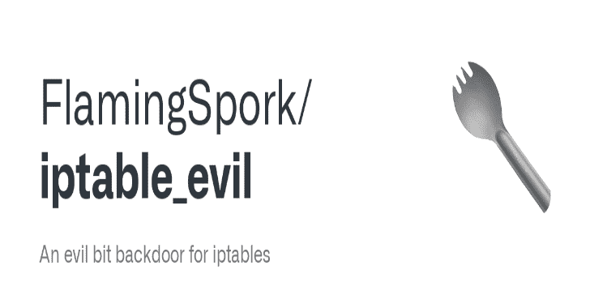
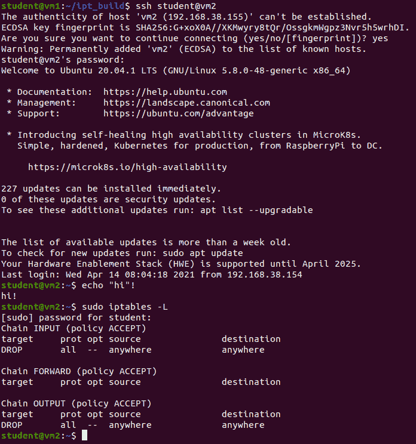
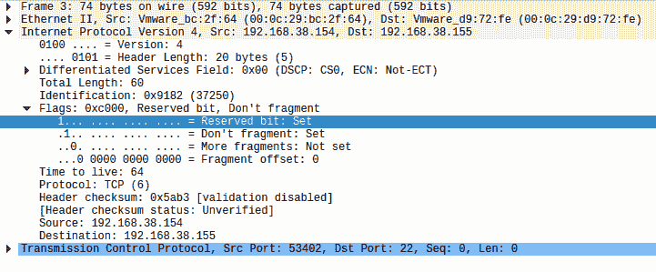

# iptable _ Evil:Iptables 的邪恶后门

> 原文：<https://kalilinuxtutorials.com/iptable/>

`**Iptable_Evil**`是`**iptables**`的一个非常特殊的后门，允许所有设置了邪恶位的数据包，不管防火墙规则如何。

最初的实现在`**iptable_evil.c**`中，它向`**iptables**`添加了一个表，并需要修改一个内核头来为它插入一个点。第二个实现是修改版的`**ip_tables**`核心模块及其从属模块，以允许所有邪恶的数据包。

我已经在 Linux 内核版本 5.8.0-48 上测试过了，但是这应该适用于几乎所有完整实现 iptables 的内核版本。

**邪位的解释**

2003 年 4 月 1 日发布的 RFC3514 将 IP 片段偏移量字段中以前未使用的高阶位定义为安全标志。对于 RFC 兼容系统，该位的`**1**`表示恶意事件，将导致数据包被阻塞。

默认情况下，此位是关闭的，但是如果您正在组装整个 IP 包(就像一些黑客工具所做的那样)，或者在使用此补丁的 Linux 内核中(在此处的存储库中镜像)，则可以在您的软件中打开此位。

**后门是怎么运作的？**

当一个包被 Linux 内核接收时，它被`**iptables**`处理，或者被发送到用户空间，或者被拒绝，或者根据配置的规则被修改。

具体来说，每个`**iptables**`表使用`**ip_tables.c**`中的函数`**ipt_do_table**`来决定是否接受给定的数据包。我已经修改过了，可以自动接受任何设置了 evil 位的数据包，并跳过所有进一步的处理。

我还试图添加另一个表(`**iptable_evil.c**`)，它将接受所有邪恶的数据包，并将其他数据包交给标准表进行处理，但是我从来没有想出如何将数据包传递到下一个表，并认为`**ipt_do_table**`后门足以作为概念证明。

**你为什么要这样做？**

我需要为我的一门课做一个相当大的计算安全项目，这似乎是一个很酷的主意。这可能比他预期的要多，但是\_(ツ)_/。

**打造**

**树内构建**

`**evil**`表需要修改内核头，所以安装它需要运行通过完整树构建产生的内核。

*   将`**replac**e-existing`的内容复制到您的内核源代码树，覆盖现有文件。
*   将`**iptable_evil.c**`复制到`**linux-X.Y.Z/net/ipv4/netfilter**`
*   (可选)将`**ip_tables.c**`复制到`**linux-X.Y.Z/net/ipv4/netfilter**`
*   根据发行版的进程编译内核(应该会生成一个包)
*   安装软件包文件
*   重启进入你的新内核
*   `**iptables -t filter -L**`
*   `**iptables -t evil -L**`(这将产生混乱的输出，但它将加载模块)

**树外构建**

这要容易得多，也快得多，但是不支持`**evil**`表，并且将内核标记为“被污染”。它*应该*可以将由此产生的`**ko**`文件复制到另一台具有完全相同内核版本的计算机上，但我还没有测试过。

*   运行`**make**`
*   **T2`rmmod iptable_*`**
*   **T2`rmmod ip_tables`**
*   **T2`insmod ip_tables.ko`**
*   **T2`insmod iptable_filter.ko`**

**测试/演示**

为了测试这一点，您要么需要用这个补丁重新构建整个内核，要么使用 Scapy 之类的工具创建自己的包。我选择了第一个选项，因为我已经为`**evil**`表构建了内核。

在第一个截图中，我已经在 iptables 中阻止了该虚拟机的所有流量，但是我仍然能够通过 SSH 连接，因为我的数据包设置了 evil 位，如第二个截图所示。

后门和非后门 SSH 连接的数据包捕获在本报告的`**docs/**`文件夹中，供您查阅。

**内核版本**

*   5 . 8 . 0-48-通用(Ubuntu 20.04)

[**Download**](https://github.com/FlamingSpork/iptable_evil)