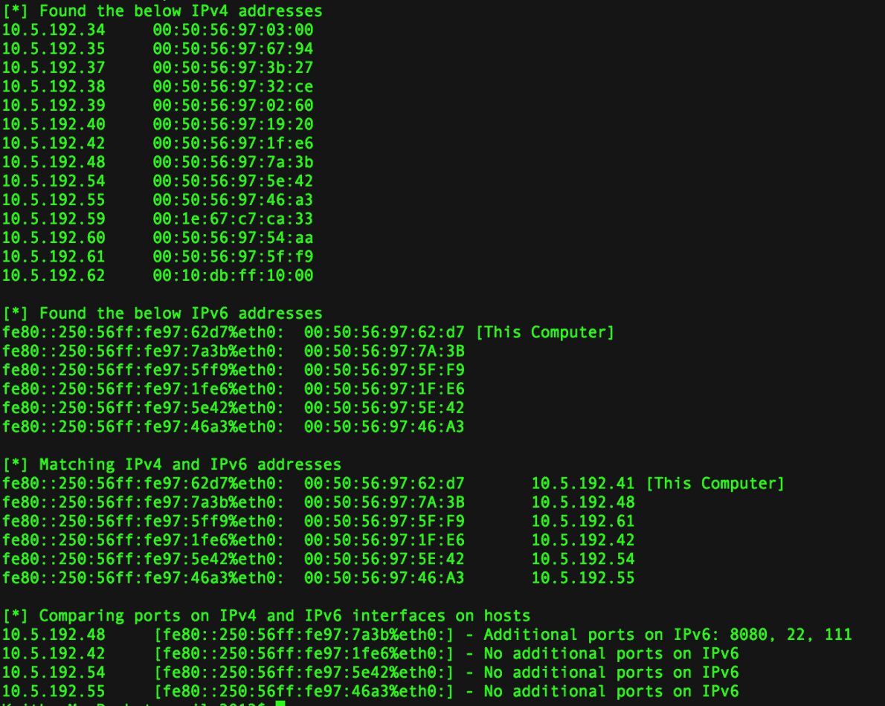

# IP v4 Bypass–使用 IPv6 绕过安全性

> 原文：<https://kalilinuxtutorials.com/ipv4bypass-ipv6-security/>

IPv4Bypass 使用 IPv6 绕过安全性。

## **依赖性**

*   python2.7
*   nmap
*   [python-nmap](https://pypi.org/project/python-nmap/)
*   [术语颜色](https://pypi.org/project/termcolor/)

##### **如何运行工具的示例**

```
$ python bypass.py -i eth0 -r 10.5.192.0/24  

$ python bypass.py  -h
Usage: bypass.py [options]

Options:
  -h, --help      show this help message and exit
  -i INTERFACENO  Network interface (e.g. eth0)
  -r IPRANGE      Local network IP range (e.g. 192.168.0.1/24)
```

**也读 [后知后觉——分析网页神器的工具 Chrome 浏览器&基于 Chrome 的应用](https://kalilinuxtutorials.com/hindsight-chrome-chromium-applications/)**

## **IPv4Bypass 工具截图**



[](https://github.com/milo2012/ipv4Bypass)