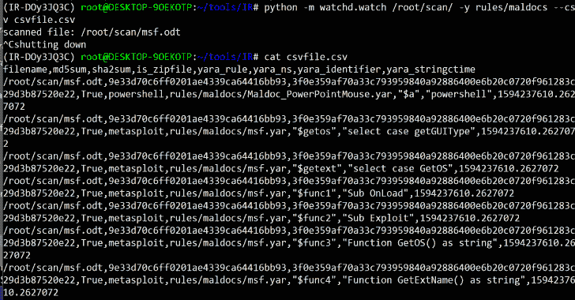

# IRFuzz:带有 Yara 规则的简单扫描器

> 原文：<https://kalilinuxtutorials.com/irfuzz/>

IRFuzz 是一个简单的扫描仪，带有 yara 规则，可用于文档存档或任何文件。

**安装**

**1。先决条件**

**Linux 还是 OS X**

*   [Yara](https://github.com/VirusTotal/yara/) :使用最新发布的源代码，编译安装即可(或者通过 pip install yara-python 安装)
*   [Yara 规则](https://github.com/Yara-Rules/rules)–您可以从这里下载 Yara 规则或导入您自己的自定义规则集。
*   Python 依赖性

依赖关系由`pipenv`管理。要开始使用以下命令安装依赖项并激活虚拟环境:

**$ pipenv 安装
$ pipenv 外壳**

**运行 IRFuzz–Watchd**

**运行 IRFuzz**

`**$ python -m watchd.watch ~/tools/IR/ -y rules/maldocs --csv csvfile.csv**`

**支持的功能**

*   用 inotify 扫描新文件
*   不支持 inotify 时的轮询
*   支持自定义扩展
*   删除模式将删除匹配的文件
*   递归目录扫描
*   列表匹配 Yara 函数和 yarastrings 和 ctime
*   Filebeat 的 CSV 结果

**自定义扩展**

`$ python -m watchd.watch ~/tools/IR/ -y rules/maldocs --csv csvfile.csv --extensions .zip,.rar`

**警报匹配 Yara 规则**

从[https://irfuzz.com/tokens](https://irfuzz.com/tokens)生成令牌

`$ python -m watchd.watch ~/tools/IR/ -y rules/maldocs --csv csvfile.csv --extensions .php --token tokenhere`

配置从网站到电报或电子邮件的提醒。

**删除匹配的文件**

`**$ python -m watchd.watch ~/tools/IR/ -y rules/maldocs --csv csvfile.csv --delete**`

**轮询(不支持 Inotify)**

`**$ python -m watchd.watch ~/tools/IR/ -y rules/maldocs --csv csvfile.csv --polling**`

添加–poll 选项以强制使用轮询机制来检测数据目录中的更改。轮询比操作系统中检测更改的底层机制慢，但对于某些文件系统(如 SMB 装载)来说是必要的。

*   **未提及扩展名时的默认扩展名**
    *   **Microsoft Office Word 支持的文件格式**
        *   。医生。docm。docx。docx。点。dotm。dotx。国防运输局(Office of Defense Transportation)
    *   **Microsoft Office Excel 支持的文件格式**
        *   。混乱办。xla。xlam。xls。xls。xlsb。xlsm。xlsx。xlsx。xlt。xltm。xltx。xlw
    *   **Microsoft Office PowerPoint 支持的文件格式**
        *   。锅碗瓢盆。他们可以的。波托克斯。-走吧。-是啊。pps(应用程式码)。ppsm(消歧义)。ppsx 的。ppt .pptm 的。pptx 的。pptx 的。pptx(消歧义)
    *   **zipdump.py**
        *   IRFuzz 使用 [zipdump.py](https://github.com/DidierStevens/DidierStevensSuite/blob/master/zipdump.py) 进行 zip 文件分析。

[**Download**](https://github.com/oxiqa/IRFuzz)