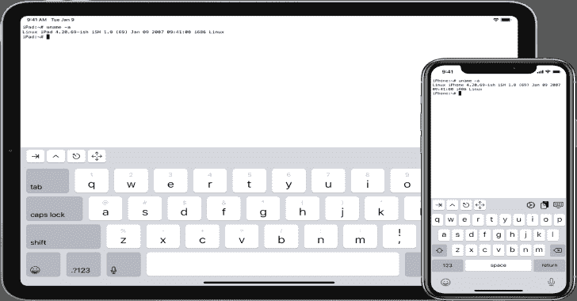

# ISH:iOS 版 Linux Shell

> 原文：<https://kalilinuxtutorials.com/ish/>

**ISH** 是一个在 iOS 上运行 Linux shell 的项目，使用用户模式 x86 仿真和 syscall 翻译。

对于项目的当前状态，请检查 issues 选项卡和提交日志。

*   [应用商店页面](https://apps.apple.com/us/app/ish-shell/id1436902243)
*   试飞测试版
*   [不和服务器](https://discord.gg/HFAXj44)
*   [包含帮助和教程的 Wiki】](https://github.com/ish-app/ish/wiki)
*   [中文自述](https://github.com/ish-app/ish/blob/master/README_ZH.md)(可能已经过时，如果是这样就发 PRs)

**黑客攻击**

这个项目有一个 git 子模块，一定要用**T0 克隆或者克隆后运行`git submodule update --init`T3。**

您将需要这些东西来构建项目:

*   python3
*   忍者
*   介子(`**pip install meson**`)
*   铿锵和 LLD(在 mac 上，`**brew install llvm**`，在 linux 上， **`sudo apt install clang lld`** 或`**sudo pacman -S clang lld**`或其他什么)
*   sqlite3(这很常见，可能已经安装在 linux 上了，而且肯定已经安装在 mac 上了。如果没有，做类似 **`sudo apt install libsqlite3-dev` )** 的事情
*   libarchive **( `brew install libarchive`，`sudo port install libarchive`，`sudo apt install libarchive-dev` )** TODO:捆绑这个依赖项

**iOS 版本**

在 Xcode 中打开项目，打开 iSH.xcconfig，把`ROOT_BUNDLE_IDENTIFIER`改成唯一的。然后单击运行。有些脚本可以自动完成所有其他工作。如果你遇到任何问题，提出问题，我会尽力帮助你。

**构建用于测试的命令行工具**

要设置您的环境，cd 到项目并运行`**meson build**`在`**build**`中创建一个构建目录。然后 cd 到构建目录并运行`**ninja**`。

要设置一个独立的 Alpine linux 文件系统，从 [Alpine 网站](https://alpinelinux.org/downloads/)下载用于 i386 的 Alpine minirootfs tarball 并运行`**./tools/fakefsify**`，将 minirootfs tarball 作为第一个参数，将输出目录的名称作为第二个参数。然后你可以用`**./ish -f alpine /bin/login -f root**`运行 Alpine 文件系统内部的东西，假设输出目录叫做`alpine`。如果`**tools/fakefsify**`在您的构建目录中不存在，那可能是因为它在您的系统中找不到 libarchive(参见上面的安装方法)。)

你可以用`**tools/ptraceomatic**`代替`ish`在一个真实的进程中单步运行程序，并比较每一步的寄存器。我用它来调试。需要 64 位 Linux 4.11 或更高版本。

**测井**

iSH 有几个日志通道，可以在构建时启用。默认情况下，它们都是禁用的。要启用它们:

*   在 Xcode 中:将 iSH.xcconfig 中的`ISH_LOG`设置为以空格分隔的日志通道列表。
*   用介子(命令行工具进行测试):运行 **`meson configure -Dlog="<space-separated list of log channels>`。**

**可用频道:**

*   `strace`:最有用的通道，记录几乎每个系统调用的参数和返回值。
*   `instr`:记录仿真器执行的每一条指令。这大大降低了速度。
*   `verbose`:调试不适合另一个类别的日志。
*   Grep for `DEFAULT_CHANNEL`查看更新列表后是否添加了更多日志通道。

**关于 JIT 的说明**

作为 iSH 的一部分，我写的最有趣的东西可能是 JIT。它实际上并不是 JIT，因为它并不针对机器码。取而代之的是，它生成一个指向称为小工具的函数的指针数组，每个小工具都以对下一个函数的 tailcall 结束；比如一些 Forth 解释器使用的线程代码技术。与纯模拟相比，其结果是速度提高了大约 3-5 倍。

不幸的是，我决定用汇编语言编写几乎所有的小工具。就性能而言，这可能是一个好的决定(尽管我永远无法确定)，但就可读性、可维护性和我的理智而言，这是一个糟糕的决定。我不得不忍受的来自编译器/汇编器/链接器的废话太多了。这就像有一个恶魔在那里，确保我的代码足够变形，如果没有，就编造愚蠢的理由为什么它不应该编译。为了在编写这段代码时保持理智，我不得不忽略代码结构和命名方面的最佳实践。你会发现宏和变量的描述性名称为`ss`、`s`和`a`。令人难以置信的汇编宏嵌套。最重要的是，几乎没有评论。

因此，警告:长期接触这些代码可能会导致丧失理智，做关于 GAS 宏和链接器错误的噩梦，或者任何其他使人虚弱的副作用。加利福尼亚州已知该代码会导致癌症、出生缺陷和生殖伤害。

[**Download**](https://github.com/ish-app/ish)