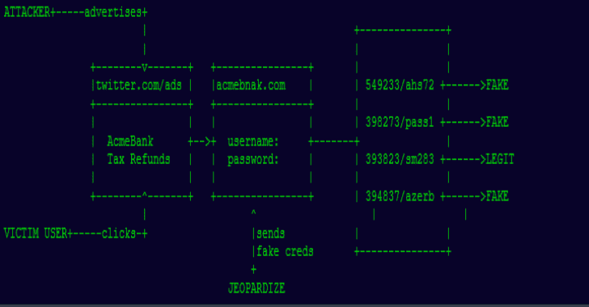
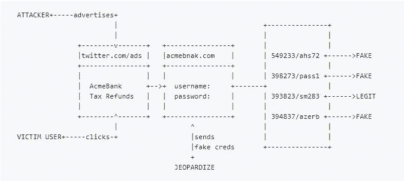

# 危及:一个低成本的威胁情报和响应工具

> 原文：<https://kalilinuxtutorials.com/jeopardize-a-low-cost-threat-intelligenceresponse-tool/>

[](https://1.bp.blogspot.com/-wKZCYncjJAQ/XnEmkypR6XI/AAAAAAAAFho/V-3sR5x56egHLRwYnYD7RGFpRqLhbi_2wCLcBGAsYHQ/s1600/1%25281%2529.png)

**危及**是一个低(零)成本的威胁情报&响应工具，用于防御网络钓鱼域名。

开发危害工具的目的是以尽可能低的成本提供针对网络钓鱼域的基本威胁情报和响应能力。

它检测注册的钓鱼域名候选(域名仿冒、同形异义词等)。)，对其进行分析并为其分配风险分值。

之后，它会向这些钓鱼网站上的登录表单发送看起来有效的凭证。

***为什么*** ***？***

想象一下这个场景:攻击者注册了一个钓鱼域名 acmebnak.com(acme bank 的域名仿冒)，复制了 acmebank.com 的原始登录表单，并通过赞助商的推文宣传这个域名。

该广告和域名可能会在第二天被标记为网络钓鱼，但攻击者已经从用户那里获取了凭据。

在此之后将其删除对受影响的用户没有帮助。harvest 为这个问题提供了一个主动的解决方案。

它利用看起来有效的凭证来迷惑攻击者，从而危及网络钓鱼表单。这将为组织赢得一些时间来采取预防措施。



它是如何工作的？

*   **生成组合**

危及生成给定域的不同单词组合。例如，如果给定的域是 acmebank.com，组合将是 acmebnak、acmeban、amcebank 等。

如果你的域名有一个短的或通用的名字(例如:aa.com)，这个工具不会帮助你。它最适用于唯一的名称。

*   **检测注册域名**

harvest 有两种不同的检测方法来识别注册域名:

**Brute:**vergene 组合生成的单词(acmebnak，amcebank 等。)与所有顶级域名(com、net、xyz、live 等。)以及 whois 是否对所有这些进行查询。
优点:不需要任何 API 密匙，完全免费。缺点 *:* 需要很多时间。

**daily**使用给定的 Zonefiles.io API 密钥，haresse 抓取过去 24 小时内注册的所有域，并在其中搜索生成的单词(acmebnak、amcebank 等。).
优点 *:* 速度快，可以作为日常威胁情报轻松使用。
缺点 *:* 需要 Zonefiles.io API 密钥(专业版)

*   **分析域名**

检测到的域已经可疑。但是有一些因素会增加成为网络钓鱼域名的可能性。此外，我们需要分析该域上是否安装了任何网络钓鱼页面，以便我们可以对其采取措施。危及检查注册域的以下元素:

*   **IP:** 如果任何 IP 地址被分配给域。如果是，网络钓鱼风险分值将会增加。
*   **Web 服务器:**如果该域上安装了 Web 服务器。如果是，网络钓鱼风险分值将会增加。
*   **名称服务器:**检查名称服务器。如果它使用 Cloudflare，网络钓鱼风险得分将会增加(无意冒犯)
*   **网站大小:**检查网站的大小。钓鱼页面通常包含不同的图片、css 和 js 文件。如果高于预定义的阈值，网络钓鱼风险分值将会增加。
*   **登录表单:**如果在网站上识别出登录表单。如果是，网络钓鱼风险分值将会增加。
*   **SSL 证书:**检查 SSL 证书的 CA。如果它是由除 Cloudflare 或 LetsEncrypt 之外的 CA 发布的，网络钓鱼风险分值将“降低”。
*   **注册日期:**查看域名的注册日期。如果时间超过一个月，网络钓鱼风险分值将会增加。
*   **Alexa 排名:**查看该域名的 Alexa 排名。如果没有列出，网络钓鱼风险分值将会增加。

*   **危害登录表单**

如果网络钓鱼得分很高，并且该网站有登录表单，则 verage 会自动使用提供的用户名/密码列表来填充该表单。

**保存结果**

它将检测到的网络钓鱼域的信息保存到 XML 文件中。例如:

```
<domain>
  <address>acmebnak.com</address>
  <name_servers>ns1.cloudflare.com ns2.cloudflare.com</name_servers>
  <mx_servers> </mx_servers>
  <date_flag>True</date_flag>
  <alexa_flag>False</alexa_flag>
  <webserver_flag>True</webserver_flag>
  <certificate_flag>False</certificate_flag>
  <form_flag>True</form_flag>
  <phishing_score>85</phishing_score>
</domain> 
```

**安装**

haresse 需要 Python3 在 macOS、Ubuntu 18.04 和基于 Debian 的 Linux 系统上运行和测试。首先，克隆回购:

**git 克隆 https://github.com/utkusen/jeopardize.git**

**进入文件夹**

**cd 危及**

**安装所需的库**

**pip 3 install-r requirements . txt**

还需要安装 selenium 的 chromedriver(填表需要。如果您不会使用它，不需要安装)

在 Ubuntu 上:运行 sudo 来安装 chromium-chrome 驱动程序

**在 Kali 上(基于 Debian):运行 pip3 安装 chromedriver-binary**

在 macOS 上:运行 brew cask 安装 chromedriver

如果你想集成 Zonefiles.io API，用文本编辑器打开 **`jeopardize.py`** ，用你自己的键替换`**ZONEFILES_API_KEY = ""**`。

**用途**

**MAC OS 用户注意:**MAC OS 似乎限制多线程作为一种安全机制。在运行该工具之前，需要运行以下命令:`e` **`xport OBJC_DISABLE_INITIALIZE_FORK_SAFETY=YES`**

您需要使用`**--**` **`domain`** 参数提供您的域名进行钓鱼检查。您还需要提供`**--type**`(蛮，每日，增量)作为注册域名检测方法。

**示例命令:** `**python3 jeopardize.py --domain facebook.com --type brute**`

**它有什么作用？:**结合 facebook (fcabook，facebkook 等)的单词组合。)和所有的顶级域名(com、net、org、XYZ ), whois 会对所有域名进行查询吗？结果将被保存到 facebook.com.xml 文件。*这不填写检测到的域名的登录表单。*

**示例命令:** `**python3 jeopardize.py --domain facebook.com --type daily**`

**它有什么作用？:**用 Zonefiles.io API 抓取过去 24 小时内注册的所有域，并在其中搜索生成的单词(fcabook、facebkook 等。)

**示例命令:** `**python3 jeopardize.py --domain facebook.com --type incremental**`

**它有什么作用？:**它获取以前生成的 XML 文件(facebook.com.xml)，抓取其中的域并更新它们的数据，还进行常规的每日扫描。

如果您想要填写检测到的网络钓鱼域的登录表单，请提供带有`**-U**`参数的用户名列表和带有`**-P**`参数的密码列表

**示例命令:** `**python3 jeopardize.py --domain facebook.com --type daily -U user.txt -P pass.txt**`

如果要激活详细模式，请在命令末尾添加`**-v**`参数。

[**Download**](https://github.com/utkusen/jeopardize)