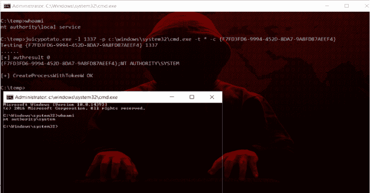
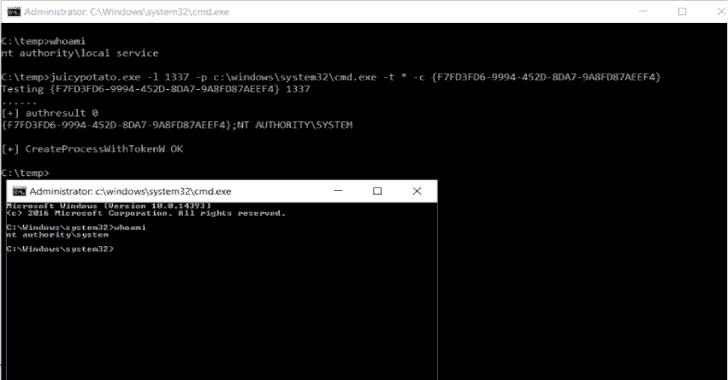

# 多汁的土豆:加了一点果汁的糖水土豆

> 原文：<https://kalilinuxtutorials.com/juicy-potato-sugared-version-rottenpotatong/>

Juicy Potato 是 [RottenPotatoNG](https://github.com/breenmachine/RottenPotatoNG) 的加糖版，有一点果汁，即**另一个本地权限提升工具，从一个 Windows 服务账户到 NT AUTHORITY\SYSTEM** 。

## **总结**

[RottenPotatoNG](https://github.com/breenmachine/RottenPotatoNG) 及其[变种](https://github.com/decoder-it/lonelypotato)利用基于 [`**BITS**`](https://msdn.microsoft.com/en-us/library/windows/desktop/bb968799(v=vs.85).aspx) [服务](https://github.com/breenmachine/RottenPotatoNG/blob/4eefb0dd89decb9763f2bf52c7a067440a9ec1f0/RottenPotatoEXE/MSFRottenPotato/MSFRottenPotato.cpp#L126)的权限提升链，在`**127.0.0.1:6666**`上拥有 MiTM 监听器，并且当您拥有`**SeImpersonate**`或`**SeAssignPrimaryToken**`权限时。在一次 Windows 构建审查中，我们发现了一个设置，其中`BITS`被故意禁用，而端口`**6666**`被占用。

我们决定武器化[rottenpotato tong](https://github.com/breenmachine/RottenPotatoNG):**向多汁的土豆**问好。

有关理论，请参见[腐烂的土豆——从服务帐户到系统的权限提升](https://foxglovesecurity.com/2016/09/26/rotten-potato-privilege-escalation-from-service-accounts-to-system/),并遵循链接和引用链。

我们发现，除了`BITS`之外，我们还可以滥用一些 COM 服务器。他们只需要:

*   可由当前用户实例化，通常是具有模拟特权的“服务用户”
*   实现`IMarshal`接口
*   以提升的用户身份运行(系统、管理员等)

经过一些测试后，我们获得并测试了几个 Windows 版本上有趣的 CLSID 的广泛列表。

## **有趣的细节**

JuicyPotato 允许您:

*   **目标 CLSID**
    *挑选任何你想要的 CLSID。[在这里](https://github.com/ohpe/juicy-potato/blob/master/CLSID/README.md)你可以找到按操作系统整理的列表。*
*   **COM 监听端口**
    *定义你喜欢的 COM 监听端口(而不是编组硬编码 6666)*
*   **COM 监听 IP 地址**
    *绑定服务器上的任意 IP*
*   **流程创建模式**
    *根据被冒名用户的权限可以选择:*
    *   `**CreateProcessWithToken**` (需要`**SeImpersonate**`)
    *   `**CreateProcessAsUser**` (需要`**SeAssignPrimaryToken**`)
    *   `**both**`
*   **进程启动**
    *如果攻击成功，启动可执行文件或脚本*
*   **流程参数**
    *自定义发起的流程参数*
*   **RPC 服务器地址**
    *对于一种隐秘的方法，你可以向外部 RPC 服务器认证*
*   **RPC 服务器端口**
    *如果您想要对外部服务器进行身份验证，并且防火墙阻止端口`135` …* 时非常有用
*   **测试模式**
    *主要用于测试目的，即测试 CLSIDs。它创建 DCOM 并打印用户的令牌。测试* 见[这里](https://github.com/ohpe/juicy-potato/blob/master/Test/README.md)

## **用法**

t:> JuicyPotato . exe
JuicyPotato v 0.1

强制参数:
-t createprocess 调用:CreateProcessWithTokenW，CreateProcessAsUser，< * > try both
-p:程序启动
-l : COM 服务器监听端口

可选参数:
-m : COM 服务器监听地址(默认 127.0.0.1)
-a:传递给程序的命令行参数

## **例子**

## **最终想法**

如果用户拥有`SeImpersonate`或`SeAssignPrimaryToken`权限，那么你就是**系统**。

几乎不可能防止所有这些 COM 服务器的滥用。你可以考虑通过`DCOMCNFG`修改这些对象的权限，但是祝你好运，这将是一个挑战。

实际的解决方案是保护敏感帐户和在`* SERVICE`帐户下运行的应用程序。停止`DCOM`肯定会阻止这种利用，但可能会对底层操作系统产生严重影响。

[**Download**](https://github.com/ohpe/juicy-potato)

**也可理解为-[Dr _ Robot:用于列举与](https://kalilinuxtutorials.com/dr_robot-enumerate-the-subdomains-associated-with-a-company/)T3 公司相关的子域名的工具**