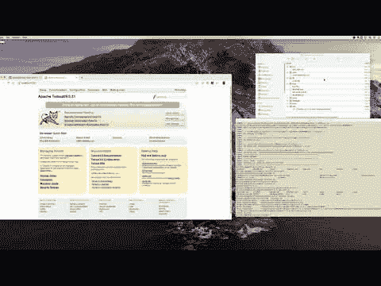

# JVMXRay:使感兴趣的 Java 安全事件对分析可见

> 原文：<https://kalilinuxtutorials.com/jvmxray/>

JVMXRay 是一种技术，用于监控对 Java 保护的系统资源(如文件、套接字等)的访问，这些资源由您的应用程序使用。它的设计强调应用程序的安全性，但在其他方面也有好处，如软件诊断、使用情况跟踪和审计。

**好处**

下面是一些更重要的好处的快速列表。

**识别受保护的资源**

跟踪与套接字、文件、流程执行等相关的不同类型的事件。当感兴趣的事件发生时，按照你的意愿处理它。目前，系统控制台(例如，System.out)、日志返回和 Java 日志记录的适配器可以与正在开发的其他适配器一起使用。

**无需更改代码**

JVMXRay 不需要对应用程序源代码做任何修改就能工作。代码通过命令行选项被拉入 JVM。解决方案是 100%的 Java 代码，因此它可以在任何地方运行。

**供应链洞察**

不需要源代码的一个额外好处是 JVMXRay 提供了对应用程序依赖性的洞察，包括第三方库(例如 Jar 文件)。事件提供了生成事件时加载类的源。

**可扩展&打开**

看不到适合你的适配器或过滤器，不知道如何编码？卷起袖子写一个。它是可扩展的。修复一个错误并提交一个请求。所有的源代码都是可用的

**使用示例部署 JVM Xray**

下面提供了一些在您的计算机上下载和编译 JVMXRay 源代码的基本信息。视频的剩余部分展示了如何让 JVMXRay 与 Tomcat 一起工作，以及如何使用 Tomcat 的示例。

**样本输出**

这项技术的输出可以以不同的方式呈现。示例日志输出看起来像什么？输出格式很灵活，下面是 JVMXRay 为您捕获的信息类型的一个示例。

**-1，1623791226603，main-1，EXIT，1bd 99 e2f 195004 a5-5c b63e 19-179 fd6 e 8882-8000，，100，，
-1，1623791226603，main-1，LINK，1bd 99 e2f 195004 a5-5c b63e 19-179 fd6 e 8882-179**

**工作原理**

Java 虚拟机为控制对受保护资源的访问提供了一个健壮的安全框架。JVMXRay 提供了 java.lang.SecurityManager 组件的一个实现，称为 NullSecurityManager。具有讽刺意味的是，NullSecurityManager 不提供策略实施，而是监视受保护资源的活动。预计其他云日志处理工具、大数据工具或云安全工具将把这些事件处理成有意义的上下文信息。

[**Download**](https://github.com/spoofzu/jvmxray)