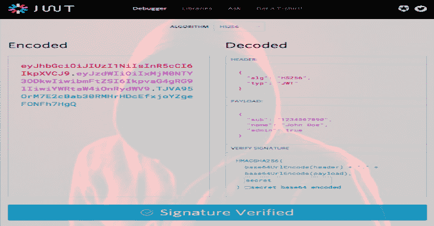

# JWT 工具:测试、调整和破解 JSON Web 令牌的工具包

> 原文：<https://kalilinuxtutorials.com/jwt-tool/>

**JWT 工具** (jwt_tool.py)是一个用于验证、伪造和破解 jwt(JSON Web token)的工具包。其功能包括:

*   检查令牌的有效性
*   RS/HS256 公钥不匹配漏洞的测试
*   alg=None 签名绕过漏洞测试
*   测试秘密/密钥/密钥文件的有效性
*   通过高速字典攻击识别弱密钥
*   伪造新的令牌报头和有效载荷值，并用密钥或通过另一种攻击方法创建新的签名

**观众**

这个工具是为 pentesters 编写的，他们需要检查正在使用的令牌的强度，以及它们对已知攻击的敏感性。

对于在项目中使用 jwt，但想在使用伪造令牌时测试稳定性和已知漏洞的开发人员来说，这可能也很有用。

**也可阅读-[ph0 neutria:恶意软件动物园构建器，直接从野外获取样本](https://kalilinuxtutorials.com/ph0neutria/)**

**要求**

该工具是使用公共库在 Python 2.x 中本地编写的。对于字典攻击选项，建议使用定制的单词列表。

作为速度参考，一台英特尔 i5 笔记本电脑在 HMAC-SHA256 签名上每秒可以测试大约 1，000，000 个密码。YMMV。

**安装**

安装只是下载 jwt_tool.py 文件(或者 git 克隆 repo)的一个例子。(如果您想将文件添加到 PATH 中并从任何地方调用它，也可以使用 chmod。)

**用途**

**$ python jwt_tool.py(文件名)**

第一个参数应该是 JWT 本身，后面跟一个文件名/文件路径(用于破解令牌，或者用作密钥文件)。

例如:

**$ python jwt _ tool . py eyj 0 exaioijkv 1 qilchbgcioijiuzi 1 nij 9 . eyjsb 2 dpb ii 6 INR py 2 fycgkifq . aqncvshlnt 9 jbftbphdbt 2g bb 1 myhiisddp 8 sqvgw/usr/share/word lists/rock you . txt**

该工具包将验证令牌并列出头部和有效载荷值。然后它会提供一个可用选项的菜单。

**注意:**目前支持使用 HS256、HS384 和 HS512 算法对令牌进行签名

输入是标准的或 url 安全的 JWT 格式，为了便于使用，生成的令牌以这两种格式输出。

**延伸阅读**

*   [JWTs-https://jwt.io/introduction/的精彩介绍](https://jwt.io/introduction/)
*   这个工具的很多灵感来自于 Tim McLean 发现的漏洞。
    [点击这里查看他关于 JWT 弱点的博客:https://auth 0 . com/blog/critical-vulnerability-in-JSON-we B- token-libraries/](https://auth0.com/blog/critical-vulnerabilities-in-json-web-token-libraries/)
*   我对使用这个工具包的介绍，以及它背后的一些历史可以在我的博客 https://www.ticarpi.com/introducing-jwt-tool/上找到
*   由 [Pentesterlab](https://www.pentesterlab.com/) 提供了一整套测试 JWT 漏洞的练习(在撰写本文时有 7 个)。如果你对 Web 应用程序测试感兴趣，我强烈推荐专业版订阅。*请注意:*如果使用正确，这个工具包将在几秒钟内解决所有的 Pentesterlab JWT 练习，但是我会**强烈**鼓励你自己完成这些练习，找出结构和弱点。毕竟都是学习的问题…
    *   [JWT(alg =无漏洞)演习](https://pentesterlab.com/exercises/jwt)
    *   [JWT_II (RS/HS256 公钥不匹配漏洞)演习](https://pentesterlab.com/exercises/jwt_ii)
    *   [JWT_III (key-id 头字段不卫生漏洞)演习](https://pentesterlab.com/exercises/jwt_iii)
    *   去 https://pentesterlab.com/exercises 寻找其他人吧！

**提示**

**在打嗝搜索中查找 jwt 的正则表达式**
*(确保勾选了“区分大小写”和“正则表达式”选项)*

*   `**[= ]ey[A-Za-z0-9_-]*\.[A-Za-z0-9._-]***`–URL 安全的 JWT 版本
*   `**[= ]ey[A-Za-z0-9_\/+-]*\.[A-Za-z0-9._\/+-]***`**–所有 JWT 版本(误报可能性较高)**

**[**Download**](https://github.com/ticarpi/jwt_tool)**