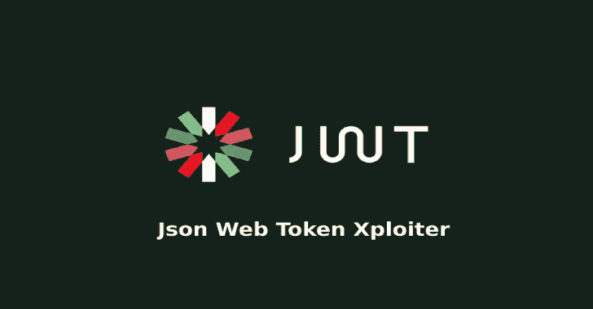

# jwtxpstool:一个测试 Json Web 令牌安全性的工具

> 原文：<https://kalilinuxtutorials.com/jwtxploiter/>

JWTXploiter】是一个测试 JSON Web 令牌安全性的工具。对照所有已知的 cv 测试 JWT；

*   篡改令牌有效负载:更改声明和子声明的值。
*   利用已知易受攻击的标头声明(kid、jku、x5u)
*   验证令牌
*   检索目标 ssl 连接的公钥，并尝试在只有一个选项的密钥混淆攻击中使用它
*   支持所有 JWAs
*   生成一个 JWK 并将其插入到令牌头中
*   还有很多很多！

### **维基**

*   看维基！维基网

### 安装

注意:除非出于开发目的，否则应该避免克隆存储库！注意:Deb 包必须被视为测试版

*   转速:

wget http://andreatedeschi . uno/jwtxploit/jwtxploit-1 . 2 . 1-1 . no arch . rpm
sudo rpm–安装 jwtxploit-1 . 2 . 1-1 . no arch . rpm

或者，如果您的计算机上安装了以前的版本

**sudo rpm–升级 jwtxploit-1 . 2 . 1-1 . no arch . rpm**

和皮普一起

**sudo pip 安装 jwtxploiter】**

对于 deb:

**wget http://andreatedeschi . uno/jwtxpsporty/jwtxpsporty _ 1 . 2 . 1-1 _ all . deb
sudo dpkg-I jwtxpsporty _ 1 . 2 . 1-1 _ all . deb**

关闭回购:

git 克隆 https://github . com/dontpanico/jwtxplorer . git
**。/install.sh**

**注意事项**。python3-pip 包是安装依赖项所必需的，请务必安装它。

[**Download**](https://github.com/DontPanicO/jwtXploiter)