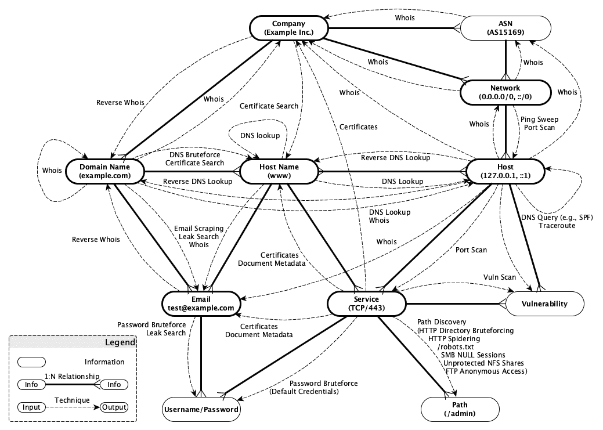

# Kali Intelligence Suite:将通过执行标准渗透测试工具，帮助快速、自主、集中和全面地收集情报

> 原文：<https://kalilinuxtutorials.com/kali-intelligence-suite/>

**Kali Intelligence Suite**(KIS)是一款针对渗透测试人员的情报收集和数据挖掘工具。它应通过以下方式自动协助快速、自主、集中和全面地收集情报:

*   执行 Kali Linux 工具(例如，dnsrecon、gobuster、hydra、nmap 等。)
*   查询公开可用的 API(例如，Censys.io、Haveibeenpwned.com、亨特. io、Securitytrails.com、DNSdumpster.com、肖丹. io 等。)
*   将收集的数据存储在中央 PostgreSQL 数据库中(请参见下一节)
*   提供一个界面来查询和分析收集的情报

在执行每个 Kali Linux 工具或查询 API 后，KIS 分析收集的信息，提取并报告感兴趣的信息，如新识别的用户凭据、主机/域、TCP/UDP 服务、HTTP 目录等。然后，提取的信息在内部存储在不同的 PostgreSql 数据库表中，这使得后续执行的 Kali Linux 工具能够连续、结构化地增强和重用收集的情报。

其他功能包括:

*   Kali Linux 工具之间的预定义依赖关系可确保相关信息(如 SNMP 默认社区字符串或默认凭据)在尝试访问相应服务之前为 KIS 所知
*   记住每个 Kali Linux 工具和 API 查询的执行状态可以确保已经执行的 OS 命令不会自动再次执行
*   Masscan、Nessus 或 Nmap 等外部扫描仪扫描结果的数据导入
*   支持基于虚拟主机的情报收集(vhost)
*   使用模块化方法，允许快速集成新的 Kali Linux 工具
*   使用可指定数量的线程并行执行 Kali Linux 命令
*   使用户能够通过 KIS 用户界面终止 Kali 命令，以防它们花费太长时间
*   使用 OSINT 访问公共 API 以增强数据

**设置和安装**

Docker.com 有 KIS 的最新版本。遵循那里的安装说明。

有关手动安装的信息可以在安装时获得。

**KIS 的数据和收集模型**

下图说明了 KIS 的数据和收集模型。因此，每个节点代表 rational 数据库中的一个表，节点之间的每条实线记录了相应的关系。虚线有向图记录了基于哪个已经收集的情报(源节点), KIS 能够收集进一步的信息(目的节点)。有向图的标签记录了 KIS 进行收集所使用的技术。

**界定项目范围**

范围是 KIS 的一个基本特性，它指定了 IP 网络、IP 地址、主机名等。，
允许 KIS 从收集数据(例如，通过 OSINT 或主动扫描)。在深入研究范围之前，理解 KIS 支持的以下集合类型很重要:

*   **被动**:被动收集不直接与目标互动，而是从 whois 等第三方来源获取信息。默认情况下，KIS 会自动执行这些集合，因此不需要确定范围。
*   **主动**:主动收藏通过主动扫描等方式直接与目标交互。因此，与被动收集相比，这些类型的收集需要目标所有者的许可，因此，KIS 不会自动执行主动收集，除非目标被明确标记为在范围内。
*   **主动** *:主动*集合其实就是被动集合。尽管如此，由于对某些第三方来源的访问受到某种程度的限制(例如，查询某些来源，如 Shodan.io 成本信用)，它们被视为活动收集器，因此，必须将目标标记为在范围内，以便对它们执行活动*收集。

可以使用脚本`**kismanage**`在以下项目上设置范围:

*   **IP 网络**和 **IP 地址**:对于 IP 网络，可以设置以下作用域类型:
    *   `**all**`:设置给定的 IP 网络(如 192.168.1.0/24)以及范围内该网络范围内的所有 IP 地址(如 192.168.1.1)。因此，KIS 会自动执行此类 IP 网络和 IP 地址上的任何活动和活动*收集器。这种范围类型在渗透测试中非常有用，在渗透测试中，范围仅限于某些 IP 网络及其所有 IP 地址。下面的列表提供了一个在初始英特尔集合设置期间如何设置此作用域类型的示例:

# **创建新的工作区示例
docker exec-it kalin telsuite kis manage 工作区-示例
#向工作区示例添加网络 192.168.1.0/24 并将范围设置为 all(默认)
docker exec-it kalin telsuite kis manage 网络-w 示例-a 192 . 168 . 1 . 0/24
#向工作区示例添加新的 IP 地址 192.168.1.1。IP 地址由于网络的作用域而自动在作用域内 all
docker exec-it kalin telsuite kis manage host-w example-a 192 . 168 . 1 . 1
#验证初始设置
docker exec-it kalin telsuite bash
kis _ shell>kis report host-w example–CSV | CSV cut-c " Network(NW)"、" Scope (NW)"、" IP Address (IP)"、" In Scope (IP)" | csvlook 【T9**

*   `**exclude**`:将给定的 IP 网络(如 192.168.1.0/24)连同所有在该网络范围内的 IP 地址(如 192.168.1.1)一起设置在范围外。因此，KIS 不会在此 IP 网络及其 IP 地址上执行任何活动和活动*收集器。此作用域类型是 KIS 自动识别的所有 IP 网络和 IP 地址的默认类型(例如，通过 whois、DNS 解析等)。).然而，这种作用域类型可用于在以后手动从作用域中排除网络。

**创建新的工作区示例
docker exec-it kalin telsuite kis manage 工作区-示例
向工作区添加二级域 megacorpone.com 示例并将范围设置为 all(默认)
docker exec-it kalin telsuite kis manage 域-w 示例-a megacorpone.com
向工作区添加新的主机名示例。由于二级
域的作用域 all
docker exec-it kalin telsuite kis manage hostname-w example-a www.megacorpone.com ftp.megacorpone.com
验证初始设置
docker exec-it kalin telsuite bash
kis _ shell>kis report Domain-w example–CSV | CSV cut-c "二级域(SLD)"、"作用域(SLD)"、"主机名(HN)"、"作用域内(HN)" | csvlook 【T10 megacorpone.com |真|
| megacorpone.com |全部| www.megacorpone.com |真|
| megacorpone.com |全部| ftp.megacorpone.com |真|
kis_shell >退出**

`**strict**`:设置给定的二级域名(如 megacorpone.com)的范围。与类型`**all**`相反，任何子域名(如 www.megacorpone.com)都不会自动包含在范围内，除非明确添加。因此，KIS 会在此类范围内的二级域以及明确添加到该范围的子域名上自动执行任何活动或活动*收集器。

这种类型在渗透测试中非常有用，因为渗透测试的范围仅限于某些子级别的领域。

下面的列表提供了一个在初始英特尔集合设置期间如何设置此作用域类型的示例:

**创建新的工作区示例
docker exec-it kalin telsuite kis manage 工作区-示例
向工作区添加二级域名 megacorpone.com 示例并将范围设置为严格
docker exec-it kalin telsuite kis manage 域名-w 示例-a megacorpone.com-s 严格
向工作区添加新的主机名示例。由于 kismanage 的默认值，它们自动在范围内。
docker exec-it kalin telsuite kis manage hostname-w example-a www.megacorpone.com ftp.megacorpone.com
验证初始设置
docker exec-it kalin telsuite bash
kis _ shell>kis report Domain-w example–CSV | CSV cut-c "二级域(SLD)"、"作用域(SLD)"、"主机名(HN)"、"作用域内(HN)" | csvlook
二级域(SLD) |作用域(SLD) |主机名(HN)
| megacorpone.com |严格| ftp.megacorpone.com |真实|
kis_shell >退出
注意，kis 也把二级域名当作主机名。 由于它没有被明确地放入范围内，所以它
仍然不在范围内。**

*   **`exclude` :** 设置给定的二级域名(如 megacorpone.com)及其范围外的所有子域名。因此，KIS 不会在这些二级域名上执行任何活动和活动*收集器。该作用域类型是 KIS 自动识别的所有二级域名及其子域名的默认类型(例如，通过从证书中提取等)。).因此，没有必要显式设置此范围类型。然而，这种范围类型可以用于在以后手动排除二级域名。

**创建新的工作区示例
docker exec-it kalin telsuite kis manage 工作区-示例
将二级域 google.com 添加到工作区示例并将范围设置为 all(默认)
docker exec-it kalin telsuite kis manage 域-w 示例-a google.com**

在这种情况下，KIS 能够枚举任何子域名，并解析它们对应的 IP 地址。此外，为了确保 KIS 扫描 IP 地址在 IP 网络范围 172.217.0.0/16 内的任何主机，此网络范围也必须添加到范围类型为`**all**`的 KIS:

**将网络 172.217.0.0/16 添加到工作区示例，并将范围设置为全部(默认)**

docker exec-it kalin telsuite kis manage network-w example-a 172 . 217 . 0 . 0/16

例 2:让我们假设二级域名 google.com 和所有解析到任何网络范围的子域名都在范围内。在这种情况下，顶级域名 google.com 被添加到 KIS 数据库中，范围类型为`all`，如下所述:

**创建新的工作区示例
docker exec-it kalin telsuite kis manage 工作区-示例
将二级域 google.com 添加到工作区示例并将范围设置为 all(默认)
docker exec-it kalin telsuite kis manage 域-w 示例-a google.com**

在这种情况下，KIS 能够枚举任何子域名，并解析它们对应的 IP 地址。此外，为了确保 KIS 扫描任何主机，网络范围 0.0.0.0/0 也必须添加到 KIS，范围类型为`all`:

**将 network 0.0.0.0/0 添加到工作区示例，并将范围设置为 all(默认)
docker exec-it kalin telsuite kis manage network-w example-a 0 . 0 . 0 . 0/0**

**KIS 收藏家名单**

下表显示了 KIS 支持的现有收集器列表。这些收集器由脚本`**kiscollect**`执行，以创建和执行实际的操作系统命令。

**优先级**列提供了关于执行顺序的信息；数字越小，相应的操作系统命令创建和执行得越早，随后的收集器可以从已经收集的信息中获益。优先级为`**-**`的收集器不会自动执行，因为它们需要用户交互或其他信息(如域凭据)才能执行。

**名称**列包含收集者的名称。这些名称可以作为命令行参数添加到`**kiscollect**`(例如`**--httpnikto**`)。该名称还指示执行哪个底层操作系统命令。

列 **Level** 指定采集器是否运行于:

*   服务:使用 IPv4/IPv6 地址和 UDP/TCP 端口号扫描服务
*   vhosts:通过使用主机名(而不是 IP 地址)和 TCP 端口号来扫描 web 服务
*   主机:根据 IPv4/IPv6 地址获取信息
*   域:基于二级域和可选的子级域获取信息
*   网络:根据 IPv4/IPv6 网络范围获取信息
*   电子邮件:根据电子邮件获取信息
*   公司:根据公司获取信息

列**类型**指定采集器是主动接近目标(`**active**`)还是从第三方来源(`**passive**`和`**active***`)获取信息。

**IP 支持**列指定了底层 Kali 工具(如 gobuster)支持的 IP 版本。Kali 使用这些信息来决定可以创建和成功执行哪些操作系统命令。此列仅与主机、网络、服务和 vhost 收集器相关(请参见列级别)。

列**超时**指定收集器自动终止之前的秒数。

列**用户**指定执行相应操作系统命令的用户。

| 优先 | 名字 | 水平 | 类型 | IP 支持 | 超时 | 用户 |
| --- | --- | --- | --- | --- | --- | --- |
| – | ftpdotdotpwn | 服务 | 活跃的 | IPv4, IPv6 | – | 没有人 |
| – | httpdotdotpwn | 服务 | 活跃的 | IPv4, IPv6 | – | 没有人 |
| – | tftpdotdotpwn | 服务 | 活跃的 | IPv4, IPv6 | – | 没有人 |
| – | httphydra | 服务 | 活跃的 | IPv4, IPv6 | – | 没有人 |
| – | rdphydra | 服务 | 活跃的 | IPv4, IPv6 | – | 没有人 |
| – | smbhydra | 服务 | 活跃的 | IPv4, IPv6 | – | 没有人 |
| – | smbmedusa | 服务 | 活跃的 | IPv4 | – | 没有人 |
| – | smbmsfalogin | 服务 | 活跃的 | IPv4, IPv6 | – | 根 |
| – | 许德拉 | 服务 | 活跃的 | IPv4, IPv6 | – | 没有人 |
| One hundred and twenty-five | 建筑 | 领域 | 活动* | – | – | 没有人 |
| One hundred and twenty-seven | hostid | 领域 | 活动* | – | – | 没有人 |
| One hundred and thirty | censysdomain | 领域 | 活动* | – | – | 氧化钾 |
| One hundred and thirty-one | 安全轨道 | 领域 | 活动* | – | – | 没有人 |
| One hundred and thirty-two | dnsdumposter | 领域 | 活动* | – | – | 没有人 |
| One hundred and thirty-three | 塞尔特波特 | 领域 | 活动* | – | – | 没有人 |
| One hundred and thirty-four | crtshdomain | 领域 | 活动* | – | – | 没有人 |
| One hundred and thirty-five | virustotal | 领域 | 活动* | – | – | 没有人 |
| One hundred and forty | dnssublist3r | 领域 | 活跃的 | – | – | 没有人 |
| One hundred and forty-one | dnsamasspassive | 领域 | 活动* | – | – | 没有人 |
| One hundred and forty-two | dnsamassactive | 领域 | 活跃的 | – | – | 没有人 |
| One hundred and forty-three | dnscrobatdomain | 领域 | 活动* | – | – | 没有人 |
| One hundred and forty-four | dnscrobattld | 领域 | 活动* | – | – | 没有人 |
| One hundred and fifty | theharvester | 领域 | 消极的 | – | – | 氧化钾 |
| One hundred and fifty-five | awsslurp | 领域 | 活跃的 | – | – | 没有人 |
| One hundred and sixty | dnsenum | 领域 | 活跃的 | – | – | 没有人 |
| One hundred and seventy | dnsgobuster | 领域 | 活跃的 | – | – | 没有人 |
| one hundred and eighty  | dnsrecon | 领域 | 活跃的 | – | – | 没有人 |
| Two hundred and ten | whois 域名 | 领域 | 活跃的 | – | Thirty | 没有人 |
| Two hundred and fifteen | dnsspf | 领域 | 活跃的 | – | – | 没有人 |
| Two hundred and twenty | dnsdmarc | 领域 | 活跃的 | – | – | 没有人 |
| Two hundred and thirty-five | dnsdkim | 领域 | 活跃的 | – | – | 没有人 |
| Two hundred and forty | dnstakeover | 领域 | 活跃的 | – | – | 没有人 |
| Three hundred and ten | dns 主机 | 领域 | 活跃的 | – | – | 没有人 |
| Three hundred and twelve | dnshostpublic | 领域 | 消极的 | – | – | 没有人 |
| Three hundred and twenty | dnsreverselookup | 宿主 | 活跃的 | IPv4, IPv6 | – | 没有人 |
| Three hundred and sixty | dnscrobotreversehost | 宿主 | 活动* | IPv4, IPv6 | – | 没有人 |
| Four hundred and ten | 猎人 | 领域 | 活动* | – | – | 没有人 |
| Four hundred and twenty | 哈韦比恩里奇 | 电子邮件 | 活动* | – | – | 没有人 |
| Four hundred and thirty | haveibeenpaste | 电子邮件 | 活动* | – | – | 没有人 |
| Five hundred and ten | whoishost | 宿主 | 消极的 | IPv4, IPv6 | Thirty | 没有人 |
| Five hundred and twelve | 谁是网络 | 网络 | 消极的 | IPv4, IPv6 | Thirty | 没有人 |
| Five hundred and fifteen | 反向钻孔 | 公司 | 活动* | – | – | 没有人 |
| Five hundred and twenty | shodanhost | 宿主 | 活动* | IPv4, IPv6 | – | 没有人 |
| Five hundred and twenty-one | shodannetwork 网络 | 网络 | 活动* | IPv4, IPv6 | – | 没有人 |
| Five hundred and thirty | censyshost | 宿主 | 活动* | IPv4 | – | 氧化钾 |
| Five hundred and forty | crtsh 公司 | 公司 | 活动* | – | – | 没有人 |
| Five hundred and fifty | dnscrobotreversenetwork | 网络 | 活动* | IPv4, IPv6 | – | 没有人 |
| One thousand one hundred | tcpnmapnetwork | 网络 | 活跃的 | IPv4, IPv6 | – | 根 |
| One thousand one hundred and fifty | tcpnmapdomain | 领域 | 活跃的 | IPv4, IPv6 | – | 根 |
| One thousand two hundred | udpnmapnetwork | 网络 | 活跃的 | IPv4, IPv6 | – | 根 |
| One thousand two hundred and fifty | udpnmapdomain | 领域 | 活跃的 | IPv4, IPv6 | – | 根 |
| One thousand two hundred and seventy | icmpnmapnetwork | 网络 | 活跃的 | IPv4, IPv6 | – | 根 |
| One thousand three hundred | tcpmasscannetwork | 网络 | 活跃的 | IPv4 | – | 根 |
| One thousand three hundred and five | dnsaxfrdomain | 领域 | 活跃的 | – | – | 没有人 |
| One thousand three hundred and six | dnsaxfrservice | 服务 | 活动* | Ipv4, Ipv6 | – | 没有人 |
| One thousand three hundred and twenty | vhostgobuster | 服务 | 活跃的 | IPv4, IPv6 | – | 没有人 |
| One thousand three hundred and fifty | anyservicenmap | 服务 | 活跃的 | IPv4, IPv6 | – | 根 |
| One thousand eight hundred and twenty | tcptraceroute | 宿主 | 活跃的 | IPv4, IPv6 | – | 没有人 |
| One thousand nine hundred | httpsmsfrobotstxt | 服务，vhost | 活跃的 | IPv4, IPv6 | – | 根 |
| Two thousand | dnsnmap | 服务 | 活跃的 | IPv4, IPv6 | – | 根 |
| Two thousand and twenty | telnetnmap | 服务 | 活跃的 | IPv4, IPv6 | – | 根 |
| Two thousand and forty | vncnmap | 服务 | 活跃的 | IPv4, IPv6 | – | 根 |
| Two thousand one hundred | mssqlnmap | 服务 | 活跃的 | IPv4, IPv6 | – | 根 |
| Two thousand one hundred and fifty | mysqlnmap | 服务 | 活跃的 | IPv4, IPv6 | – | 根 |
| Two thousand two hundred | smbnmap | 服务 | 活跃的 | IPv4, IPv6 | – | 根 |
| Two thousand two hundred and fifty | ftpnmap | 服务 | 活跃的 | IPv4, IPv6 | – | 根 |
| Two thousand three hundred | smtpsnap | 服务 | 活跃的 | IPv4, IPv6 | – | 根 |
| Two thousand four hundred | rpcnmap | 服务 | 活跃的 | IPv4, IPv6 | – | 根 |
| Two thousand five hundred | rdpnmap | 服务 | 活跃的 | IPv4, IPv6 | – | 根 |
| Two thousand seven hundred | pop3nmap | 服务 | 活跃的 | IPv4, IPv6 | – | 根 |
| Two thousand seven hundred and fifty | msrpcenum | 服务 | 活跃的 | IPv4, IPv6 | – | 根 |
| Two thousand eight hundred | imapnmap | 服务 | 活跃的 | IPv4, IPv6 | – | 根 |
| Two thousand eight hundred and fifty | x11nmap 地图 | 服务 | 活跃的 | IPv4, IPv6 | – | 根 |
| Two thousand nine hundred | tftpnmap | 服务 | 活跃的 | IPv4, IPv6 | – | 根 |
| Two thousand nine hundred and fifty | nfsnmap | 服务 | 活跃的 | IPv4, IPv6 | – | 根 |
| Three thousand one hundred | 手指 | 服务 | 活跃的 | IPv4 | – | 没有人 |
| Three thousand two hundred | ntpdate | 服务 | 活跃的 | IPv4, IPv6 | – | 没有人 |
| Three thousand three hundred | ntpq | 服务 | 活跃的 | IPv4, IPv6 | – | 没有人 |
| Four thousand | h323 版本 | 服务 | 活跃的 | IPv4, IPv6 | – | 根 |
| Four thousand one hundred | sipnmap | 服务 | 活跃的 | IPv4, IPv6 | – | 根 |
| Four thousand one hundred and twenty | sipspf | 服务 | 活跃的 | IPv4, IPv6 | – | 根 |
| Four thousand two hundred | 特技替身演员 | 服务 | 活跃的 | IPv4, IPv6 | – | 根 |
| Eleven thousand | vncmsfnoneauth | 服务 | 活跃的 | IPv4, IPv6 | – | 根 |
| Eleven thousand and ten | vncmsfalogin | 服务 | 活跃的 | IPv4, IPv6 | – | 根 |
| Eleven thousand one hundred | ftphydra | 服务 | 活跃的 | IPv4, IPv6 | – | 没有人 |
| Eleven thousand two hundred | mssqlhydra | 服务 | 活跃的 | IPv4, IPv6 | – | 没有人 |
| Eleven thousand four hundred | pgsqlhydra | 服务 | 活跃的 | IPv4, IPv6 | – | 没有人 |
| Eleven thousand five hundred | 辛菲拉 | 服务 | 活跃的 | IPv4, IPv6 | – | 没有人 |
| Eleven thousand six hundred | sshchangeme | 服务 | 活跃的 | IPv4, IPv6 | – | 氧化钾 |
| Eleven thousand six hundred and ten | httpchangeme | 服务，vhost | 活跃的 | IPv4, IPv6 | – | 氧化钾 |
| Eleven thousand seven hundred | ipmi | 服务 | 活跃的 | IPv4, IPv6 | – | 根 |
| Eleven thousand seven hundred and fifty | rmiregistrymsfgather | 服务 | 活跃的 | IPv4, IPv6 | – | 根 |
| Eleven thousand seven hundred and sixty | rmirregistrynmap | 服务 | 活跃的 | IPv4, IPv6 | – | 根 |
| Twelve thousand one hundred | FTP 文件列表 | 服务 | 活跃的 | IPv4, IPv6 | – | 没有人 |
| Thirteen thousand | showmount | 服务 | 活跃的 | IPv4, IPv6 | Three hundred | 没有人 |
| Thirteen thousand and ninety | smbcme | 服务 | 活跃的 | Ipv4, Ipv6 | – | 氧化钾 |
| Thirteen thousand one hundred | SMB 客户端 | 服务 | 活跃的 | IPv4, IPv6 | – | 没有人 |
| Thirteen thousand two hundred | smbfilelist | 服务 | 活跃的 | IPv4, IPv6 | – | 没有人 |
| Thirteen thousand two hundred and ten | smbmap | 服务 | 活跃的 | IPv4 | – | 没有人 |
| Twenty-one thousand five hundred | nbtscan | 服务 | 活跃的 | IPv4 | – | 没有人 |
| Twenty-one thousand six hundred | LDAP 搜索 | 服务 | 活跃的 | IPv4, IPv6 | – | 没有人 |
| Twenty-one thousand six hundred and ten | ldapnmap | 服务 | 活跃的 | IPv4, IPv6 | – | 根 |
| Thirty-one thousand one hundred | snmpcheck | 服务 | 活跃的 | IPv4 | Three hundred | 没有人 |
| Thirty-one thousand one hundred and ten | snmpnmap | 服务 | 活跃的 | IPv4, IPv6 | – | 根 |
| Thirty-one thousand two hundred | 一六一 | 服务 | 活跃的 | IPv4 | Sixty | 没有人 |
| Thirty-one thousand three hundred | snmpwalk | 服务 | 活跃的 | IPv4 | – | 没有人 |
| Thirty-one thousand four hundred | oraclesidguess | 服务 | 活跃的 | IPv4 | – | 没有人 |
| Forty-one thousand two hundred | sshnmap | 服务 | 活跃的 | IPv4, IPv6 | – | 根 |
| Forty-one thousand three hundred | 半人马图 | 服务，vhost | 活跃的 | IPv4, IPv6 | – | 根 |
| Forty-one thousand three hundred and ten | tlsnmap | 服务，vhost | 活跃的 | IPv4, IPv6 | – | 根 |
| Forty-one thousand three hundred and fifteen | 分析 | 服务，vhost | 活跃的 | IPv4 | – | 没有人 |
| Forty-one thousand three hundred and twenty | sslscan | 服务，vhost | 活跃的 | IPv4, IPv6 | – | 没有人 |
| Forty-one thousand three hundred and thirty | certopenssl | 服务，vhost | 活跃的 | IPv4, IPv6 | One hundred and twenty | 没有人 |
| Fifty-one thousand one hundred | httpgobuster | 服务，vhost | 活跃的 | IPv4, IPv6 | – | 没有人 |
| Fifty-one thousand one hundred and ten | httpgobustersmart | 服务，vhost | 活跃的 | IPv4, IPv6 | – | 没有人 |
| Fifty-one thousand one hundred and fifty | httpkiterunner | 服务，vhost | 活跃的 | Ipv4 | – | 氧化钾 |
| Fifty-one thousand two hundred | httpnmap | 服务，vhost | 活跃的 | IPv4, IPv6 | – | 根 |
| Fifty-one thousand two hundred and five | httpntlmnmap | 服务，vhost | 活跃的 | IPv4, IPv6 | – | 根 |
| Sixty-one thousand four hundred | rpcclient | 服务 | 活跃的 | IPv4, IPv6 | – | 没有人 |
| Sixty-one thousand five hundred | rpcinfo | 服务 | 活跃的 | IPv4, IPv6 | – | 没有人 |
| Seventy-one thousand one hundred | ikescan | 服务 | 活跃的 | IPv4 | – | 根 |
| Ninety-one thousand and fifty | httpwpscan | 服务 | 活跃的 | IPv4, IPv6 | – | 氧化钾 |
| Ninety-one thousand one hundred | enum4linux | 服务 | 活跃的 | IPv4 | – | 没有人 |
| Ninety-one thousand two hundred | httpnikto | 服务，vhost | 活跃的 | IPv4 | – | 没有人 |
| Ninety-one thousand two hundred and twenty-five | httpburpsuitepro | 域，主机 | 活跃的 | IPv4, IPv6 | – | 没有人 |
| Ninety-one thousand two hundred and fifty | httpdavtest | 服务，vhost | 活跃的 | IPv4, IPv6 | – | 没有人 |
| Ninety-one thousand two hundred and sixty | httpwhatweb | 服务 | 活跃的 | IPv4, IPv6 | – | 没有人 |
| Ninety-one thousand three hundred | httpsqlmap | 服务，vhost | 活跃的 | IPv4, IPv6 | – | 没有人 |
| Ninety-one thousand four hundred | smtpuserenum | 服务 | 活跃的 | IPv4 | – | 没有人 |
| Ninety-one thousand six hundred | mysqlhydra | 服务 | 活跃的 | IPv4, IPv6 | – | 没有人 |
| Ninety-two thousand two hundred | httpwapiti | 服务，vhost | 活跃的 | IPv4, IPv6 | – | 没有人 |
| One hundred thousand | vnc 查看器 | 服务 | 活跃的 | IPv4 | – | 没有人 |
| One hundred thousand one hundred | httpeyewitness | 服务，vhost | 活跃的 | IPv4, IPv6 | Three thousand six hundred | 氧化钾 |

**用法**

设置完成后，以下 KIS 命令可用。

**kismanage**

该脚本允许:

*   设置和测试 KIS
*   管理数据库(重建、创建备份、恢复备份等。)
*   创建工作区、网络、主机名、电子邮件、公司等。
*   导入 Nmap、Nessus 和 Masscan 扫描结果
*   定义范围

运行以下命令以获取更多信息和示例:

**坞站执行-it kali Intel suite kismanage-h**

**kiscollect**

这个脚本实现了一个命令行界面来收集情报。

运行以下命令以获取更多信息和示例:

**docker exec-it kalin telsuite kis collect-h**

**kisreport**

该脚本允许通过各种过滤选项分析收集的数据。支持的报告格式有:

*   字符分隔值(CSV):以结构化 CSV 格式导出收集的情报。这允许通过 grep、csvcut 或 Aquatone 等工具进行进一步处理
*   Microsoft Excel:将所有收集的情报导出到 Microsoft Excel 文件中。
*   文本:导出收集的原始文本情报(例如，工具 Nikto 的文本输出)。
*   Raw:从 Shodan.io 等 API 导出额外收集的文件，如 JSON 对象，或证书文件。

运行以下命令以获取更多信息和示例:

**坞站执行-it kali Intel suite kisreport-h**

[**Download**](https://github.com/chopicalqui/KaliIntelligenceSuite)