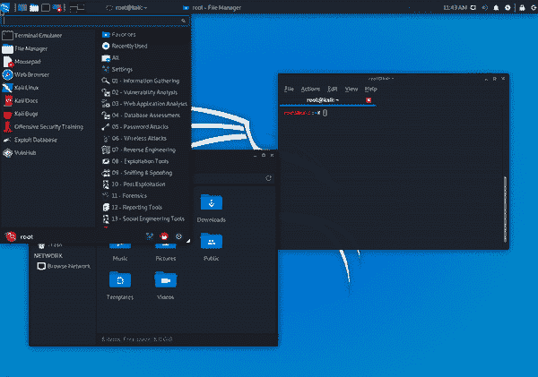
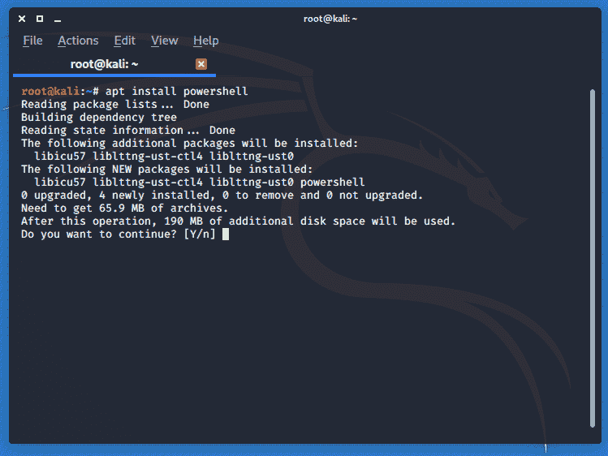
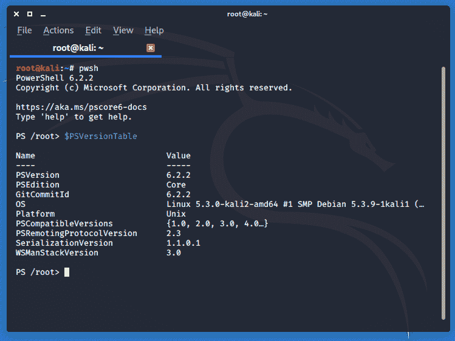

# Kali Linux 2019.4 发布–渗透测试和道德黑客 Linux 发行版的新版本

> 原文：<https://kalilinuxtutorials.com/kali-linux-2019-4/>

我们非常兴奋地宣布我们 2019 年的第四个也是最后一个版本， **Kali Linux 2019.4** ，可以立即下载。这使内核升级到版本 5.2.9，并包括各种新功能，包括 NetHunter、ARM 和软件包(以及针对正常错误的修复和更新)。

**Kali Linux 2019.4 包含的特性**

*   一个新的默认桌面环境 Xfce
*   新的 GTK3 主题(用于 Gnome 和 Xfce)
*   “卡莉卧底”模式介绍
*   Kali 文档有了一个新家，现在是 Git 驱动的
*   公共打包–将您的工具放入 Kali
*   Kali NetHunter KeX–Android 上的完整 Kali 桌面
*   设置期间的 BTRFS
*   添加了 PowerShell
*   [内核升级到版本 5.3.9](https://pkg.kali.org/pkg/linux)
*   加上正常的错误修复和更新。

那么现在让我们详细地看一下同样的情况；

**新的桌面环境和 GTK3 主题**

升级到桌面环境已经很久了。几个月以来，我们一直在思考如何修复它，我们需要做什么，尝试不同的方法，等等。

我们有一些问题，我们希望正面解决，作为一个总结，如性能问题，破碎的用户体验和现代外观。

为了解决这个问题，他们找到了 Daniel Ruiz de Alegría，并开始在 Xfce 上开发一个新的主题。他们考虑 Xfce，因为它能最好地解决这些问题，同时仍能被大多数用户访问。

我们对这个新的 UI 更新感到非常兴奋，它将会爱上所有的 kali 用户。但是由于 UI 可能有点像宗教，如果您不想放弃 Gnome，请不要担心。

他们仍然为你准备了一个 Gnome 版本，只是做了一些改动。随着时间的推移，他们将对他们发布的所有桌面环境进行更改，以使他们“接近”类似的用户体验，而不管您运行的是什么。因为我们没有资源来大规模投资改变所有这些不同的环境，这将是最小的。所以如果你想看些东西，请提交一个[功能](https://bugs.kali.org)的申请！

**卡莉卧底**

还有一个新的增加是切换到他们开发卡利卧底主题的世界，一个看起来像休闲视角的窗户的卡利主题。

因此，如果你在公共场所工作，不停地砍，你可能不想看到和想知道你在为每个人做什么独特的卡利龙。所以，一个小脚本将把你的 Kali 主题转换成 Windows 的默认安装。

那样你会更加隐蔽地工作。完成后，再次运行脚本，在一个更私密的地方切换回 Kali 主题。就像魔法一样！

**PowerShell**

现在用户可以直接在 Kali 上执行 PowerShell 脚本。

网络猎人 Kex

NetHunter Kex 也发布了新版本。简而言之，这允许您将您的 Android 设备与蓝牙键盘和鼠标一起连接到 HDMI 输出，并获得一个完整的 Kali 桌面，没有妥协。是的。从电话里。

这是一个你必须信任的特性。在你看到它之前，你不会完全理解它的作用。这非常接近于使用一个功能齐全的便携式 ARM 台式机，它可以放在你的口袋里，配有一部足够强大的手机。在评估中，有很多方法可以利用这一点。

点击这里查看他们的文档，获得如何使用 NetHunter Kex 的完整分类。

**手臂**

在最新的 2019.4 版本中，将支持 8 GB 的 ARM 卡，16 GB 的 SD 卡将是我们在 2020.1 中支持的最低容量。但是如果你想支持更小的卡，用户总是可以创建他们自己的图像。

根据报告，在发布试用期间，少数设备没有正确显示 Kali 菜单。这并不重要，不足以延迟发布，因此您可以运行以下命令作为一种变通方法来正确查看菜单:

**apt 更新&apt 远程升级**

完成后注销，这样你就回到了登录管理器。然后使用 CTRL+ALT+F11(chrome book 上 ESC 键旁边指向左边的键)切换到控制台。

**登录后运行:**

rm -rf。缓存/。config/。本地/&同步&重启

重新启动后，列表会有正确的条目。我们只是看看为什么这种情况会发生在一些视频中。

**安装**

**[点击这里](https://www.kali.org/downloads/)** 下载最新版本。

**如果你已经安装了 Kali，记住你可以随时快速更新:**

**–root @ kali:~ # cat</etc/apt/sources . list
–deb http://http.kali.org/kali kali-rolling main non-free contrib
EOF
–root @ kali:~ #
–root @ kali:~ # apt 更新& & apt -y 全升级
–root @ kali:~ #
–root @ kali:~ #[-f/var/run/reboot-required]&&reboot-f**

**如果你想换成我们新的 Xfce:**

**root@kali:~# apt -y 安装 kali-desktop-xfce**

**你现在应该在 Kali Linux 2019.4 上。我们可以通过做**来进行快速检查

**根@ kali:~ # grep version/etc/OS-release
版本= " 2019.4 "
版本 _ id = " 2019.4 "
版本 _ code _ version = " kali-rolling "
根@kali:~#
根@kali:~# uname -v** 

注意:“uname -r”的输出可能会因架构而异。

[**Download**](https://www.kali.org/news/kali-linux-2019-4-release/)