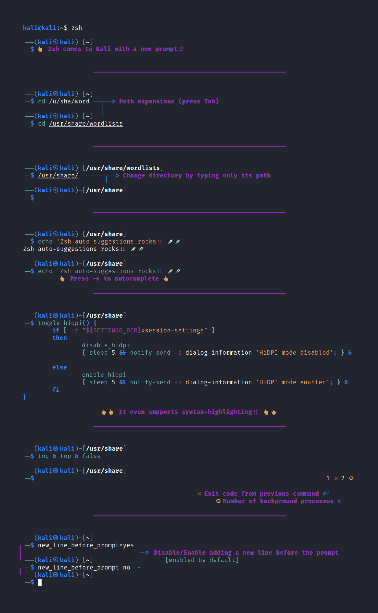
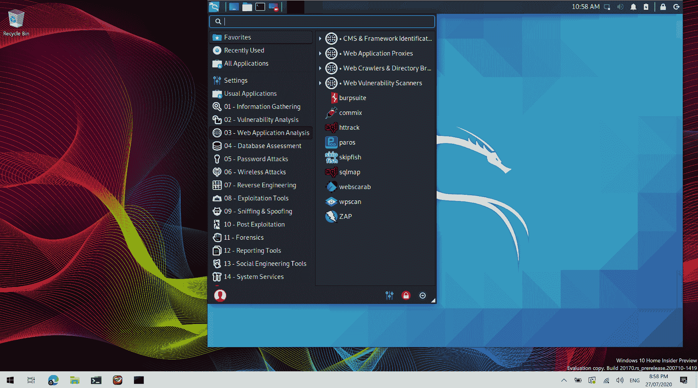
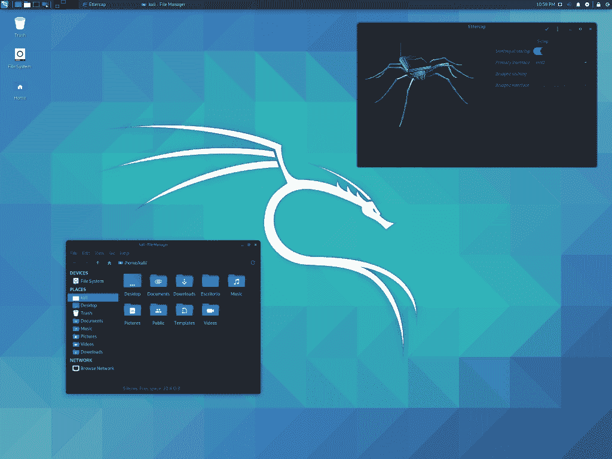

# Kali Linux 2020.3 版本(ZSH、Win-Kex、HiDPI 和蓝牙武器库)-立即下载！！

> 原文：<https://kalilinuxtutorials.com/kali-linux-2020-3/>

[ – Download Now!!")](https://1.bp.blogspot.com/-yLyQdN5Nt7o/Xz5lwrpxwhI/AAAAAAAAKOg/QEmOZAy4UaMFFGAonqZIc9xE-2IDLeuaQCLcBGAsYHQ/d/Kali%2BLinux%2B2020.3.jpg)

又到了一年中的这个时候，又到了 Kali Linux 发布的时候了！**第三季度–Kali Linux 20202.3**。这个版本有各种令人印象深刻的更新，包括新的外壳，蓝牙武器，自动化 HiDPI 支持，诺基亚支持，新的更新工具图标

快速概述自 2020 年 5 月[日](https://www.kali.org/releases/kali-linux-2020-2-release/)发布以来的新内容:

*   **新外壳**——开始从“Bash”切换到“ **ZSH** 的过程
*   “ **Win-Kex** ”的发布——准备好 **WSL2**
*   **自动化 HiDPI** 支持–轻松切换模式
*   **工具图标**–每个默认工具现在都有自己独特的图标
*   **蓝牙武器库**–Kali net hunter 的新工具集
*   **诺基亚支持**–Kali NetHunter 的新设备
*   **设置过程**——不再有**遗漏网络库**和**更快安装**

**新壳(即将上市)**

今天，kali Linux 2020.3 宣布计划切换到 **ZSH 外壳**。这目前被安排为 2020.4 中的**默认 shell(对于这个 **2020.3 版本，bash 仍将是默认的**)。**

kali@kali:~$ cp /etc/skel/。zshrc ~/
kali@kali:~$

然后你需要做的就是切换到 ZSH:

**kali @ kali:~ $ zsh** 



如果你喜欢你看到的，你可以**通过做`chsh -s /bin/zsh`把 ZSH 设为你的默认** *(替换巴什)*。

你为什么要做出改变？巴什怎么了？你可以用 bash 做很多高级的事情，并定制它做更多，但是 ZSH 允许你做更多。这是一个非常大的卖点。

你为什么选了 ZSH 而不是鱼？ A .)在切换 SHell 的讨论中，出现的一个选项是鱼*(友好交互 SHell)* 。Fish 是一个不错的 shell *(可能比 ZSH 更好)*，但是实际上它并不是一个真正的考虑因素，因为它与 POSIX 不兼容。这将会导致很多问题，因为普通的一行程序是行不通的。

你会使用任何 ZSH 框架吗(例如，我的 ZSH 或 Prezto)？ A .)目前，默认情况下，不会。这些设备的重量不适用于低功耗设备。之后你仍然可以自己安装它们*(我们团队的许多人都这么做)*。

**Win-KeX**

在“Windows Subsystem for Linux”(WSL)上安装 Kali Linux 是[自它问世以来我们一直在利用的东西。随着](https://www.kali.org/tutorials/kali-on-the-windows-subsystem-for-linux/) [WSLv2](https://www.kali.org/news/wsl2-and-kali/) 的发布，整体功能和用户体验得到了显著改善。

今天，随着 **Win-KeX** (Windows + Kali 桌面体验)的推出，这种体验再次得到改善。安装后，输入`kex`，或者点击按钮，Win-KeX 会给你一个**持续会话 GUI** 。



安装完 WSL*(网上有无数的指南，或者你可以关注[我们的](https://www.kali.org/docs/wsl/win-kex/) )* 之后，你可以通过以下方式安装`Win-KeX`:

**须藤 apt 更新&须藤 apt install -y kali-win-kex**

之后，如果你想做一个快捷方式，跟随我们的[指南](https://www.kali.org/docs/wsl/win-kex/)，或者你可以直接输入`kex`！

这是因为默认情况下不包含它们**，以保持图像尽可能小。您要么需要手动逐个安装它们，要么获取[默认元包](https://www.kali.org/docs/general-use/metapackages/)来获得所有开箱即用的工具:**

`**sudo apt install -y kali-linux-default**`

请注意，Win-KeX 确实需要 x64 上的 **WSL v2，因为它与 WSL v1 或 arm64 不兼容。**

有关更多信息，请参见我们的文档页面

**自动化 HiDPI**

HiDPI 显示器越来越普遍。不幸的是，开箱即用的 Linux 支持并不太好(老 Linux 用户可能还记得这在很多硬件变更中非常普遍的一段时间。).



**工具图标**

在过去的几个版本中，kali linux 2020.3 为工具引入了主题图标。


**Kali NetHunter 蓝牙兵工厂**

Kali Linux 2020.3 介绍**蓝牙兵工厂**。它将 Kali NetHunter 应用程序中的一组蓝牙工具与一些预配置的工作流和令人兴奋的用例相结合。你可以使用你的外置适配器进行**侦察**、**欺骗**、**监听**、**向各种设备注入音频**，包括扬声器、耳机、手表，甚至汽车。

请注意，从现在起`RFCOMM`和`RFCOMM tty`需要在内核中启用**来支持一些工具。**

[](https://www.kali.org/wp-content/uploads/2020/08/release-2020.3-nh-bluetooth.jpg)

## **下载 Kali Linux 2020.3**

现在，您可以使用以下命令将您的系统更新到最新的 Kali 2020.3:-

```
*sudo apt update && sudo apt -y full-upgrade*
```

如果你已经有一个 Kali Linux 并且想要升级；

```
*kali@kali:~$ echo "deb http://http.kali.org/kali kali-rolling main non-free contrib" | sudo tee /etc/apt/sources.list
kali@kali:~$
kali@kali:~$ sudo apt update && sudo apt -y full-upgrade
kali@kali:~$
kali@kali:~$ [ -f /var/run/reboot-required ] && sudo reboot -f
kali@kali:~$*
```

对于新的安装，你可以从这里下载。

Kali Linux 2020.3 升级后检查；

```
*kali@kali:~$ grep VERSION /etc/os-release*
```

还推荐你看一下我们的 [**Kali Linux 教程** s](http://kalilinuxtutorials.com/) ，里面涵盖了几十个 Kali Linux 工具。另外，学习 [**Kali Linux 课程**](https://ethicalhackersacademy.com/collections/ethical-hackers-academy/products/complete-hacking-tools-in-kali-linux-operating-system) 并完成 **[Kali Linux 命令列表](https://ethicalhackersacademy.com/blogs/ethical-hackers-academy/kali-linux-commands)。**