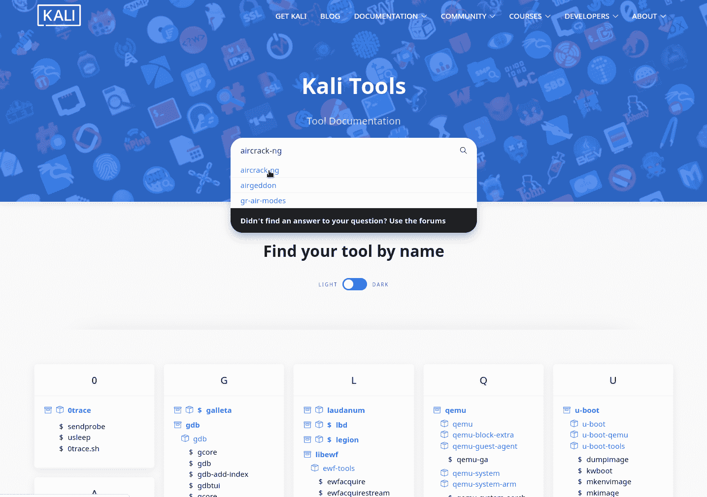
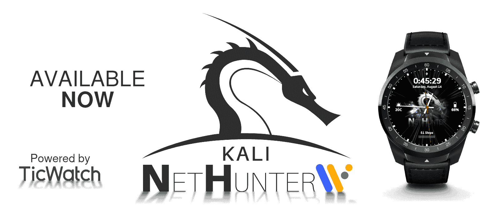
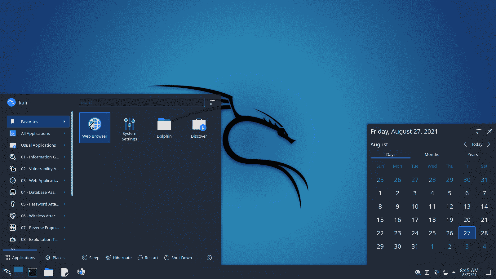

# Kali Linux 2021.3:渗透测试和道德黑客 Linux 发行版

> 原文：<https://kalilinuxtutorials.com/kali-linux-2021-3-2/>

**Kali Linux 2021.3** 是一个渗透测试和道德黑客 Linux 发行版。自 6 月 2021.2 版发布以来的变化总结如下:

*   **OpenSSL**—默认的广泛兼容性——请继续阅读这意味着什么
*   **新的 Kali-Tools 网站**-跟随 Kali-Docs 的脚步，Kali-Tools 进行了彻底的更新
*   **在实时映像会话中提供更好的虚拟机支持**–默认情况下，从您的机器中复制&粘贴并拖放&到 Kali 虚拟机中
*   **新工具**—从对手模拟，到子域接管，再到 Wi-Fi 攻击
*   **Kali NetHunter 智能手表**——首款适用于 TicHunter Pro 的智能手表
*   **KDE 5.21**–等离子桌面收到版本冲击

* * *

**OpenSSL:默认的广泛兼容性**

从 Kali Linux 2021.3 开始，OpenSSL 现在已经配置了**更广泛的兼容性**，以允许 Kali 与尽可能多的服务对话。这意味着传统协议*(如 TLS 1.0 和 TLS 1.1)* 和旧的密码在默认情况下**启用**。这样做是为了帮助提高 Kali 与仍在使用这些旧协议的旧的、过时的系统和服务器对话的能力。这可能会增加您在可用攻击面上的选择*(如果您的目标运行着这些生命周期终止(EoL)服务，然后忘记了它们，这还能发现什么？)*。虽然这不是一个适合通用操作系统的配置，但这个设置对 Kali 来说是有意义的，因为它使用户能够与更多的潜在目标进行交流。

这个设置很容易通过命令行工具`**kali-tweaks**`来修改。进入`**Hardening**`部分，从那里您可以将 OpenSSL 配置为**强安全**模式，它使用当今的现代标准，允许安全通信。

有关更多详细信息，请参考文档:kali.org/docs/general-use/openssl-configuration/

**卡莉工具**

在 2019.4 中，我们将文档移到了更新的/docs/页面。现在终于轮到我们的 Kali-Tools 网站了！

我们已经刷新了以前网站的每个方面，给出了一个新的，更快的，布局，内容和系统！后端现在处于半自动化状态，更多的是开放的，像以前一样，允许任何人帮助和贡献。

一旦这些网站适应了所有的变化，变得成熟了一些，我们将开始把它们打包，允许离线阅读。

**虚拟化:全面改进**

卡利现场图像在这个释放周期收到了一些爱！我们努力让在虚拟化环境中运行实时映像的用户体验更加顺畅。像主人和客人之间的**复制粘贴**和**拖放**这样的基本功能现在可以开箱即用了。这真的适合所有人:VMware、VirtualBox、Hyper-V 和 QEMU+Spice。我们忘记谁了吗？在 Kali 窃听器上给我们留言！

同一行:现在为 **Hyper-V 增强会话模式**配置 Kali 非常容易。在一个终端中打开`**kali-tweaks**`，选择`**Virtualization**`，如果 Kali 在 Hyper-V 下运行，你会看到一个打开 Hyper-V 增强会话模式的设置。现在就像按回车键一样简单！

如果您使用此功能，请确保访问 kali . org/docs/virtual ization/install-hyper-v-guest-enhanced-session-mode/，因为还有一些其他事项需要注意。

非常感谢@Shane Bennett，他花了大量的时间来测试这个特性，一直以来都提供了非常详细的反馈，甚至还帮助我们编写了文档。恭喜你肖恩。

**卡利的新工具**

如果没有任何新的工具加入，它就不是一个 Kali 版本了！快速浏览一下添加了什么*(到网络存储库)*:

*   berate _ AP–协调 MANA rogue Wi-Fi 接入点
*   CALDERA–可扩展的自动化对手仿真平台
*   EAP hammer–针对 WPA2 企业 Wi-Fi 网络的定向邪恶双胞胎攻击
*   host hunter——使用 OSINT 技术发现主机名的侦察工具
*   RouterKeygenPC–生成默认 WPA/WEP Wi-Fi 密钥
*   sub jack–子域接管
*   WPA _ Sycophant–EAP 中继攻击的邪恶客户端部分

**Kali NetHunter 更新**

**卡莉网游手表**

我们自豪地推出世界上第一款 Kali NetHunter 智能手表 TicHunter Pro ,这要归功于我们自己的 NetHunter 开发人员@yesimxev 的出色工作。它仍然是实验性的，因此功能仅限于 USB 攻击和一些基本功能。硬件也有局限性，因为这么小的电池无法为任何 OTG 适配器提供足够的电压，所以巨大的天线不会伸出你的手腕！未来非常有希望，带来对 Nexmon 和内部蓝牙使用的支持。

图片可以在我们的下载页面上找到。

请注意，由于技术原因，这些图像包含一个“纳米卡利根”。详细的安装指南可以在我们的 Kali 文档中找到。欢迎加入冒险之旅！

**通过 Magisk 安装 Kali NetHunter】**

感谢@Mominul Islam 的惊人工作，我们现在可以将 **Kali NetHunter 带到 Android 11 设备上，而无需完全工作的 TWRP** ！

每个 Kali NetHunter 映像都可以作为 Magisk 模块刷新。这项工作仍处于起步阶段，还需要做更多的工作来使它达到通过 TWRP 的传统安装程序的标准。

缺少的部分之一是内核安装。我们还不能通过 Magisk 安装内核。这必须通过像“Franco 内核管理器”这样的内核安装程序来完成。如果你渴望在你的 Android 11 设备上安装 NetHunter，那就试试吧。如果你有兴趣帮助完成内核部分，请通过我们的 GitLab 问题跟踪器与我们联系。非常感谢任何帮助！

**Kali NetHunter 为我们的首选设备一加 7 安装分步指南**

我们的【Kali NetHunter 首选设备是运行 Android 10 (stock ROM) 的一加 7。

对于一步一步的安装指南和链接到所有需要恢复你的手机到最新的股票 Android 10 ROM，安装 TWRP，Magisk 和 Kali NetHunter，头部到我们的 Kali 文档页面。

**卡利臂更新**

我们一直忙于对 Kali ARM 图像进行各种调整和修补，包括:

*   我们的**卡利臂建造脚本已经被重新修改**。
    *   感谢@cyrus104，我们现在有了一个构建脚本来支持 **Gateworks Newport** 板，他还为它添加了文档。
    *   @Re4son 为基于**【Pi-Tail】***(点击此处了解更多信息)*的 Raspberry Pi Zero W 贡献了一个构建脚本。
    *   此外，基于 RaspberryPi Zero W 的 **"P4wnP1"** 构建脚本也经历了一些重大变化。
*   所有映像*应该*最终**在第一次引导**时调整文件系统的大小。
*   我们现在**重新生成默认的 snakeoil 证书**，它修复了一些之前无法运行的工具。
*   对于支持的 **iptables，图像默认为`**iptables-legacy**`和`**ip6tables-legacy**`。**
*   我们现在**在所有图像上设置了默认的区域设置**为`**en_US.UTF-8**`，当然，你可以将其更改为你喜欢的区域设置。
*   ARM 镜像上的 **Kali 用户**现在默认在所有**相同组**中作为基础镜像，并使用 **zsh** 作为默认 shell。您可以使用预装的`**kali-tweaks**`工具来更改您的默认 shell。
*   Raspberry Pi 镜像现在可以在`/boot`分区上使用`wpa_supplicant.conf`文件了。
*   树莓派图像**现在预装了`kalipi-config`，和`kalipi-tft-config`** 。
*   **Pinebook Pro 的内核**已经更新到 **5.14** ，现在你可以在 LCD 屏幕上看到**消息，因为它正在引导**，而不是闪烁的光标，直到 X 启动。

**桌面&主题更新**

桌面领域也有一些变化:

*   改进了 Xfce 通知和注销对话框的 GTK3 主题
*   重新设计的 GTK2 主题更适合旧的程序
*   改进了 Kali-Dark 和 Kali-Light 语法——突出 GNOME 和 Xfce 的主题

除了这些变化，Kali 的首选桌面之一，KDE 等离子，已经收到了一个版本，现在包括 5.21 版本。这次更新带来了更新的外观，有一个新的应用程序启动器和主题改进。以下是 Kali 定制版的预览图:

**Kali-Docs 更新**

我们的文档网站，以及在这篇博客文章中已经提到的页面，下面的其他页面已经有了很大的变化:

*   安全下载 Kali Linux 映像
*   Kali Linux & WSL & Mesa
*   Kali Linux IRC 频道
*   贡献运行时测试

**GitLab 提交 2021**

今年我们参加了 GitLab 的虚拟会议，@g0tmi1k 做了一个关于 Kali Linux 和 OffSec 之间动态的演讲。给它一只表！

**安培&臂**

在我们宣布与 Ampere 的合作伙伴关系后，我们现在已经将我们的 ARM 包构建机器完全转移到它们的硬件上，并且喜欢速度的提高！再次感谢安培的协助！如果你需要一些 ARM 服务器，给他们看看！如果他们很好地以这种方式帮助我们，我们相信他们也会对你很好。

* * *

**即将到来的变化**

展望未来，我们将宣布以下变化:

*   **卡利-菜单刷新**–我们知道你可能不会使用它，但是对于那些使用它的人，我们计划对它的结构做一些重大的改变。这将有望在 2021.4 进行**现场测试，然后根据用户反应在以后的版本中进行默认设置。您可以使用`**kali-tweaks**`改变菜单布局。如果您想为这一变化提供意见，请加入我们，让我们听到您的声音！**
*   负载平衡器(http.kali.org【cdimage.kali.org】T2)–它处理 apt 包和操作系统映像。我们将从 MirrorBrain 转换到 MirrorBits。我们将很快联系所有的社区镜像维护者，通知他们我们的基础设施的变化。如果你想成为一面镜子，请看看我们的指南。

* * *

**下载 Kali Linux 2021.3**

**新鲜影像**:那你还在等什么？已经开始下载了！

经验丰富的 Kali Linux 用户已经意识到了这一点，但是对于那些没有意识到这一点的人来说，我们也制作了**周版本**供你使用。如果你等不及我们的下一个版本，并且你想要最新的包*(或者错误修复)*当你下载镜像的时候，你可以用每周镜像来代替。这样你就可以少做一些更新。*只需知道这些是自动化的构建，我们不会像对待我们的标准发布映像一样进行质量保证。但是我们很乐意接受关于这些图片的错误报告，因为我们希望在我们的下一个版本发布之前修复所有问题！*

**现有安装**:如果您已经有一个现有的 Kali Linux 安装，请记住您可以随时进行快速更新:

 **echo】deb http://http . kali . org/kali-rolling main non-free contributor | sudo tea/etc/apt/sources . list
【sudo apt update】&&sudo apt-y full upgrade** 

你现在应该在 Kali Linux 2021.3 上。我们可以通过以下方式进行快速检查:

**]
grep version/etc/OS release
version = " 2021.3 "
version _ id = " 2021.3 "
version _ code = " kali-rolling "
【uname-v】** 

*注: **`uname -r`** 的输出可能因系统架构而异。*

像往常一样，如果你在 Kali 中遇到任何错误，请在我们的错误跟踪器上提交一份报告。我们永远无法修复我们不知道已经损坏的东西！ **和 Twitter 都不是 Bug 追踪器！**

[**Download**](https://www.kali.org/blog/kali-linux-2021-3-release/)