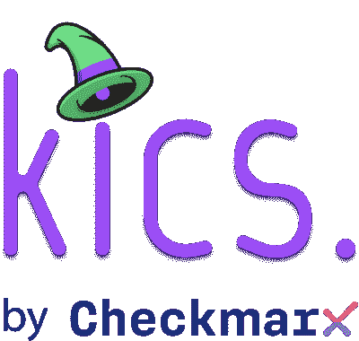

# kics:发现安全漏洞、合规性问题和基础设施错误配置

> 原文：<https://kalilinuxtutorials.com/kics-2/>

.png)

**KICS，**代表保持基础设施代码安全，是每个云原生项目的重要组成部分，并且是开源的。使用 Checkmarx 的 KICS 在基础设施即代码开发周期的早期识别安全缺陷、法律遵从性问题和基础设施错误配置。

## 它是如何工作的

KICS 固有的延展性是它如此强大和受欢迎的原因。实现这种可扩展性需要:

查询是完全灵活和可变的启发式规则。这些很容易更改、扩展和包含。

一个健壮但仍然简单的架构，使得快速添加对新基础设施的支持成为代码解决方案变得简单。

KICS 是使用开放策略代理开发的，并且是完全开源的(OPA)。

减压阀是实现安全查询的自然选择，而 Golang 的速度、简单性和可靠性使其成为创建 KICS 的理想选择。

对于 AWS、GCP、Azure 和其他云提供商，我们已经创建了一千多个现成的查询，涵盖了广泛的漏洞检查。

## 高层架构

KICS 的 IaC 语言解析器和可插拔架构的可扩展管道使得合并额外的 IaC 语言和查询变得简单。

命令行界面、解析器、查询执行引擎、IaC 提供程序、安全查询和结果写入器是 KICS 的重要组成部分。

*   使用命令行界面向 KICS 提供 CLI 输入。
*   解析器负责处理输入的 IaC 文件(terraform 等)
*   IaC 的提供者=> IaC 语言被转换成一个标准化的 JSON \sQueries 执行引擎:为每个安全使用预构建的 REGO 查询，并针对标准化的 JSON 安全查询进行错误配置。
*   Writer = >以 JSON 格式输出数据。

## 执行流程

[**Download**](https://github.com/Checkmarx/kics#getting-started)