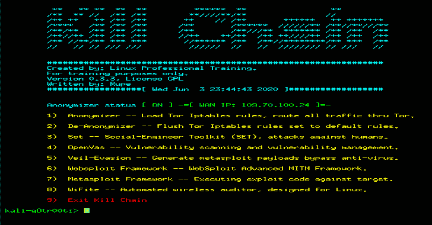

# KillChain:执行攻击的“杀伤链”阶段的统一控制台

> 原文：<https://kalilinuxtutorials.com/killchain/>

**Kill Chain** 是一个带有匿名器的统一控制台，将执行以下攻击阶段:

*   侦察
*   武器化
*   交付
*   剥削
*   装置
*   指挥与控制
*   和行动

**依赖工具集**

*   **Tor —** 为控制台内置[匿名器](https://github.com/ruped24/toriptables2)。
*   **Set —** 社会工程师工具包(Set)，攻击人类。
*   **OpenVas —** 漏洞扫描和漏洞管理。
*   **面纱规避—** 生成 metasploit 有效负载绕过反病毒。
*   **Websploit —** WebSploit 高级 MITM 框架。
*   **Metasploit —** 针对目标执行漏洞利用代码。
*   **WiFite —** 自动无线审计器，专为 Linux 设计。

**设置**

**安装 Killchain.py:**

sudo apt-get 更新
sudo apt-get 安装 websploit openvas 面纱-逃避 tor
sudo git 克隆 https://github.com/ruped24/killchain.git
CD kill chain
sudo chmod+x kill chain . py
sudo。/killchain.py

**killchain.py 一行程序安装**

**sudo apt-get 更新&&【sudo apt-get-y 安装 web 站点 open vas veil-evacuator】&&【sudo git 克隆 https://github . com/rupped 24/kill chain . git&【CD kill chain】&&sudo/killchain.py**

**安装后设置**

**[点击](https://drive.google.com/file/d/1Alpn3uYuyAip_jxAmlOfRqlhosUgUDiZ/view)** 查看菜单上的选项

**Killchain 菜单设置选项；**

*   **杀伤链选项 4**

OpenVas 第一次运行需要一段时间。去喝杯咖啡吧。您可以启动多个杀死链会话。没必要看着油漆干。OpenVas 安装完成后；通过在外部终端中运行以下命令来重置 openvas web 界面管理员密码。

`**sudo openvasmd --user=admin --new-password=<Your_new_reset_admin_password>**`

**将浏览器指向 https://localhost:9392
登录用户名= admin
登录密码= Your _ new _ reset _ admin _ Password**

*   **杀伤链选项 5**

**关于面纱规避的说明:**面纱将在启动时完成设置。接受所有默认值。这需要一段时间。不要离开屏幕，有一个对话框你必须点击通过。一旦完成，它将自动启动。

*   **杀伤链选项 6**

Websploit:要退出 websploit，请键入 exit。

*   **杀伤链选项 7**

Metasploit:要退出 metasploit，请键入 exit。

*   **杀伤链选项 8**

**WiFite** :在本控制台框架内进行现场勘测。

**在外部终端运行 wifite，对目标进行无线攻击。**

行动方案矩阵和故障排除

[**Download**](https://github.com/ruped24/killchain)