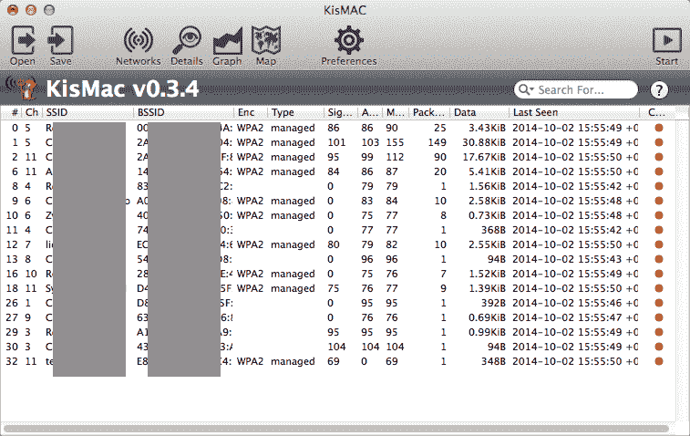

# kismac 2——Mac OS X 的免费开源无线安全工具

> 原文：<https://kalilinuxtutorials.com/kismac2-open-source-wireless-mac/>

KisMAC2 是一个免费的、开源的 Mac OS X 无线安全工具。这个项目是一个活跃的项目，在 KisMAC 最初开发停止的地方继续进行。原始 KisMac 的 Trac 位于[http://trac.kismac-ng.org](http://trac.kismac-ng.org)



**又读[Scrounger——移动应用测试工具包](https://kalilinuxtutorials.com/scrounger-mobile-application-testing/)**

## **最新消息:**

*   MAC OS 10.9–10.12(仅限 64 位)
*   ARC(仅限 64 位)
*   新 GUI
*   现代目标 c 语法
*   重写大部分不推荐使用的方法
*   从版本中删除调试信息

## **如何构建 KisMAC2:**

```
git clone https://github.com/IGRSoft/KisMac2.git ./KissMac2
cd KissMac2
git submodule update --init --recursive
open KisMac2.xcworkspace
Build
```

[ ](https://github.com/IGRSoft/KisMac2) **信用:维塔利·帕罗西尼(Korich)**