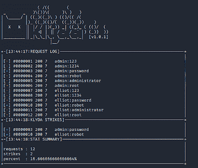

# Klyda:针对在线 Web 应用程序的字典/喷雾攻击的高度可配置脚本

> 原文：<https://kalilinuxtutorials.com/klyda/>

.png)

Klyda 项目的创建是为了帮助针对在线网络应用的基于凭证的快速攻击。 **Klyda** 支持从简单的密码喷雾，到大型多线程字典攻击的使用。

Klyda 是一个新项目，我正在寻找任何贡献。非常感谢任何帮助。
**Klyda** 提供简单、易记的用法；但是，仍然为您的需求提供了可配置性:

*   多线程任务
*   针对大规模攻击组合单词列表
*   将数据列入黑名单以缩小结果范围
*   为了偷偷摸摸的目的限制线程速度

## 安装和使用

**1)** 将 Git repo 克隆到你的机器上，`git clone https://github.com/Xeonrx/Klyda`
**2)** Cd 到 Klyda 目录，`cd Klyda`
**3)** 通过 Pip 安装必要的模块，`pip install requests beautifulsoup4 colorama numpy`
**4)** 显示 Klyda 帮助提示用法，`python3 klyda.py -h`

Klyda 主要是为 Linux 设计的，但是应该可以在任何能够运行 Python 的机器上工作。

Klyda 需要做的只是四个简单的依赖项:要攻击的 URL、用户名、密码和表单数据。

## 网址

您可以通过`--url`标签解析 URL。应该是这样的，`--url http://127.0.0.1`
记住**永远不要**对网页发起攻击，你没有适当的权限这样做。

## 用户名

用户名是这些字典攻击的主要目标。它可以是一个完整的用户名范围，也可以是几个特定的用户名，或者可能只有一个用户名。这就是你在使用脚本时的所有决定。您可以用几种方式指定用户名…

**1)** 手动指定它们，`-u Admin User123 Guest`
**2)** 给一个文件使用，或者几个文件合并，`-U users.txt extra.txt`
**3)** 给两个文件&手动输入，`-U users.txt -u Johnson924`

## 密码

密码是这些攻击的难点。你不知道他们，因此为什么字典和暴力攻击存在。像用户名一样，你可以只给一个密码，最多给几个。您可以用几种方式指定密码…

**1)** 手动指定它们，`-p password 1234 letmein`
**2)** 给一个文件使用，或者几个文件合并，`-P passwords.txt extra.txt`
**3)** 给两个文件&手动输入，`-P passwords.txt -p redklyda24`

## 格式数据

FormData 是您形成请求的方式，因此目标网站可以接受它，并处理给定的信息。通常您需要指定一个:用户名值、一个密码值，有时还需要一个额外的值。通过查看浏览器 inspect 元素的 network 选项卡，可以看到目标使用的表单数据。对于 Klyda，使用`-d`标签。

当转发请求时，你需要使用占位符让 Klyda 知道在哪里输入用户名和密码。它可能看起来像这样… `-d username:xuser password:xpass Login:Login`

`xuser`是注入用户名的占位符，&是注入密码的占位符。一定要知道这些，不然 Klyda 就没法工作了。

将表单数据格式化为`(key):(value)`

## 黑名单

为了让 Klyda 知道它是否成功击球，你需要给它数据来挖掘。Klyda 利用失败登录尝试的黑名单，因此它可以区分失败的或完整的请求。您可以将三种不同类型的数据列入黑名单…

**1)** 字符串，`--bstr "Login failed"`
**2)** 状态码，`--bcde 404`
**3)** 内容长度，`--blen 11`

您可以根据需要为每个黑名单指定尽可能多的数据。如果在响应中找不到任何给定的数据，Klyda 会给它一个“打击”，说这是一次成功的登录尝试。否则，如果发现黑名单中的数据，Klyda 会将其标记为不成功的登录尝试。因为你给了 Klyda 评估的数据，假阳性是不明显的。

如果你不给任何数据到黑名单，那么每一个请求都会被标记为 Klyda 的一击！

## 速率限制&线程

默认情况下，Klyda 只使用单线程运行；但是，您可以使用`-t`标签指定更多。这有助于加快你的工作。

然而，凭证攻击在网络上可能会非常严重；因此很容易被检测到。由于太多的登录尝试，目标帐户可能只是收到一个简单的锁定。这造成了 DoS 攻击，但是阻止了你获得用户的凭证，而这正是 Klyda 的目标。

所以为了让这些攻击不那么响亮，你可以使用`--rate`标签。这允许您将线程限制在每分钟特定的请求数。
它会被格式化成这样，`--rate (# of requests) (minutes)`

例如，`--rate 5 1`每分钟只会发出 5 个请求。记住，这是针对每个线程的。如果您有 2 个线程，这将每分钟发送 10 个请求。

## 举例

在该死的易受攻击的 Web 应用程序(DVWA)或 Mutillidae 上测试 Klyda。

**python 3 kly da . py–URL http://127 . 0 . 0 . 1/dvwa/log in . PHP-u 用户 guest admin -p 1234 密码 admin -d 用户名:xuser 密码:xpass 登录:log in–bstr“登录失败”**

**python 3 kly da . py–URL http://127 . 0 . 0 . 1/mutillidae/index . PHP？page = log in . PHP-u root-P passwords . txt-d username:xuser password:xpass log in-PHP-submit-button:log in–bstr "认证错误"**

[Click Here To Download](https://github.com/Xeonrx/Klyda)