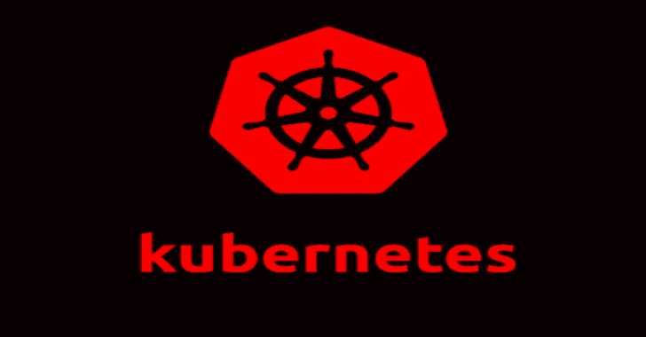

# Kube-Alien:向 k8s 集群发起攻击的工具

> 原文：<https://kalilinuxtutorials.com/kube-alien-launch-attack-k8s-cluster/>

**Kube-Alien** 工具从内部对 k8s 集群发起攻击。这意味着您已经需要有权限在集群中部署 pod 来运行它。

在运行 kube-alien pod 之后，它试图通过将您的公钥添加到节点的/root/来接管集群的节点。ssh/authorized_keys 文件通过使用这个镜像[https://github.com/nixwizard/dockercloud-authorizedkeys](https://github.com/nixwizard/dockercloud-authorizedkeys)(可以使用 config.py 中的 ADD_AUTHKEYS_IMAGE param 进行调整)从 docker/docker cloud-authorized keys 分叉。

**也可阅读-[固件分析工具包:模拟固件并分析其安全漏洞](https://kalilinuxtutorials.com/firmware-analysis-toolkit/)**

如果群集的某个组件配置错误，攻击就会得逞，它会沿着以下方向发展:

*   Kubernetes API
*   库伯莱服务
*   Etcd 服务
*   库比涅斯仪表板

**该工具的用途**

*   在对 k8s 集群进行安全审计时，可以快速评估其安全状况。
*   上述攻击媒介利用的详细演示。

**现实生活中 k8s 集群如何从内部被攻击**

*   RCE 或 SSRF vunerability 在一个应用程序，这是运行在您的集群的一个豆荚。

**用法**

在使用这个工具之前，应该将 Kube-alien 图像推送到你的 dockerhub(或其他注册表)中。

g **it 克隆 https://github . com/nixwizard/kube-alien . git
kube-alien CD
dock build-t ka。/
停靠标签 ka your _ docking ub _ account/kube 外星人:ka
停靠标签推动您的 _ docking ub _ account/kube 外星人:ka**

AUTHORIZED_KEYS env 需要设置为您的 ssh 公钥的值，如果成功，公钥将被添加到所有节点的根的 AUTHORIZED_KEYS 文件中。

**kube CTL run–image = YOUR _ docker hub _ ACCOUNT/kube-alien:ka kube-alien–env = " AUTHORIZED _ KEYS = $(cat ~/。ssh/id _ RSA . pub)"–永不重启**

或者您可以将我的图像用于快速测试目的:

**kube CTL run–image = nix wizard/kube-alien kube-alien:ka–env = " AUTHORIZED _ KEYS = $(cat ~/。ssh/id _ RSA . pub)"–永不重启**

检查 Kube-alien pod 的日志以查看攻击是否成功:

**kube CTL logs $(kube CTL get pods | grep alien | cut-f1-d ' ')**

[Download](https://github.com/nixwizard/kube-alien)