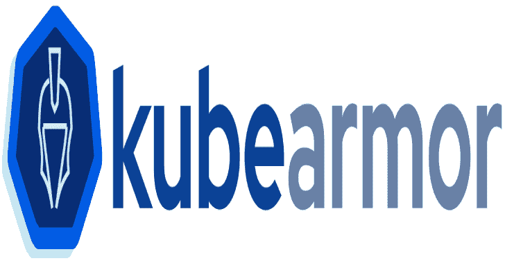
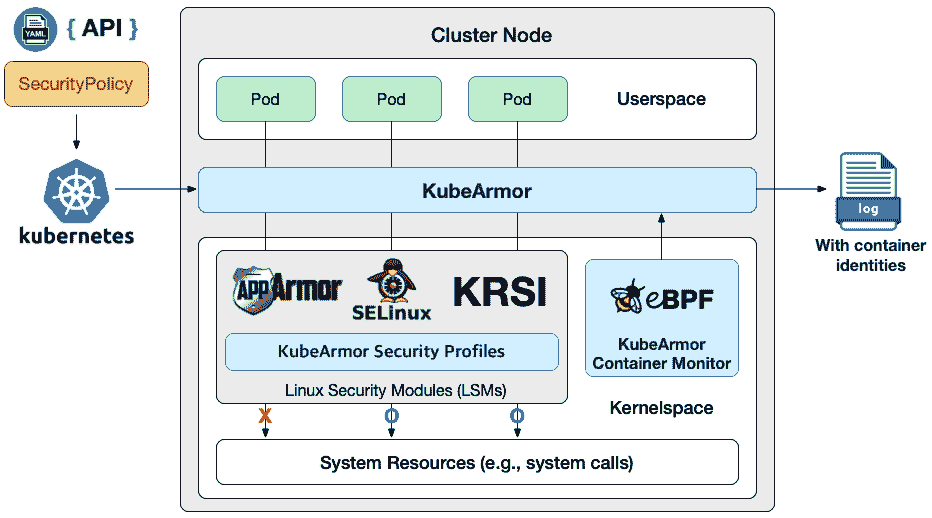

# KubeArmor:容器感知的运行时安全执行系统

> 原文：<https://kalilinuxtutorials.com/kubearmor-container-aware-runtime-security-enforcement-system/>

**耳罩简介**

KubeArmor 是一个容器感知的运行时安全强制系统，它在系统级限制容器的行为(如进程执行、文件访问、网络操作和资源利用)。

KubeArmor 使用 [Linux 安全模块(LSM)](https://en.wikipedia.org/wiki/Linux_Security_Modules)运行，这意味着如果在 Linux 内核中启用了 Linux 安全模块(例如 [AppArmor](https://en.wikipedia.org/wiki/AppArmor) 、 [SELinux](https://en.wikipedia.org/wiki/Security-Enhanced_Linux) 或 [KRSI](https://lwn.net/Articles/808048/) )，它可以在任何 Linux 平台(例如 Alpine、Ubuntu 和谷歌的容器优化操作系统)上工作。KubeArmor 将使用适当的 LSM 来执行所需的政策。

KubeArmor 是为 Kubernetes 环境设计的；因此，运营商只需要定义安全策略并将其应用到 Kubernetes。然后，KubeArmor 将自动检测来自 Kubernetes 的安全策略的变化，并在没有任何人工干预的情况下将它们强制实施到相应的容器中。

如果有任何违反安全策略的行为，KubeArmor 会立即生成带有容器标识的审计日志。如果操作员有任何日志记录系统，它也会自动向他们的系统发送审核日志。

**功能概述**

*   在系统级别限制容器的行为

传统的容器安全解决方案(例如，Cilium)主要通过在网络级别确定它们的容器间关系(即，服务流)来保护容器。相比之下，KubeArmor 通过指定容器中的恶意或未知行为所需的操作来防止这些行为(例如，应该只允许特定的进程访问敏感文件)。

为此，KubeArmor 提供了在系统级过滤进程执行、文件访问、资源利用，甚至容器内部的网络操作的能力。

*   在运行时对容器实施安全策略

一般来说，安全策略(例如，Seccomp 和 AppArmor 配置文件)是在 Kubernetes 的 pod 定义中静态定义的，它们在创建时应用于容器。然后，不允许在运行时更新安全策略。

为了避免这个问题，KubeArmor 单独维护安全策略，这意味着安全策略不再与容器紧密耦合。然后，KubeArmor 根据给定容器的标签和安全策略，直接将安全策略应用到每个容器的 Linux 安全模块(LSM)中。

*   生成容器感知审计日志

LSM 没有任何与容器相关的信息；因此，它们仅基于系统元数据(例如，用户 ID、组 ID 和进程 ID)生成审计日志。因此，很难找出哪些容器会导致违反策略。

为了解决这个问题，KubeArmor 使用了一个基于 eBPF 的系统监视器，它跟踪容器中的流程生命周期，并在 LSM 为容器中的任何策略违规生成审计日志时，将系统元数据转换为容器标识。

*   为策略定义提供易于使用的语义

KubeArmor 提供了监控容器流程生命周期的能力，并根据这些能力做出政策决定。一般来说，否定一个特定的行为要容易得多，但是只允许特定的行为而否定所有的行为就比较困难了。KubeArmor 管理与处理此类策略决策相关的内部复杂性，并为策略语言提供简单的语义。

*   支持容器间的网络安全实施

KubeArmor 旨在保护容器本身，而不是容器之间的交互。但是，使用 KubeArmor，用户可以添加策略，这些策略可以在网络系统调用级别应用策略设置(例如，bind()、listen()、accept()和 connect())，从而在一定程度上控制容器之间的交互。

**入门**

请看看下面的文件。

1.  [部署指南](https://github.com/accuknox/KubeArmor/blob/master/getting-started/deployment_guide.md)
2.  [容器的安全策略规范](https://github.com/accuknox/KubeArmor/blob/master/getting-started/security_policy_specification.md)
3.  [集装箱安全策略示例](https://github.com/accuknox/KubeArmor/blob/master/getting-started/security_policy_examples.md)
4.  [节点(主机)安全策略规范](https://github.com/accuknox/KubeArmor/blob/master/getting-started/host_security_policy_specification.md)
5.  [节点(主机)的安全策略示例](https://github.com/accuknox/KubeArmor/blob/master/getting-started/host_security_policy_examples.md)

如果你想作出贡献，也请参考以下文件。

1.  [投稿指南](https://github.com/accuknox/KubeArmor/blob/master/contribution/contribution_guide.md)
2.  [开发指南](https://github.com/accuknox/KubeArmor/blob/master/contribution/development_guide.md)
3.  [技术路线图](https://github.com/accuknox/KubeArmor/blob/master/contribution/technical_roadmap.md)

**社区**

*   Slack 请加入[耳麦 Slack 频道](https://kubearmor.herokuapp.com/)与耳麦开发者和其他用户交流。我们随时欢迎您讨论使用 KubeArmor 时遇到的问题。

[**Download**](https://github.com/accuknox/KubeArmor)