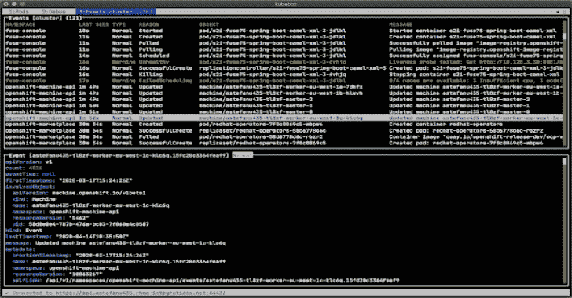
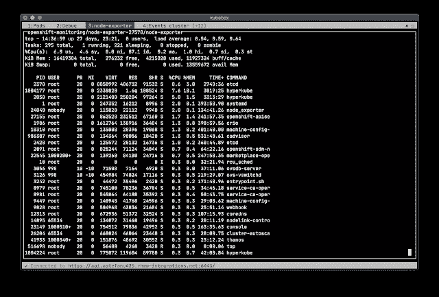
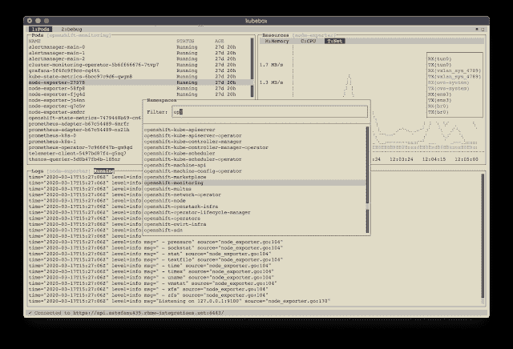
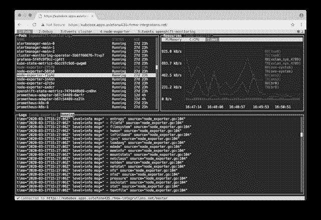

# kube box:Kubernetes 的终端和网络控制台

> 原文：<https://kalilinuxtutorials.com/kubebox/>

**kube box**kubernetes 的终端和网络控制台。

**特性**

*   来自 *kubeconfig* 文件(`**KUBECONFIG**`环境变量或`**$HOME/.kube**`)的配置
*   交互式切换上下文
*   [认证支持](https://github.com/astefanutti/kubebox#authentication)(不记名令牌、基本认证、私钥/证书、OAuth、OpenID 连接、亚马逊 EKS、谷歌 Kubernetes 引擎、数字海洋)
*   名称空间选择和窗格列表监视
*   集装箱日志滚动/查看
*   容器资源使用情况(内存、CPU、网络、文件系统图表) ^([ [1](https://github.com/astefanutti/kubebox#_footnotedef_1) ])
*   集装箱远程执行终端
*   集群、名称空间、pod 事件
*   对象配置编辑器和 CRUD 操作
*   集群和节点视图/监控

**运行**

根据您的偏好和限制，您可以使用以下替代方案来使用 Kubebox:

**可执行文件**

为您的操作系统下载 Kubebox 独立可执行文件:

Linux
curl lo kubrix https://github . com/astefanutti/kubrix/releases/download/v 0 . 8 . 0/kubrix-Linux&chmod+x kubrix
**【OSX】t5** 

然后运行:

**$。/kubebox**

**服务器**

Kubebox 可以通过您的 Kubernetes 集群中托管的服务来提供。终端仿真由 [Xterm.js](https://github.com/xtermjs/xterm.js) 提供，与 Kubernetes 主 API 的通信由服务器代理。

要在 Kubernetes 集群中部署服务器，运行:

**$ kubi KL 申请-f https://raw . github . com/astefanutti/kubi brix/master/kubi tetes . YAML**

要关闭服务器并清理资源，请运行:

**$ kubectl 删除名称空间 kubebox**

为了让入口资源工作，群集必须运行入口控制器。更多信息见[入口控制器](https://kubernetes.io/docs/concepts/services-networking/ingress/#ingress-controllers)。

或者，要在 OpenShift 集群中部署服务器，运行:

**$ oc new-app-f https://raw . github . com/astefanutti/kube box/master/open shift . YAML**

**库贝克特尔**

您可以使用`kubectl`将 Kubebox 作为*集群内*客户端运行，例如:

**$ kube CTL run kube box-it–RM–env = " TERM = xterm "–image = astefanutti/kube box–restart = Never**

如果启用了 RBAC，您必须使用`**--serviceaccount**`选项并引用一个具有足够权限的服务帐户。

**码头工人**

您可以使用 Docker 运行 Kubebox，例如:

**$ docker run-it––RM azufaniti/kub ebox**

您可能希望挂载您的主目录，以便 Kubebox 可以依赖于`**~/.kube/config**`文件，例如:

**$ docker run-it–RM-v ~/。kube/:/home/node/。kube/:ro astefanutti/kubebox**

**上线**

Kubebox 可在 https://astefanutti.github.com/kubebox 在线购买。请注意，它要求该地址与 API 服务器允许的 CORS 来源相匹配。这可以通过 [Kubernetes API 服务器 CLI](https://kubernetes.io/docs/admin/kube-apiserver/) 来实现，例如:

**$ kube-API server–CORS-allowed-origins。***

**认证**

我们尝试支持由`kubectl`支持的各种认证策略，以便提供与您的本地设置的无缝集成。根据您使用 Kubebox 的方式，我们支持以下不同的认证策略:

|  | 可执行的 | 码头工人 | 在线的 |
| --- | --- | --- | --- |
| OpenID 连接 | ✔️ | ✔️ | ^([ [2](https://github.com/astefanutti/kubebox#_footnotedef_2) ]) |
| 亚马逊女战士 | ✔️ |  |  |
| 数字海洋 | ✔️ |  |  |
| 谷歌库比厄引擎 | ✔️ |  |  |

如果不支持您正在使用的模式，您可以手动刷新身份验证令牌/证书，并相应地更新您的 *kubeconfig* 文件。

**管理员**

Kubebox 依靠 [cAdvisor](https://github.com/google/cadvisor) 来检索资源使用指标。在 0.8.0 版本之前，Kubebox 用来访问嵌入在 *Kubelet* 中的 cAdvisor 端点。然而，正如在 [kubernetes#68522](https://github.com/kubernetes/kubernetes/issues/68522) 中所讨论的，这些端点正在被弃用，并且最终将被移除。

从 0.8.0 版本开始，Kubebox 希望 cAdvisor 被部署为一个 [DaemonSet](https://kubernetes.io/docs/concepts/workloads/controllers/daemonset/) 。这可以通过以下方式实现:

**$ ku bectl apply-f https://raw . github . com/astefanutti/kube box/master/CAD visor . YAML**

建议使用提供的`cadvisor.yaml`文件，该文件已经过测试，可以与 Kubebox 一起使用。然而，来自 [cAdvisor](https://github.com/google/cadvisor) 项目的 DaemonSet 示例应该也能正常工作。请注意，cAdvisor 容器必须使用*特权*安全上下文运行，以便它们可以访问每个节点上的容器运行时。

您可以更改添加到`**cadvisor.yaml**`文件中声明的 cAdvisor 容器参数的默认`**--storage_duration**`和`**--housekeeping_interval**`选项，以分别调整存储移动窗口的持续时间(默认为`**5m0s**`)和采样周期(默认为`**10s**`)。您可能还必须提供集群容器运行时套接字的路径，以防它不遵循通常的约定。

**热键**

| 好吧，好吧 | 描述 |
| --- | --- |
| *通用* |
| `l`、`Ctrl` + `l` | 注册 |
| `n` | 更改当前名称空间 |
| [ `Shift` +] `←`，`→`，
[ `Alt` +] `1`，…，`9` | 导航屏幕
(使用 exec 终端内的`Shift`或`Alt`) |
| `↑`，`↓` | 导航列表/表单/日志 |
| `Enter` | 选择项目/提交表单 |
| `Esc` | 关闭模式窗口/取消窗体/回退焦点 |
| `Ctrl` + `z` | 关闭当前选项卡 |
| `q`、`Ctrl` + `q` | 退出^([3](https://github.com/astefanutti/kubebox#_footnotedef_3)) |
| *登录* |
| `←`，`→` | 导航 Kube 配置 |
| *豆荚* |
| `Enter` | 选择容器/循环容器 |
| `r` | 容器中的远程外壳 |
| `m` | 内存使用 |
| `c` | CPU 使用率 |
| `t` | 网络使用 |
| `f` | 文件系统使用 |
| `e` | 打开 pod 事件选项卡 |
| `Shift` + `e` | 打开命名空间事件选项卡 |
| `Ctrl` + `e` | 打开集群事件选项卡 |
| *日志* |
| `g`、`Shift` + `g` | 移到顶部/底部 |
| `Ctrl` + `u`，`Ctrl` + `d` | 向上/向下移动一页 |

**常见问题解答**

*   ***资源使用指标不可用！***
    *   从 0.8.0 版本开始，Kubebox 希望将 [cAdvisor](https://github.com/google/cadvisor) 部署为 DaemonSet。详见[章节](https://github.com/astefanutti/kubebox#cadvisor)；
    *   指标是从 cAdvisor pod 的 REST API 中检索的，该 pod 运行在与请求指标的容器相同的节点上。REST API 通过 API 服务器代理访问，这需要适当的 RBAC 权限，例如:#列出 cAdvisor pod 的权限(使用“spec.nodeName”字段选择器选择)$ ku bectl auth can-I list pods-n CAD visor yes #代理所选 CAD visor pod 的权限，调用其 REST API $ ku bectl auth can-I get pod-sub resource proxy-n CAD visor yes

**开发**

$ git 克隆 https://github.com/astefanutti/kubebox.git
$ CD kube box
$ NPM 安装
$ node index.js

**截图**

*   **集群事件:**

*   **外壳装入容器:**

*   **终端主题支持:**

*   **网络浏览器版本:**

*   需要将 [cAdvisor](https://github.com/google/cadvisor) 部署为守护集。更多细节见[章节。](https://github.com/astefanutti/kubebox#cadvisor)
*   Web 版本不支持自定义 IDP 证书颁发机构文件。
*   在 Web 版本中不可用。

[**Download**](https://github.com/astefanutti/kubebox)