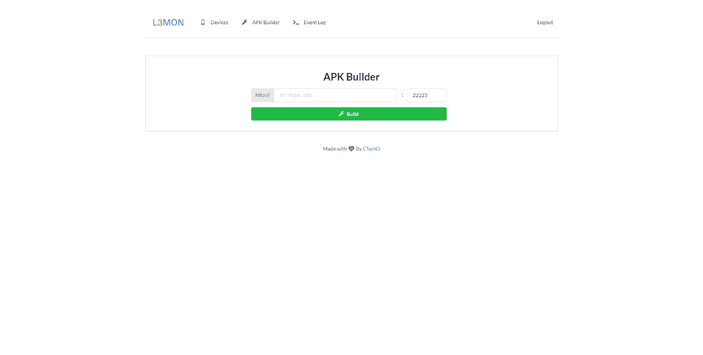
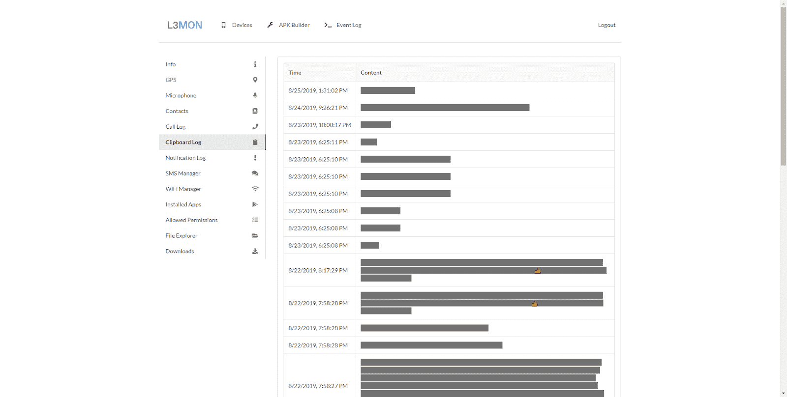
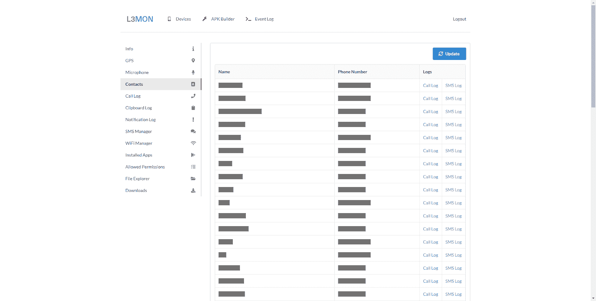
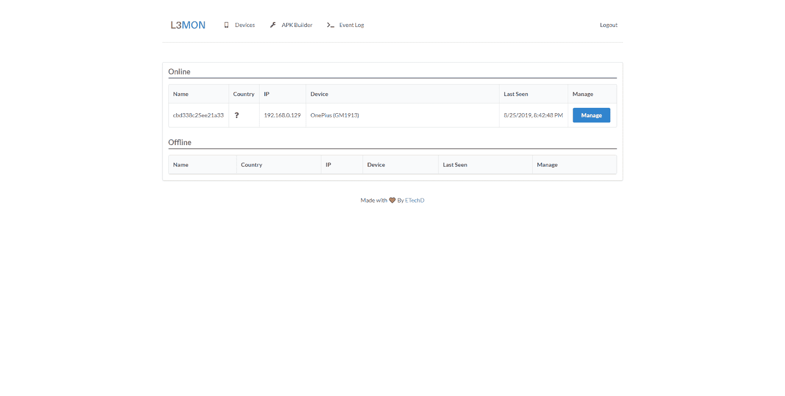
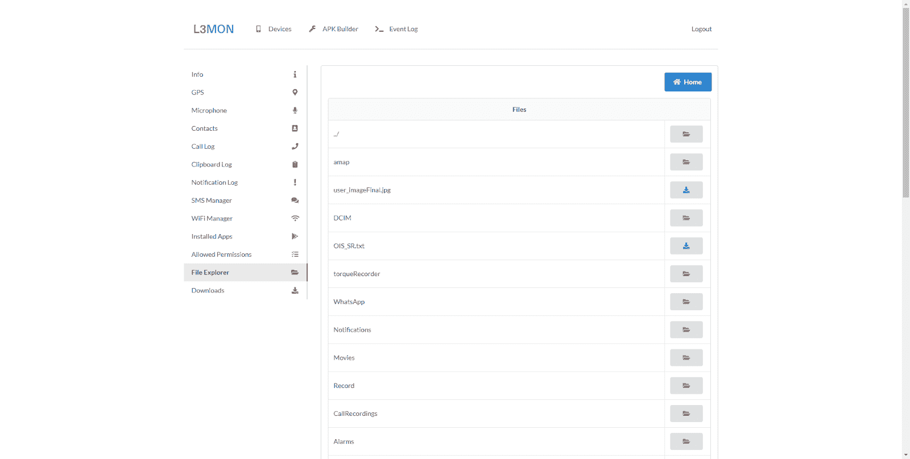
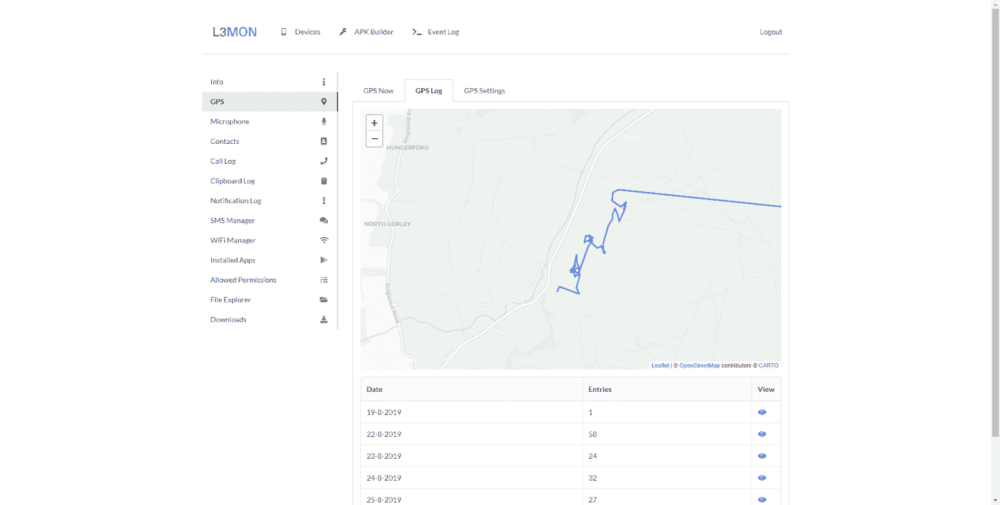
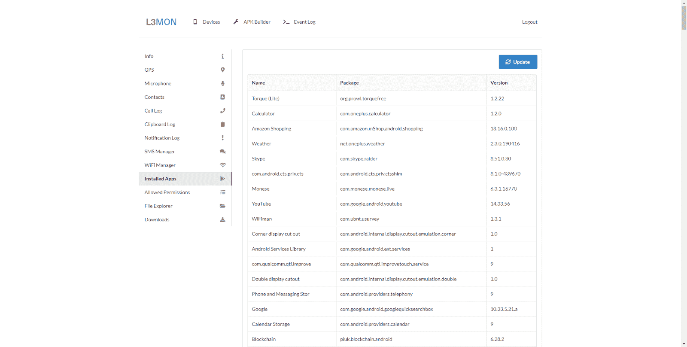
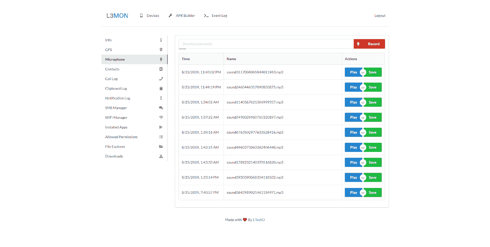
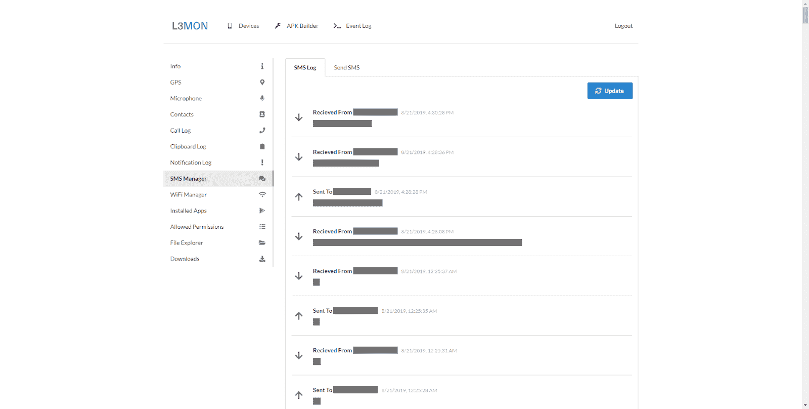
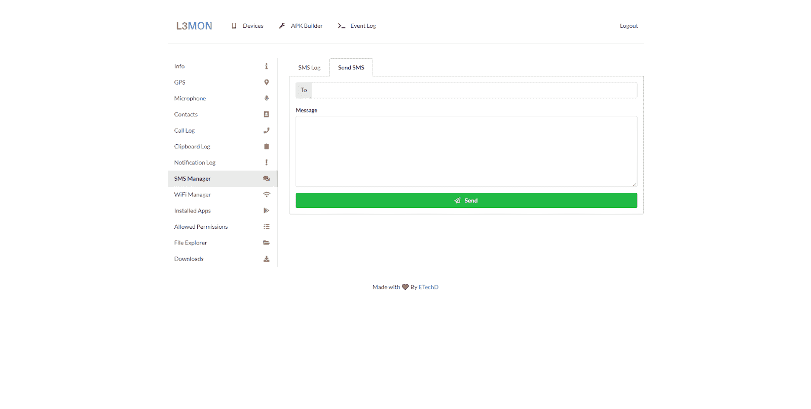

# L3MON:基于云的远程 Android 管理套件

> 原文：<https://kalilinuxtutorials.com/l3mon/>

L2MON 是一个基于云的远程 android 管理套件，由 NodeJS 提供支持。

**特性**

*   GPS 测井
*   麦克风录音
*   查看联系人
*   短信日志
*   发送短信
*   通话记录
*   查看已安装的应用
*   查看存根权限
*   实时剪贴板日志记录
*   实时通知日志记录
*   查看 WiFi 网络(以前查看的日志)
*   文件浏览器和下载器
*   命令队列
*   APK 建造者建造的

**先决条件**

*   Java 运行时环境 8
    *   操作系统详情见[安装](https://github.com/D3VL/L3MON#Installation)
*   NodeJs
*   一个服务器

**安装**

1.  安装 JRE 8(使用 java 1.8.0，我们再怎么强调这一点也不为过。任何不使用它的问题都将被关闭，不会有任何回应)
    *   Debian，Ubuntu 等
        *   `**sudo apt-get install openjdk-8-jre**`
    *   软呢帽、神谕、红帽等
        *   `**su -c "yum install java-1.8.0-openjdk"**`
    *   Windows 操作系统
        *   点击[此处](https://www.oracle.com/technetwork/java/javase/downloads/jre8-downloads-2133155.html)下载
2.  在这里安装 NodeJS [指令](https://nodejs.org/en/download/package-manager/)(如果你不能理解这一点，你真的不应该使用它)
3.  安装 PM2
    *   `**npm install pm2 -g**`
4.  从[这里](https://github.com/D3VL/L3MON/releases/)下载并提取最新版本
5.  在提取的文件夹中，运行以下命令
    *   `**npm install**` < -安装依赖项
    *   `**pm2 start index.js**`<–启动脚本
    *   `**pm2 startup**` < -启动时运行 L3MON
6.  设置用户名和密码
    1.  停 L3 mon〔t0〕
    2.  在文本编辑器中打开`**maindb.json**`
    3.  在`**admin**`下
        *   将`**username**`设置为纯文本
        *   将`**password**`设置为小写的 MD5 哈希
    4.  保存文件
    5.  运行`**pm2 restart all**`
7.  在浏览器中导航至`**http://<SERVER IP>:22533**`

建议在反向代理如 [NGINX](https://www.nginx.com/resources/wiki/start/topics/tutorials/install/) 后面运行 L3MON

**注释**

提出问题时，您**必须**使用提供的模板。没有这一点的问题将不会很快得到支持，并将被放在象征性的一堆的底部。

请浏览当前的问题，打开和关闭，看看你的问题是否已经得到解决。如果是与 java 相关的，那肯定已经解决了——简而言之，使用 Java 1.8.0

**截图**

**APK Builder**

**Call Log**

**Clipboard Log**

**Contacts**

**Devices**

**Installed Apps**

**GPS Log**

**File Explorer**

**Microphone**

**WiFi Manager**

**免责声明**

**D3VL** 对此软件不提供任何担保，也不对因使用此工具而导致的任何直接或间接损害负责。L3MON 仅供教育和内部使用。

[**Download**](https://github.com/D3VL/L3MON#features)