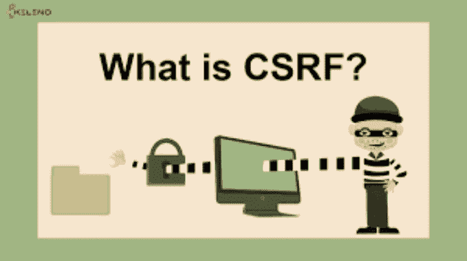
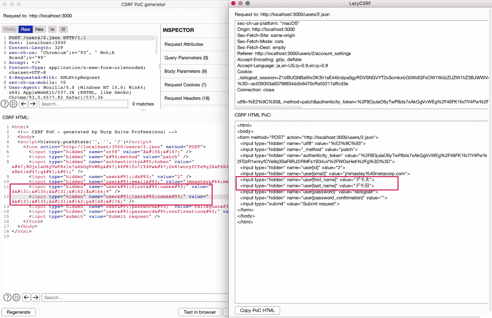
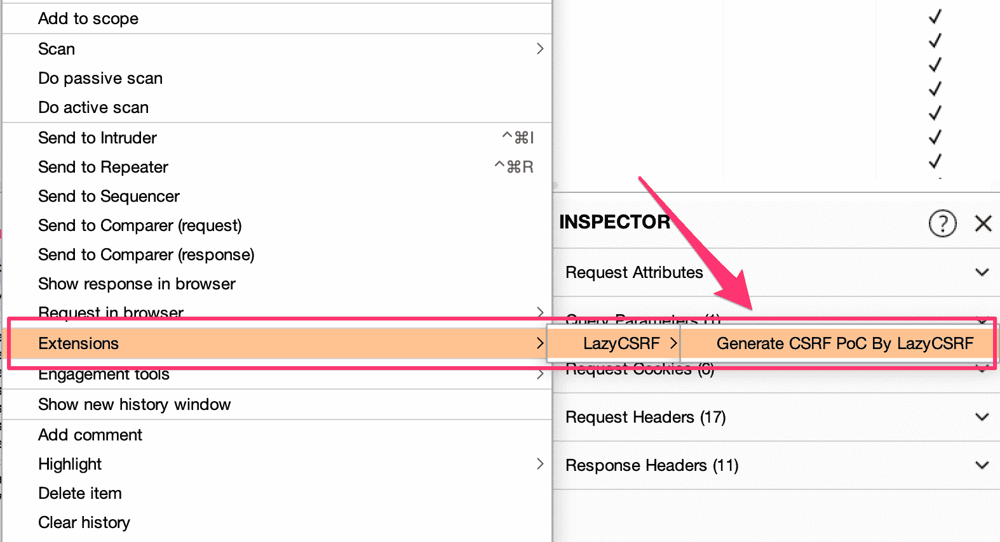

# lazycsrf 更有用的 csrf poco 发生器

> 原文：<https://kalilinuxtutorials.com/lazycsrf/>

LazyCSRF 是一个更有用的 CSRF PoC 生成器，它运行在 Burp Suite 上。

**动机**

Burp Suite 是一个拦截 HTTP 代理，它实际上是执行 web 应用程序安全测试的工具。我最喜欢的 Burp Suite 的特点是`**Generate CSRF PoC**`。但是，自动确定请求内容的功能被破坏了，它会尝试使用`**form**`生成 PoC，即使对于不能用`**form**`表示的 PoC，比如使用 JSON 作为参数或 PUT 请求的情况。此外，可以在 Burp Suite 本身中显示的多字节字符在生成的 CSRF PoC 中经常出现乱码。这些就是创建 LazyCSRF 的动机。

**特色**

*   使用 XMLHttpRequest 自动切换到 PoC
    *   如果参数是 JSON
    *   如果请求是上传/修补/删除
*   支持显示多字节字符(如日语)
*   用 Burp Suite Community Edition 生成 CSRF PoC(当然，它在 Professional Edition 中也有效)

**多字节字符显示差异**

下图显示了 Burp 的 CSRF PoC 生成器和 LazyCSRF 在多字节字符显示方面的差异。LazyCSRF 可以为 CSRF 生成 PoC，而不会混淆多字节字符。只有在 Burp Suite 上的字符没有出现乱码的情况下才会出现这种情况。

**安装**

从 GitHub 发行版下载 JAR。在 Burp Suite 中，转到 Extender 选项卡中的 Extensions 选项卡，并添加一个新的扩展。选择扩展类型`**Java**`，并指定 JAR 的位置。

**用法**

右键单击 Burp Suite，从打开的菜单中选择**`Extensions`->-`LazyCSRF`->`Generate CSRF PoC By LazyCSRF`**，即可生成 CSRF PoC。

**如何建造**

**intellij**

如果用 IntelliJ 的思路，可以按照**`Build`->-`Build Artifacts`->->-`Build`来构建。**

**命令行**

可以用 maven 来构建。

[**Download**](https://github.com/tkmru/lazyCSRF)