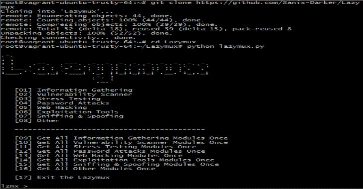

# Lazymux:众多黑客和笔测试工具的庞大列表

> 原文：<https://kalilinuxtutorials.com/lazymux/>

**Lazymux** 工具安装程序非常好用，只提供给懒惰的 termux 用户；这是许多黑客工具和笔测试的庞大列表！

**注:**我对本项目的不良使用不负任何责任。

**要求**

Linux 环境
Python 2 . x
git

**安装&使用 Lazymux**

git 克隆 https://github . com/gameye 98/lazy yms
CD lazy yms
python 2 lazy yms . py
or
python lazy yms . py

**作者:** [Gameye98](https://github.com/Gameye98)

[**Download**](https://github.com/Sanix-Darker/Lazymux)