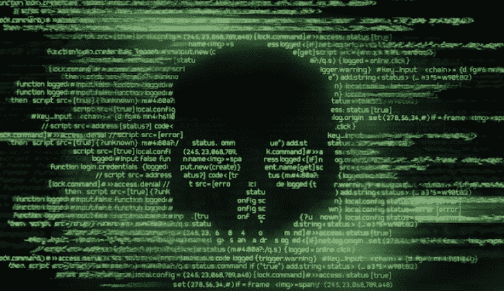

# lazy sign——使用 Windows 二进制文件和 Bat 文件的力量为二进制文件创建假证书

> 原文：<https://kalilinuxtutorials.com/lazysign/>

使用 windows 二进制文件和 bat 文件的力量为二进制文件创建假证书

多年来，已经发布了几个很酷的工具，它们能够窃取或伪造二进制文件的假签名。然而，所有这些工具都有额外的依赖项，需要 Go、python、…

这个回购给你一个机会，假签署 0 额外的依赖，所有使用的二进制文件是微软自己的开发包的一部分。我冒昧地写了一个 bat 文件，让事情变得简单。

所以，如果你像我一样懒，就克隆 git，运行 bat，按照说明操作，享受你的新的假签名二进制文件。经过一些调整，它甚至可以用于使用有效证书进行签名。

[**Download**](https://github.com/jfmaes/LazySign)