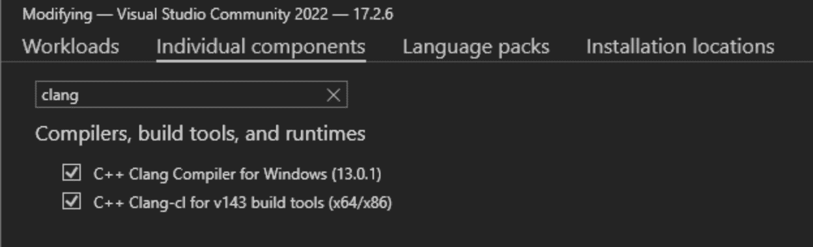
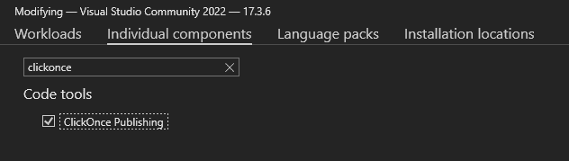

# lazzy:shell code Loader，使用不同的开源库开发，演示了不同的执行技术

> 原文：<https://kalilinuxtutorials.com/lazzzy/>

[](https://blogger.googleusercontent.com/img/b/R29vZ2xl/AVvXsEiIb7zkLuBaCpoxHOQVpN6A9PZ_BUjk3VBKHHszmxq6JsmjWHEsH8-uhhB91yRN2OhB6uRGRyrTQ2llNk4GJ4G-yy9lS69OrNXRf-97k9m_vFDSv1JctF7s9pvaS_vUqkuuAEesTAAD__sydbXJu5QOWpfVytT0XwCaXHNIOzYmVFih7D19WXbqVMHp/s1248/laZzzy(1).png)

lazzy 是一个外壳代码加载器，展示了恶意软件通常采用的不同执行技术。laZzzy 是使用不同的开源头文件库开发的。

## 特性

*   直接系统调用和本机(`Nt*`)函数(不是所有函数，而是大部分)
*   导入地址表(IAT)规避
*   加密有效负载(XOR 和 AES)
    *   随机生成的密钥
    *   用 NOPS ( `\x90`)自动填充有效载荷(如有必要)
    *   有效负载的逐字节内存解密
*   异或加密字符串
*   PPID 欺骗
*   阻止非 Microsoft 签名的 dll
*   (可选)PE 图标和属性的克隆
*   (可选)使用假冒证书进行代码签名

## 如何使用？

#### **要求**:

*   Windows 机器 w/ Visual Studio 和以下组件，可从 *`Visual Studio Installer` > `Individual Components`* 安装:
    *   `C++ Clang Compiler for Windows`和`C++ Clang-cl for build tools`


`ClickOnce Publishing`



*   Python3 和所需的模块:
    *   `python3 -m pip install -r requirements.txt`

## 选择

```
(venv) PS C:\MalDev\laZzzy> python3 .\builder.py -h

⠀⠀⠀⠀⠀⠀⠀⠀⠀⠀⠀⠀⠀⠀⠀⠀⠀⠀⠀⠀⠀⠀⠀⠀⠀⠀⠀⠀⣀⣀⣀⡀⠀⠀⠀⠀⠀⠀⠀⠀⠀⠀⠀⠀⠀⠀⠀⠀⠀⠀⠀⠀⠀⠀⠀⠀
⠀⠀⣿⣿⠀⠀⠀⠀⠀⠀⠀⠀⠀⠀⠀⠀⠀⠀⠀⠀⠀⠀⣠⣤⣤⣤⣤⠀⢀⣼⠟⠀⠀⠀⠀⠀⠀⠀⠀⠀⠀⠀⠀⠀⠀⠀⠀⠀⠀⠀⠀⠀⠀⠀⠀⠀
⠀⠀⣿⣿⠀⠀⠀⠀⢀⣀⣀⡀⠀⠀⠀⢀⣀⣀⣀⣀⣀⡀⠀⢀⣼⡿⠁⠀⠛⠛⠒⠒⢀⣀⡀⠀⠀⠀⣀⡀⠀⠀⠀⠀⠀⠀⠀⠀⠀⠀⠀⠀⠀⠀⠀⠀
⠀⠀⣿⣿⠀⠀⣰⣾⠟⠋⠙⢻⣿⠀⠀⠛⠛⢛⣿⣿⠏⠀⣠⣿⣯⣤⣤⠄⠀⠀⠀⠀⠈⢿⣷⡀⠀⣰⣿⠃⠀⠀⠀⠀⠀⠀⠀⠀⠀⠀⠀⠀⠀⠀⠀⠀
⠀⠀⣿⣿⠀⠀⣿⣯⠀⠀⠀⢸⣿⠀⠀⠀⣠⣿⡟⠁⠀⠀⠀⠀⠀⠀⠀⠀⠀⠀⠀⠀⠀⠈⢿⣧⣰⣿⠃⠀⠀⠀⠀⠀⠀⠀⠀⠀⠀⠀⠀⠀⠀⠀⠀⠀
⠀⠀⣿⣿⠀⠀⠙⠿⣷⣦⣴⢿⣿⠄⢀⣾⣿⣿⣶⣶⣶⠆⠀⠀⠀⠀⠀⠀⠀⠀⠀⠀⠀⠀⠘⣿⡿⠃⠀⠀⠀⠀⠀⠀⠀⠀⠀⠀⠀⠀⠀⠀⠀⠀⠀⠀
⠀⠀⠀⠀⠀⠀⠀⠀⠀⠀⠀⠀⠀⠀⠀⠀⠀⠀⠀⠀⠀⠀⠀⠀⠀⠀⠀⠀⠀⠀⠀⠀⠀⠀⣼⡿⠁⠀⠀⠀⠀⠀⠀⠀⠀⠀⠀⠀⠀⠀⠀⠀⠀⠀⠀⠀
⠀⠀by: CaptMeelo⠀⠀⠀⠀⠀⠀⠀⠀⠀⠀⠀⠀⠀⠀⠀⠀⠀⠀⠀⠈⠉⠁⠀⠀⠀

usage: builder.py [-h] -s  -p  -m  [-tp] [-sp] [-pp] [-b] [-d]

options:
  -h, --help  show this help message and exit
  -s          path to raw shellcode
  -p          password
  -m          shellcode execution method (e.g. 1)
  -tp         process to inject (e.g. svchost.exe)
  -sp         process to spawn (e.g. C:\\Windows\\System32\\RuntimeBroker.exe)
  -pp         parent process to spoof (e.g. explorer.exe)
  -b          binary to spoof metadata (e.g. C:\\Windows\\System32\\RuntimeBroker.exe)
  -d          domain to spoof (e.g. www.microsoft.com)

shellcode execution method:
   1          Early-bird APC Queue (requires sacrificial proces)
   2          Thread Hijacking (requires sacrificial proces)
   3          KernelCallbackTable (requires sacrificial process that has GUI)
   4          Section View Mapping
   5          Thread Suspension
   6          LineDDA Callback
   7          EnumSystemGeoID Callback
   8          FLS Callback
   9          SetTimer
   10         Clipboard
```

## 例子

执行`builder.py`并提供必要的数据。

```
(venv) PS C:\MalDev\laZzzy> python3 .\builder.py -s .\calc.bin -p CaptMeelo -m 1 -pp explorer.exe -sp C:\\Windows\\System32\\notepad.exe -d www.microsoft.com -b C:\\Windows\\System32\\mmc.exe

⠀⠀⠀⠀⠀⠀⠀⠀⠀⠀⠀⠀⠀⠀⠀⠀⠀⠀⠀⠀⠀⠀⠀⠀⠀⠀⠀⠀⣀⣀⣀⡀⠀⠀⠀⠀⠀⠀⠀⠀⠀⠀⠀⠀⠀⠀⠀⠀⠀⠀⠀⠀⠀⠀⠀⠀
⠀⠀⣿⣿⠀⠀⠀⠀⠀⠀⠀⠀⠀⠀⠀⠀⠀⠀⠀⠀⠀⠀⣠⣤⣤⣤⣤⠀⢀⣼⠟⠀⠀⠀⠀⠀⠀⠀⠀⠀⠀⠀⠀⠀⠀⠀⠀⠀⠀⠀⠀⠀⠀⠀⠀⠀
⠀⠀⣿⣿⠀⠀⠀⠀⢀⣀⣀⡀⠀⠀⠀⢀⣀⣀⣀⣀⣀⡀⠀⢀⣼⡿⠁⠀⠛⠛⠒⠒⢀⣀⡀⠀⠀⠀⣀⡀⠀⠀⠀⠀⠀⠀⠀⠀⠀⠀⠀⠀⠀⠀⠀⠀
⠀⠀⣿⣿⠀⠀⣰⣾⠟⠋⠙⢻⣿⠀⠀⠛⠛⢛⣿⣿⠏⠀⣠⣿⣯⣤⣤⠄⠀⠀⠀⠀⠈⢿⣷⡀⠀⣰⣿⠃⠀⠀⠀⠀⠀⠀⠀⠀⠀⠀⠀⠀⠀⠀⠀⠀
⠀⠀⣿⣿⠀⠀⣿⣯⠀⠀⠀⢸⣿⠀⠀⠀⣠⣿⡟⠁⠀⠀⠀⠀⠀⠀⠀⠀⠀⠀⠀⠀⠀⠈⢿⣧⣰⣿⠃⠀⠀⠀⠀⠀⠀⠀⠀⠀⠀⠀⠀⠀⠀⠀⠀⠀
⠀⠀⣿⣿⠀⠀⠙⠿⣷⣦⣴⢿⣿⠄⢀⣾⣿⣿⣶⣶⣶⠆⠀⠀⠀⠀⠀⠀⠀⠀⠀⠀⠀⠀⠘⣿⡿⠃⠀⠀⠀⠀⠀⠀⠀⠀⠀⠀⠀⠀⠀⠀⠀⠀⠀⠀
⠀⠀⠀⠀⠀⠀⠀⠀⠀⠀⠀⠀⠀⠀⠀⠀⠀⠀⠀⠀⠀⠀⠀⠀⠀⠀⠀⠀⠀⠀⠀⠀⠀⠀⣼⡿⠁⠀⠀⠀⠀⠀⠀⠀⠀⠀⠀⠀⠀⠀⠀⠀⠀⠀⠀⠀
⠀⠀by: CaptMeelo⠀⠀⠀⠀⠀⠀⠀⠀⠀⠀⠀⠀⠀⠀⠀⠀⠀⠀⠀⠈⠉⠁⠀⠀⠀

[+] XOR-encrypting payload with
        [*] Key:                        d3b666606468293dfa21ce2ff25e86f6

[+] AES-encrypting payload with
        [*] IV:                         f96312f17a1a9919c74b633c5f861fe5
        [*] Key:                        6c9656ed1bc50e1d5d4033479e742b4b8b2a9b2fc81fc081fc649e3fb4424fec

[+] Modifying template using
        [*] Technique:                  Early-bird APC Queue
        [*] Process to inject:          None
        [*] Process to spawn:           C:\\Windows\\System32\\RuntimeBroker.exe
        [*] Parent process to spoof:    svchost.exe

[+] Spoofing metadata
        [*] Binary:                     C:\\Windows\\System32\\RuntimeBroker.exe
        [*] CompanyName:                Microsoft Corporation
        [*] FileDescription:            Runtime Broker
        [*] FileVersion:                10.0.22621.608 (WinBuild.160101.0800)
        [*] InternalName:               RuntimeBroker.exe
        [*] LegalCopyright:             © Microsoft Corporation. All rights reserved.
        [*] OriginalFilename:           RuntimeBroker.exe
        [*] ProductName:                Microsoft® Windows® Operating System
        [*] ProductVersion:             10.0.22621.608

[+] Compiling project
        [*] Compiled executable:        C:\MalDev\laZzzy\loader\x64\Release\laZzzy.exe

[+] Signing binary with spoofed cert
        [*] Domain:                     www.microsoft.com
        [*] Version:                    2
        [*] Serial:                     33:00:59:f8:b6:da:86:89:70:6f:fa:1b:d9:00:00:00:59:f8:b6
        [*] Subject:                    /C=US/ST=WA/L=Redmond/O=Microsoft Corporation/CN=www.microsoft.com
        [*] Issuer:                     /C=US/O=Microsoft Corporation/CN=Microsoft Azure TLS Issuing CA 06
        [*] Not Before:                 October 04 2022
        [*] Not After:                  September 29 2023
        [*] PFX file:                   C:\MalDev\laZzzy\output\www.microsoft.com.pfx

[+] All done!
        [*] Output file:                C:\MalDev\laZzzy\output\RuntimeBroker.exe
```

## 外壳代码执行技术

1.  早起的 APC 队列*(需要牺牲过程)*
2.  线程劫持*(需要牺牲进程)*
3.  KernelCallbackTable *(需要有 GUI 的牺牲进程)*
4.  剖视图映射
5.  线悬挂
6.  LineDDA 回拨
7.  EnumSystemGeoID 回调
8.  光纤本地存储(FLS)回拨
9.  SetTimer
10.  剪贴板

## 笔记

*   仅适用于 **Windows x64**
*   调试只在**释放**模式下工作
*   有时， **KernelCallbackTable** 在第一次运行时不工作，但最终会在以后工作

[Click Here To Download](https://github.com/capt-meelo/laZzzy)