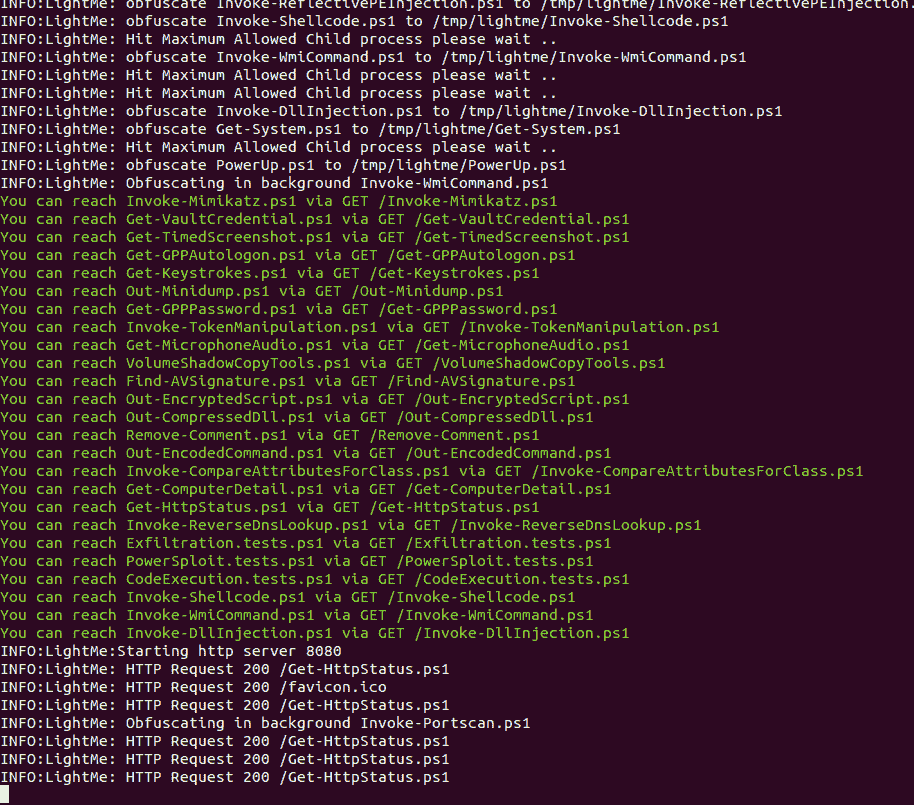

# LightMe : HTTP 服务器提供混淆的 Power shell 脚本/负载

> 原文：<https://kalilinuxtutorials.com/lightme/>

LightMe 是一个简单的 HTTP 服务器，在对 Power shell 脚本/负载进行混淆后提供服务，并在后台作为服务运行混淆，以保持对负载的混淆，从而在每个 HTTP 请求上提供几乎新的混淆负载。

**主要特点**

*   混淆特定目录中的所有 power shell 文件
*   HTTP 服务器来提供混淆的 Power shell 文件
*   背景混淆器
*   几乎每个请求都有新的负载，(取决于`**Background obfuscation interval**`
*   由调用混淆提供支持

**安装**

**git clone–recurse-sub modules https://github.com/WazeHell/LightMe
CD light me/
#安装 powershell
sudo apt-get 安装 powershell**

**使用**

**python 3 light me . py–帮助**

**作为服务运行**

**#安装监督人
sudo apt-get 安装监督人
sudo vim/etc/supervisor/conf . d/light me . conf
#编辑配置
[program:light me _ server]
directory =/light me _ path/
command =/usr/bin/python 3 light me . py-path/PowerSploitOrWhatever/
num procs = 1
user = your username
auto start = true
auto restart = trueUTF-8，LC_ALL=en_US。UTF-8
#运行
须藤服务监督重启
须藤监督重读
须藤监督更新
须藤监督重启全部**

[**Download**](https://github.com/WazeHell/LightMe)