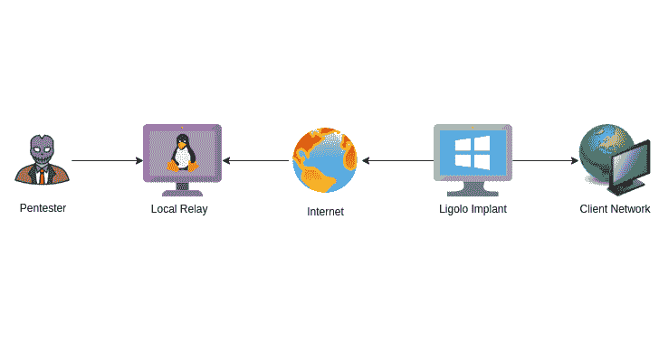
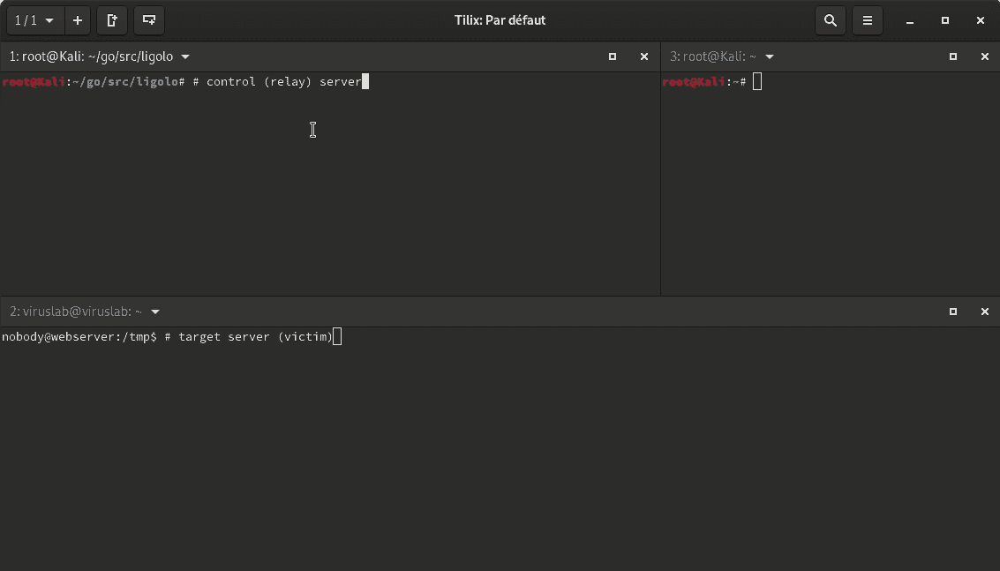
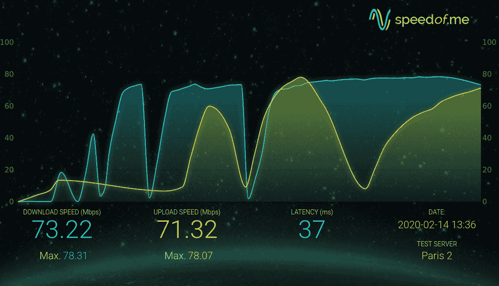

# Ligolo:反向隧道使 Pentesters 变得容易

> 原文：<https://kalilinuxtutorials.com/ligolo/>

**Ligolo** 是一款*简易*和*轻型*工具，用于在完全安全的情况下从反向连接建立 *SOCKS5* 或 *TCP* 隧道(带椭圆曲线的 TLS 证书)。

和 Autoroute + Socks4a 的 Meterpreter 不相上下，但是更稳定更快。

**用例**

在外部审计期间，您的 Windows / Linux / Mac 服务器遭到破坏。该服务器位于局域网内，您想与该网络上的其他机器建立连接。

它可以建立一个隧道来访问内部服务器的资源。

**快速演示**

使用代理链(WAN)中继 RDP 连接。

**性能**

下面是两台 100mb/s 主机之间的速度测试截图(ligolo / localrelay)。性能可能因系统和网络配置而异。

**用途**

**设置/编译**

确保 *Go* 已安装并正常工作。

*   获取 Ligolo 和依赖项

**CD ' go env gopath `/src
git 克隆 https://github . com/sys dream/ligolo
CD ligolo
make dep**

2.  生成自签名 TLS 证书(将放在 *certs* 文件夹中)

**制作证书 TLS_HOST=example.com**

注意:当调用*构建*时，您也可以通过使用`**TLS_CERT**` make 选项来使用您自己的证书。例如: **`make build-all TLS_CERT=certs/mycert.pem`。**

3.  建设

*   3.1.对于所有架构

**进行全部构建**

*   3.2.(或)对于当前架构

**进行构建**

**如何使用？**

Ligolo 由两个模块组成:

*   本地中继
*   利戈戈

Localrelay 旨在控制服务器(攻击者服务器)上启动。

它是在目标计算机上运行的程序。

对于 localrelay，您可以保留默认选项。它将监听端口 5555 上的每个接口，并等待来自 ligolo ( `-relayserver`参数)的连接。

对于 ligolo，您必须使用`-relayserver ip:port`参数指定中继服务器(或您的攻击服务器)的 IP 地址。

您可以使用`-h`选项寻求帮助。

一旦在 *Ligolo* 和 *LocalRelay* 之间建立了连接，一个 *SOCKS5* 代理将在中继服务器上的 TCP 端口`1080`上建立(您可以使用 *-localserver* 选项更改 TCP 地址/端口)。

之后，你所要做的就是使用你最喜欢的工具(比如 Proxychains)，探索客户的局域网。

**TL；博士**

在你的攻击服务器上。

。/bin/localrelay_linux_amd64

在受损主机上。

> ligolo _ windows _ amd64 . exe-relay server localrayserver:5555

建立连接后，在 ProxyChains 配置文件(在攻击服务器上)中设置以下参数:

[代理列表]
#在此添加代理……
# mean wile
#默认设置为“tor”
socks 5 127 . 0 . 0 . 1 1080

利润。

$ proxy chains nmap-sT 10 . 0 . 0 . 0/24-p 80-Pn-A

**选项**

本地中继选项:

**local relay 的用法:**
-certfile 字符串
**TLS 服务器证书(默认为“certs/server . CRT”)**
-keyfile 字符串
**TLS 服务器密钥(默认为“certs/server . key”)**
-local server 字符串
**本地服务器地址(您的 proxychains 参数)(默认为“127 . 0 . 0 . 1:1080”)**
-relay server

选项行:

**ligolo 用法:**
-自动重启
**出现异常时尝试重新连接**
-relayserver 字符串
**中继服务器(回连地址)(默认“127 . 0 . 0 . 1:5555”)**
-Skip verify
**跳过 TLS 证书锁定验证**
-targetserver 字符串
**目的服务器(RDP 客户端，SSH)–未指定时，Ligolo 启动 socks5 代理服务器**

**特性**

*   带 TLS 固定的 TLS 1.3 隧道
*   多平台(Windows / Linux / Mac / …)
*   多路复用(所有流都有一个 TCP 连接)
*   SOCKS5 代理或简单中继

**待办事项**

*   更好的超时处理
*   SOCKS5 UDP 支持
*   实施 MTL

[**Download**](https://github.com/sysdream/ligolo)