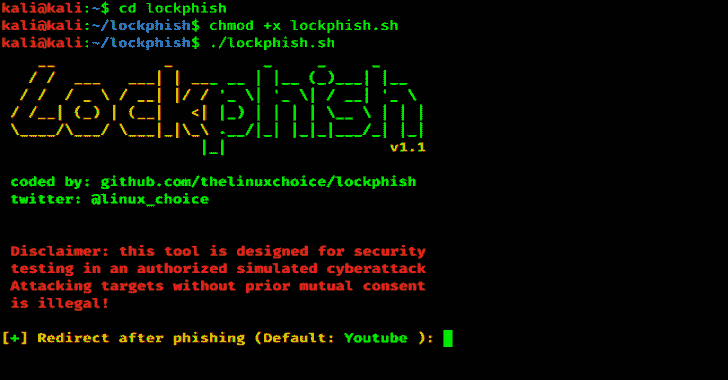

# Lockphish:网络钓鱼攻击的第一个工具

> 原文：<https://kalilinuxtutorials.com/lockphish-2/>

**Lockphish** 这是第一款针对锁屏钓鱼攻击的工具(07/04/2020)，旨在通过 https 链接获取 Windows 凭据、Android PIN 和 iPhone 密码。

**特性**

*   Windows、Android 和 iPhone 的锁屏钓鱼页面
*   自动检测设备
*   通过 Ngrok 进行端口转发
*   IP 跟踪器

**用途**

**git 克隆 https://github.com/kali-linux-tutorial/lockphish
CD lock phish
bash lock phish . sh**

**结论**

这是一个很棒的钓鱼工具，你可以在你的安卓系统和电脑上使用。只需安装 Termux 并遵循使用命令。

**免责声明**

未经双方事先同意，使用 Lockphish 攻击目标是非法的。最终用户有责任遵守所有适用的地方、州和联邦法律。开发人员不承担任何责任，也不对本程序造成的任何误用或损坏负责。

[**Download**](https://github.com/jaykali/lockphish)