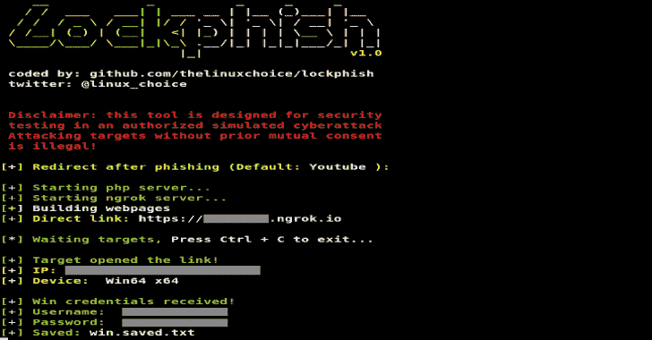

# Lockphish:在锁定屏幕上进行网络钓鱼攻击的工具

> 原文：<https://kalilinuxtutorials.com/lockphish/>

**Lockphish** 这是第一款针对锁屏钓鱼攻击的工具(2020 年 5 月 13 日)，旨在通过 https 链接获取 Windows 凭据、Android PIN 和 iPhone 密码。

**特性**

*   Windows、Android 和 iPhone 的锁屏钓鱼页面
*   自动检测设备
*   通过 Ngrok 进行端口转发
*   IP 跟踪器

**免责声明**

未经双方事先同意，使用 Lockphish 攻击目标是非法的。最终用户有责任遵守所有适用的地方、州和联邦法律。开发人员不承担任何责任，也不对本程序造成的任何误用或损坏负责。

**也读作-[GDBFrontend:简单、灵活&可扩展 GUI 调试器](https://kalilinuxtutorials.com/gdbfrontend/)**

**用途**

**git 克隆 https://github.com/thelinuxchoice/lockphish
CD lock phish
bash lock phish . sh**