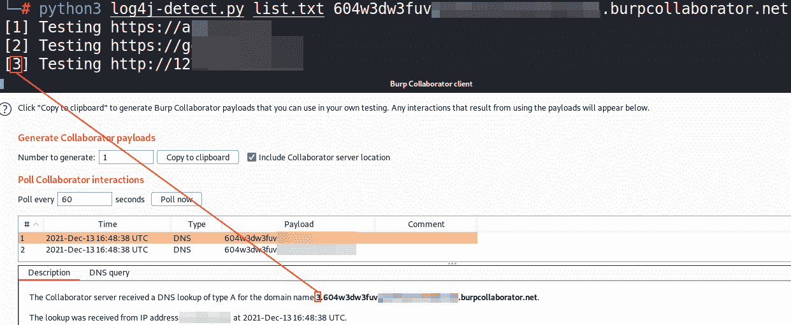

# Log4J-Detect:用多线程检测 URL 列表的“Log4J”Java 库漏洞的脚本

> 原文：<https://kalilinuxtutorials.com/log4j-detect/>

**Log4J-Detect** 是 Python 3 开发的一个脚本“log4j-detect.py ”,负责检测一个 URL 列表是否容易受到 CVE-2021-44228 的攻击。

为此，它使用线程(更高的性能)向指定列表中的每个 URL 发送 GET 请求。GET 请求包含一个有效负载，该负载在成功时向 Burp Collaborator / interactsh 返回一个 DNS 请求。此有效负载在测试参数和“用户代理”/“推荐人”/“X-Forwarded-For”/“身份验证”标头中发送。最后，如果主机易受攻击，Burp Collaborator / interactsh 有效负载的子域前缀和脚本输出中会出现一个标识号，从而可以知道哪个主机通过 DNS 做出了响应。

请注意，该脚本仅处理漏洞的 DNS 检测，并不测试远程命令执行。

**下载 log4j-detect.py**

**wget https://github . com/takito 1812/log4j-detect/raw/main/log4j-detect . py**

**运行 log4j-detect.py**

**python3 log4j-detect.py**

[**Download**](https://github.com/takito1812/log4j-detect)