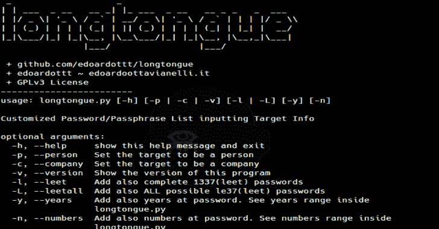

# Longtongue:输入目标信息的自定义密码/口令列表

> 原文：<https://kalilinuxtutorials.com/longtongue/>

**Longtongue** 是输入目标信息的自定义密码/口令列表。

**安装**

**git 克隆 https://github.com/edoardottt/longtongue.git
CD long tongue
python 3 long tongue . py**

**用途**

**用法:**long tongue . py[-h][-p |-c |-v][-L |-L][-y][-n]

**自定义密码/口令列表输入目标信息**

**可选参数:**
【h】，–帮助显示此帮助消息并退出
-p，–个人设置目标为个人
-c，–公司设置目标为公司
-v 查看 longtongue.py
-n 内的年份范围，–数字也在密码处添加数字。请参见 longtongue.py 中的数字范围