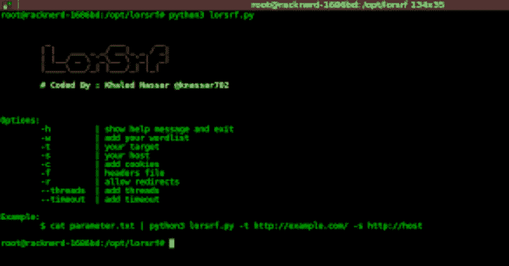
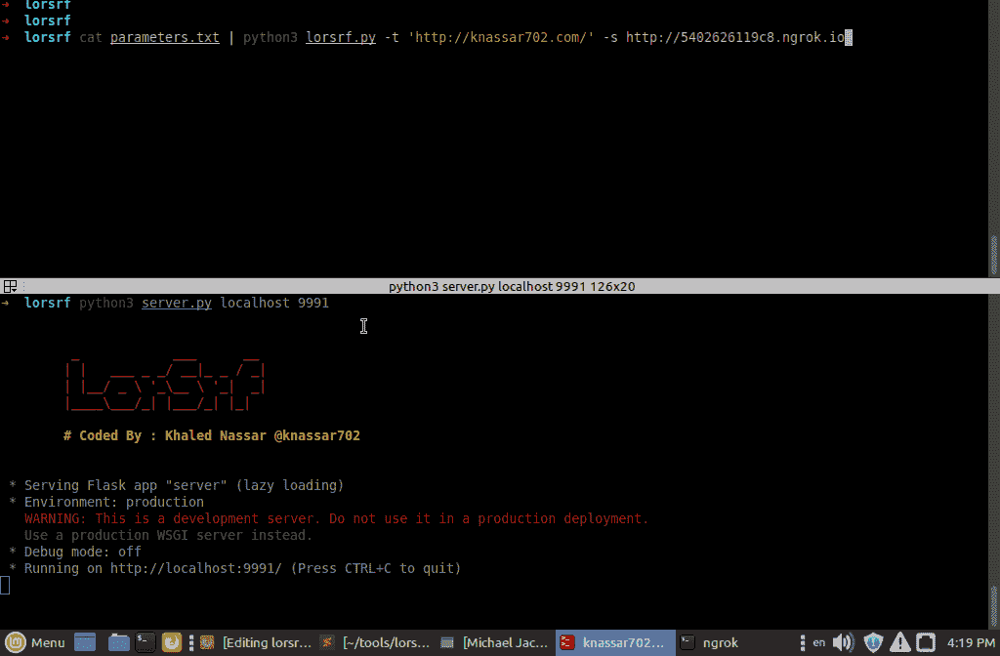

# lorsrf:SSR 参数 bruteforce

> 原文：<https://kalilinuxtutorials.com/lorsrf/>

**Lorsrf** 已经添加到 scant3r 中，增加了有用的功能(多 http 方法、多内容类型(json、query、xml、speed、大型 worlist 等等))。使用`**GET**`和`**POST**`方法强制隐藏参数以发现 SSRF 漏洞

**安装**

*   下载它

**git 克隆 https://github . com/knasar 702/lorsrf
CD lorsrf
sudo pip 3 安装请求 flask**

安装 ngrok 工具

**步骤**

**恩罗克**

*   运行您的 ngrok `**./ngrok http 9090**`
*   运行`**server.py**`脚本并添加 ngrok 端口`**python3 server.py 9090**`
*   运行`l**orsrf.p**y`并使用`**-s**`选项添加 ngrok 主机

**requestbin.com**

*   登录 https://requestbin.com
*   复制您的主机并使用`**-s**`选项添加它(没有`**server.py**`文件)

**怎么用。？**

**cat YOUR _ list . txt | python 3 lor SRF . py-t URL _ TARGET-s YOUR _ HOST-w word list . txt**

**例题**

cat 参数. txt | python 3 lorsrf . py-t http://target . com-s hTTP://53252 . ngok . io

添加线程

**$ cat parameters . txt | python 3 lor SRF . py-t http://target.com-s http://53252 . ngrok . io–threads = 50**

添加超时

**$ cat parameters . txt | python 3 lor SRF . py-t http://target.com-s http://53252 . ngrok . io—**time out = 4

添加 cookies

美元 cat 参数。txt | python 3 lorsrf . py-t http://target . com-s http://53252 . ngok . io-c ' user = 5&phpsetion = 5232’

从文本文件添加标题

$**cat headers . txt
Cookie:test = 1
Auth:Basic TG 9 Yu 3 jmcg = =
$ cat parameters . txt | python 3 lor SRF . py-f headers . txt-s ' http://my host . com '-t ' http://ssrf . hack . com '
GET/？parameter = { YOUR _ HOST } HTTP/1.1
主机:targer.com
Cookie:test = 1
Auth:Basic TG 9 Yu 3 jmcg = =**

跟随重定向

**$ cat parameters . txt | python 3 lor SRF . py-t http://target.com-s http://532**52 . ngrok . io-r

**测试**

**python 3 lor SRF . py-t ' http://test PHP . vulnweb . com/show image . PHP '-s ' https://YOUR _ host . com '-w parameters . txt**

**GIF**

[**Download**](https://github.com/knassar702/lorsrf)