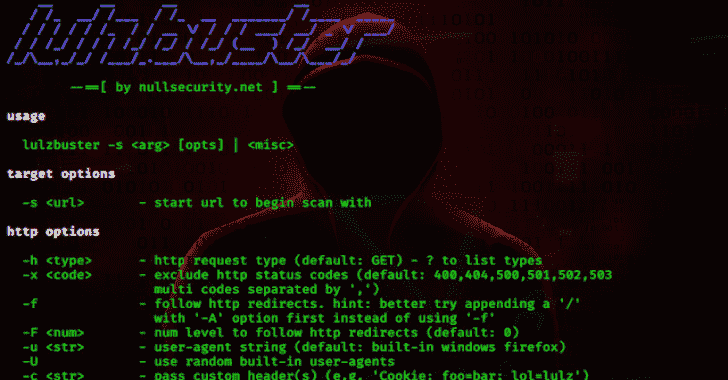

# Lulzbuster:一个非常快速和智能的网络目录

> 原文：<https://kalilinuxtutorials.com/lulzbuster/>

Lulzbuster 是一个非常快速和智能的网络目录和文件枚举工具，用 c 语言编写。

**用途**

$ lulzbuster -H

**用法**
lulzbuster-s【opts】|

**目标选项**
-s–启动 url 开始扫描用

**Http 选项**
-H–Http 请求类型(默认:GET)–？要列出类型
-x–排除 http 状态代码(默认值:400，404，500，501，502，503
用“，”分隔的多个代码)
-f–遵循 http 重定向。提示:最好先尝试在'/'
后面加上'-A '选项，而不是使用'-F '
-F–num level 跟随 http 重定向(默认值:0)
-U–用户代理字符串(默认值:内置 windows Firefox)
-U–使用随机内置用户代理
-c–传递自定义头(例如，' Cookie:foo = bar；lol = lulz ')
-a–http 认证凭证(格式:🙂
-r–开启自动更新 referrer
-j–定义 http 版本(默认:curl 的默认)–？列出

**超时选项**
-D–请求之间延迟的秒数(默认值:0)
-C–连接超时的秒数(默认值:10)
-R–请求超时的秒数(默认值:30)
-T–放弃并完全退出 lulzbuster 的秒数
(默认值:无)

**调优选项**
-T–并发扫描的线程数
注意:该值应该始终等于-t 的值
其他选项
-w–单词列表文件
(默认:/usr/local/share/lulzbuster/lists/medium . txt)
-A–追加任何用逗号分隔的单词(如'/，)。 php，~ bak)
-p–代理地址(格式:://:)–？to
列出支持的方案
-P–代理验证凭证(格式:🙂
-I–不安全模式(跳过 ssl/tls 证书验证)
-S–智能模式，即消除误报、更多信息、
等。(如果速度不是您的第一要务，请使用此选项！)
-n–名称服务器(默认为:' 1.1.1.1，8.8.8，208.67.222.222'
多个由'分隔。)
-l–将找到的路径和有效 URL 记录到文件

**Misc**
-X–打印内置用户代理
-V–打印 lulzbuster 的版本并退出
-H–打印此帮助并退出

**也读作-[pwn drop:自部署文件托管服务](https://kalilinuxtutorials.com/pwndrop/)**

**注释**

*   干净的代码；真实项目
*   lulzbuster 已经打包并可用于 BlackArch Linux
*   我的主枝总是稳定的；开发分支是为当前工作创建的。
*   你能找到的我所有的公开资料都是通过[nullsecurity.net](https://www.nullsecurity.net/)正式宣布和发布的。

**免责声明**

我们在此强调，在[nullsecurity.net](http://nullsecurity.net)上发现的黑客相关内容仅用于教育目的。我们不对任何损坏负责。你要对自己的行为负责。

**贷方:no trix**

[**Download**](https://github.com/noptrix/lulzbuster)