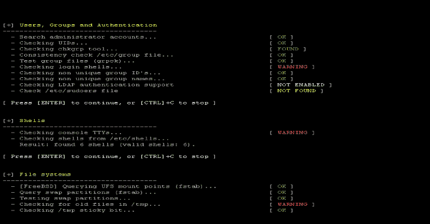

# Lynis:用于 Unix/Linux 系统的安全审计工具

> 原文：<https://kalilinuxtutorials.com/lynis-security-auditing-tool-2/>

Lynis 是一个安全审计工具，适用于 Linux、macOS、BSD、Solaris、AIX 等 UNIX 衍生工具。它会执行深度安全扫描。[点击此处](https://packages.cisofy.com)可获得软件包。

**要求**

Shell 和基本实用程序

**权限**

普通用户或首选根权限

**安装**

**安装** ***通包***

通过包管理器安装该工具是开始使用它的一种选择。对于大多数操作系统和发行版，都有一个端口或包可用。

首先添加我们的[软件库](https://packages.cisofy.com/)。这样，您的系统就可以使用最新版本。

**Red Hat**

这适用于运行 YUM 的系统，包括 CentOS、Fedora、Red Hat Enterprise Linux (RHEL)。

**也可阅读-[利维坦:大范围大规模审计工具包](https://kalilinuxtutorials.com/leviathan/)**

**$ yum 安装 lynis**

Debian

运行 Debian、Linux Mint、Ubuntu 或的系统是基于其中的一个。

**$ apt-get 安装 lynis**

**openSUSE**

**$ zyker 安装 lynis**

**通过 Git 安装**

**克隆项目**

第一步是克隆项目。在此之前，请选择父目录。Git 将创建一个子目录，其中包含完整的程序。

**$ cd /usr/local**

$ git 克隆 https://github.com/CISOfy/lynis
克隆成‘lynis’……
远程:计数对象:1733，完成。
远程:压缩对象:100% (8/8)，完成。
远程:总计 1733 (delta 3)，复用 0 (delta 0)，打包复用 1725
接收对象:100% (1733/1733)，886.18 KiB | 378.00 KiB/秒，完成。
解决增量:100% (1204/1204)，完成。
检查连接…完成。

**$ cd lynis**

就是这样。运行第一次安全审计的时间:

**$ lynis 审计系统**

虽然不需要进行配置，但是有一些有用的命令需要学习。

**通过直接下载安装**

*   **创建目录**

它可以从每个目录启动。因此，选择一个您想要存储工具的目录。出于示例目的，我们使用/usr/local/lynis，因为/usr/local 目录存在于大多数发行版中。

**$ mkdir-p/usr/local/lynis
$ CD/usr/local**

*   **下载**

下一步是将该工具的最新版本下载到/usr/local 目录中。在这个方法中，我们使用压缩的 tarball，它是所有文件的存档。

转到工具[下载页面](https://cisofy.com/downloads/lynis/)。将链接复制到 tarball(以 tar.gz 结尾)。

将此链接与 wget(通常默认安装)一起使用。macOS 用户可以使用 curl 工具，而 BSD 用户可以使用 fetch。

**wget https://cisofy . com/files/lynis . tar . gz**

或者

**curl https://cisofy . com/files/lynis .–tar . gz-o lynis . tar . gz**

*   **打开 tarball 的包装**

**【tar xfvz lynis .】tar . gz**

**通过自制软件安装**

对于 macOS 的用户来说，Homebrew 可以作为手动安装和使用 Git 的替代方案。

**$ brew 安装 lynis**

用家酿安装好之后，就是第一次运行的时候了。

**运行中**

如果该工具是通过软件包或自制软件安装的，您可以从任何目录运行它。

对于其他方法，请确保您位于正确的目录中，并添加'./'放在命令前面，比如:

**$。/lynis**

它可以在没有任何预配置的情况下运行。配置和微调是可能的，将在后面的章节中介绍。现在，我们将运行基本扫描:

**$ lynis 审计系统**

**Lynis 又停顿了一下**

默认情况下，它在第一部分之后开始并暂停。用 CTRL+C 你可以停止程序。按 ENTER 键，将继续下一组测试。如果我们想不停顿地运行它，我们可以给它一个附加参数:–quick。这将启用“快速”选项，非常适合在你做其他事情的时候运行它。

**$ lynis 审计系统–快速**

**特性**

它是安全审计工具，适用于 Unix、Linux 和 macOS 系统。世界各地的系统管理员、审计员和安全专家都在使用它。一些功能包括:

**基础知识**

*   开放源码
*   命令过程
*   没有依赖关系
*   容易理解

**支持**

*   动态操作系统检测
*   300 多项内置测试
*   支持自定义测试
*   插件支持
*   符合性检查
*   广泛的软件支持

**报告**

*   屏幕上的报告和报告文件中的详细信息
*   警告和建议的报告
*   详细记录
*   硬化指数

[**Download**](https://cisofy.com/downloads/lynis/)