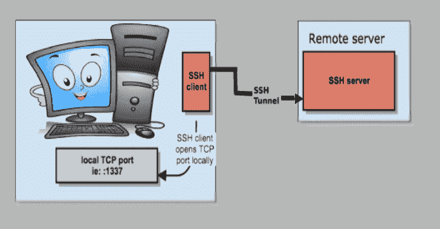

# 马洛里:SSH 上的 HTTP/HTTPS 代理

> 原文：<https://kalilinuxtutorials.com/mallory-http-https-proxy-over-ssh/>

马洛里是一个基于 SSH 的 HTTP/HTTPS 代理工具。

**安装**

*   本地机器:`**go get github.com/justmao945/mallory/cmd/mallory**`
*   远程服务器:需要我们的老朋友 sshd

**配置**

**配置文件**

默认路径是`**$HOME/.config/mallory.json**`，可以在启动程序时设置

**mallory-config path/to/config . JSON**

**内容:**

*   `**id_rsa**`是我们私钥文件的路径，可以由`ssh-keygen`生成
*   `**local_smart**`是为 HTTP 代理提供目的主机智能检测的本地地址
*   `**local_normal**`与`**local_smart**`类似，但通过远程 SSH 服务器发送所有流量，而不检测目的主机
*   `**remote**`是 SSH 服务器的远程地址
*   `**blocked**`是需要使用代理的域的列表，任何其他域将直接连接到它们的服务器

**又读-[dr Memory:Windows、Linux、Mac 的内存调试器&安卓](https://kalilinuxtutorials.com/drmemory-memory-debugger-windows-linux-mac-android/)**

{
"id_rsa": "$HOME/。ssh/id_rsa "、
" local _ smart ":" 1315 "、
" local _ normal ":" 1316 "、
" remote ":" ssh://user @ VM . me:22 "、
" blocked ":[
" angularjs . org "、
"golang.org "、
"google.com "、
"google.co.jp "、
"googleapis.com "

配置文件中的阻止列表将在更新时自动重新加载，您可以手动进行:

**#发送信号重新加载**
kill-usr 2
**#或者通过发送 http 请求使用重新加载命令**
mallory -reload

**系统配置**

*   将 HTTP 和 HTTPS 代理都设置为端口为`**1315**`的`**localhost**`，以用于阻止列表
*   为终端使用将环境变量`**http_proxy**`和`**https_proxy**`设置为`**localhost:1316**`

**获得域名的正确后缀名称**

**马洛里-后缀 www.google.com**

**给定端口**转发所有流量的简单命令

**# install it:go get github.com/justmao945/mallory/cmd/forward** 
**#所有通过端口 20022 的流量将被转发到 destination.com:22**
forward-network TCP-listen:20022-forward destination.com:22

**#你可以 ssh 到目的地:22 through localhost:20022** ssh root @ localhost-p 20022

[**Download**](https://github.com/justmao945/mallory)