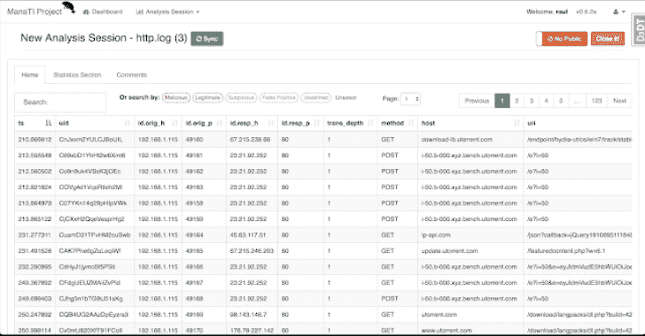

# Manati:一个基于网络的工具，用于帮助直观的威胁分析人员的工作

> 原文：<https://kalilinuxtutorials.com/manati-intuitive-threat-analysts/>

ManaTI 项目的目标是开发机器学习技术，以帮助直观的威胁分析师加快发现新的安全问题。机器学习将通过发现新的关系和推论来促进分析。

该项目将包括开发一个 web 界面，供分析师与数据和机器学习输出进行交互。该项目由思科系统公司提供部分支持。有关该项目的更多信息，请访问[同温层实验室](https://www.stratosphereips.org/projects-manati/)页面。

**安装**

ManaTI 是一个 Django 项目，有一个 Postgres 数据库，可以在 Linux 和 MacOS 上运行。我们建议使用 virtualenv 环境来设置它。linux 的安装步骤是:

sudo apt-get 更新；sudo apt-get 升级-y

*   克隆存储库

git 克隆 git@github.com:平流层/manati . git；马纳提 cd

或者，如果您不想使用 SSH，请使用 HTTPS

git 克隆 https://github . com/平流层 PS/manati . git；马纳提 cd

*   安装 Virtualenv 来隔离 ManaTI 所需的 python 库，也将安装 python 库进行开发

sudo apt-get install virtualenv python-pip python-dev libpq-dev build-essential libssl-dev libffi-dev

*   创建虚拟文件夹

virtualenv。vmanati

*   主动虚拟

来源。vmanati/bin/activate

*   安装 PostgreSQL 数据库引擎

sudo apt-get 安装 PostgreSQL-server-dev-all PostgreSQL-9.5

*   创建环境变量文件。将文件 **.env.example** 复制并重命名为**。包络**，和**。环境示例**至**。环境码头**

cp .env.example。env〔t0〕CP。env dock . example。env 坞站

**OPTIONAL**

如果需要，您可以修改数据库的密码和名称。请记住，在下面的 Postgres 数据库设置中反映更改。

*   安装所需的 python 库

pip install -r 要求/local.txt

*   启动 postgresql

sudo/etc/init . d/PostgreSQL start

**配置数据库**

*   作为 root:(安装数据库后应该有一个用户 postgres)

**苏–postgres**

*   创建数据库:

psql
用密码‘password’创建用户 manati _ db _ user
创建数据库 manati _ db
将数据库 manati_db 上的所有权限授予 manati _ db _ user
改变角色 manati _ db _ user create role create db；
CTRL-D(输出 postgres db shell)

**也读作-[subsh:在线子域检测脚本](https://kalilinuxtutorials.com/sub-sh-online-subdomain-detect-script/)**

可选择的

要更改 postgres 用户的默认密码(如果需要，您可以输入相同的密码)，如果您想将 pgAdmin3-4 用作 postgres 客户端，这是一个特别好的主意。记住不要退出“sudo–postgres”

psql
\密码；
CTRL-D(输出 postgres db shell)

**如何运行它**

不建议以 root 用户身份运行服务器，但是因为只有 root 用户可以打开小于 1024 的端口号，所以使用哪个用户由您决定。默认情况下，它打开端口 8000，因此您可以以 root 用户身份运行它:

**python。/manage.py runserver**

在此之后，只需在[http://localhost:8000/manati _ project/manati _ ui](http://localhost:8000/manati_project/manati_ui)中打开你的浏览器

如果您想在网络中打开服务器，您可以使用:

python。/manage.py runserver :8000

如果您想查看正在运行或排队的作业，请转到[http://localhost:8000/manati _ project/django-rq/](http://localhost:8000/manati_project/django-rq/)

**投入生产**

使用 surpevisor，gunicorn 作为服务器与 RQ worker(与 redis 服务器)一起处理后台任务。未来我们计划为 nginx 准备设置

**CD path/to/project _ directory
python manage . py collect static–no input–clear
sudo supervisord-c supervisor-manati . conf-n**

**Docker 图像**

如果你已经安装了 docker，也许安装 ManaTI docker 镜像是个好主意。docker 文件和服务器配置文件在这里。这个 ManaTI docker 映像在服务器 NGINX 和 uWSGI 上执行。本图由@Piuliss 维护

**docker pull honeyjack/manati:最新
docker run–name manati-p 8888:8888-DTI honey jack/manati:最新 bash**

然后，等待 5 或 10 秒钟，并转到 [http://localhost:8888](http://localhost:8888)

**Docker 作曲家**

如果你不想浪费时间安装 ManaTI，并且你已经安装了 docker，你可以执行 docker-compose。首先克隆存储库并转到目录项目。

**cd Manati
cp .env.example。环境
cp。env-docker.exampleenv-docker
docker-compose build
docker-compose run web bash-c " python manage . py make migrations–no input；python manage.py 迁移；python manage . py check _ external _ modules "
docker-compose run web bash-c " python manage . py create super user 2–username admin–password password 123–no input–email ' admin @ manait project . com ' "
docker-compose up #或' docker-compose up -d '如果您不想在控制台中看到日志，**

在此之后，只需在[http://localhost:8000/manati _ project/manati _ ui/new](http://localhost:8000/manati_project/manati_ui/new)中打开你的浏览器

[**Download**](https://github.com/stratosphereips/Manati)