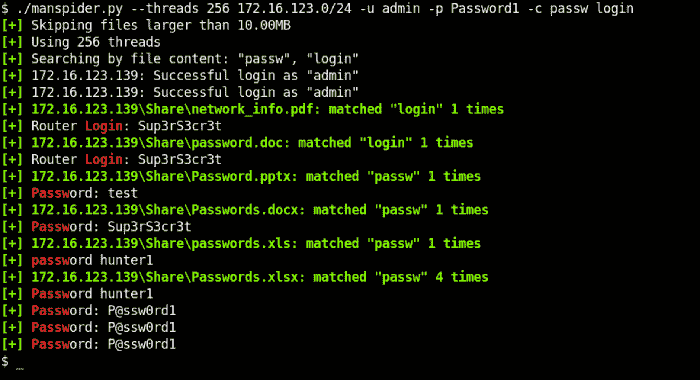

# MANSPIDER:蜘蛛整个网络的多汁文件坐在中小企业的股份。搜索文件名或文件内容-支持正则表达式！

> 原文：<https://kalilinuxtutorials.com/manspider/>

**MANSPIDER** 将抓取每个目标系统上的每个共享。如果提供的凭证不起作用，它将退回到“guest ”,然后进入空会话。

**支持的文件类型**

*   `**PDF**`
*   `**DOCX**`
*   `**XLSX**`
*   `**PPTX**`
*   任何基于文本的格式
*   还有更多！！

**安装**

安装这些依赖项以添加额外的文件解析功能:

**#for images (png，jpeg)
$ sudo 安装 tessera CT tessera CT-data-eng
# for legacy document support(。doc)
$ sudo 安装 antiword**

安装 manspider(请耐心等待，这可能需要一段时间):

**$ pip 安装 pipx
$ pipx 安装人蜘蛛**

**示例#1:在网络中搜索可能包含凭证的文件名**

注意:匹配的文件会自动下载到`**$HOME/.manspider/loot**`！(`**-n**`禁用)

**$ man spider 192 . 168 . 0 . 0/24-f passw 用户管理帐户网络登录登录 cred-d evil corp-u bob-p passw 0 rd**

**示例#2:搜索包含“密码”的 XLSX 文件**

**$ man spider share . evil corp . local-c password-e xlsx-d evil corp-u bob-p pass w0 rd**

**示例#3:搜索感兴趣的文件扩展名**

**$ man spider share . evil corp . local-e bat com VBS PS1 PS D1 PS m1 PEM key RSA pub reg txt CFG conf config-d evil corp-u bob-p Passw0rd**

**示例#4:搜索财务相关文件**

本示例在发音清晰的目录中搜索包含 5 个或更多连续数字的文件名(**如`000202006.EFT`** )

**$ man spider share . evil corp . local–dirnames bank financ payable payment 对账汇款凭证供应商 eft swift -f '[0-9]{5，}' -d evilcorp -u bob -p Passw0rd**

**示例#5:搜索证书**

**$ man spider share . evil corp . local-e pfx p12 pkcs12 PEM key CRT cer CSR jks keystore key key der-d evil corp-u bob-p pass w0 rd**

**用法提示#1**

您可以一次运行多个 manspider 实例。当一个实例已经在运行，并且您想要搜索它下载的内容时，这很有用(类似于`**grep -R**`)。为此，指定关键字`**loot**`作为目标，它将在`**$HOME/.manspider/loot**`中搜索下载的文件。

**用法提示 2**

合理的默认值有助于防止出现不必要的情况，比如陷入单一目标。所有这些都可以被覆盖:

*   **默认蜘蛛深度:10** (用 **`-m`** 覆盖)
*   **默认最大文件大小:10MB** (用`**-s**`覆盖)
*   **默认螺纹:5 个**(用`**-t**`覆盖)
*   **不包括的股份:`C$`、`IPC$`、`ADMIN$`、`PRINT$`、**(用`**--exclude-sharenames**`覆盖)

**用法提示 3**

Manspider 接受以下任何组合作为目标:

*   inchespersecond 每秒英寸数
*   主机名
*   子网(CIDR 格式)
*   包含上述任何内容的文件
*   包含文件的本地文件夹

例如，您可以指定以下任意或所有选项:

*   **T2`192.168.1.250`**
*   **T2`share.evilcorp.local`**
*   **T2`192.168.1.0/24`**
*   **T2`smb_hosts.txt`**
*   **`loot`** (搜索已经下载的文件)
*   **`/mnt/share`** (递归搜索一个目录)
    *   **注意**:搜索本地文件时，必须指定一个目录，而不是单个文件

**用途**

**用法:manspider[-H][-u USERNAME][-d DOMAIN][-m max depth][-H HASH][-t THREADS][-f REGEX[REGEX…]][-e EXT[EXT…]][–exclude-extensions EXT[EXT…]]
[-c REGEX[REGEX…]][–sharenames SHARE[SHARE…]][–exclude-sharenames[SHARE…]][–dirnames DIR[DIR…]]][–exclude-dirnames DIR 匹配的文件和日志存储在$HOME/.manspider 中。所有过滤器都不区分大小写。
位置参数:
将 IP、主机名、CIDR 范围或包含目标的文件作为目标进行搜索(注意:也支持本地搜索，指定目录名或关键字“loot”以搜索
下载的文件)
0 可选参数:
-h，–help 显示此帮助消息并退出
-u USERNAME，–USERNAME USERNAME
用于身份验证的用户名
-p PASSWORD，–PASSWORD PASSWORD
用于身份验证的密码
-d DOMAIN，–DOMAIN DOMAIN 域域
用于 –max depth max depth
到 spider 的最大深度(默认值:10)
-H HASH，–HASH HASH 用于身份验证的 NTLM HASH
-t THREADS，–THREADS
并发线程(默认值:5)
-f REGEX [REGEX …]，–filenames REGEX[REGEX…]
使用 REGEX(空格分隔)
-e EXT [EXT …]，–extensions EXT[EXT…]
过滤文件名仅显示具有这些扩展名的文件名(空格分隔， 例如`docx xlsx`仅用于 word & excel 文档)
–exclude-EXT EXT[EXT…]
忽略带有这些扩展名的文件
-c REGEX [REGEX …]， –content REGEX[REGEX…]
使用 REGEX 搜索文件内容(支持多个)
–sharenames SHARE[SHARE…]
仅搜索具有这些名称的共享(支持多个)
–exclude-sharenames[SHARE…]
不搜索具有这些名称的共享(支持多个)
–dirnames DIR[DIR…]
仅搜索包含这些字符串的目录(支持多个)
–exclude-dirnames DIR[DIR…]
不 –no-download 不下载匹配的文件
-mfail INT，–max-failed-logons INT
限制失败的登录
-o，–or-logic 使用 OR 逻辑而不是 AND(如果文件名、扩展名或内容匹配则下载文件)
-s SIZE，–max-filesize SIZE
不检索超过此大小的文件，例如“500K”或“. 5M”(默认值:10M)
-v，–详细显示调试消息**

[**Download**](https://github.com/blacklanternsecurity/MANSPIDER)