# 如何使用 Masscan 快速枚举大量主机

> 原文：<https://kalilinuxtutorials.com/masscan/>

Masscan 已经存在了一段时间，已经被所有的圣灵降临者所使用。这是一种侦察工具，每秒钟可以传输多达 1000 万个数据包。它使用异步传输&一个自定义的 TCP/IP 协议栈。所以不同的线程被用来传输&接收数据包。

Masscan 可用于非常快速地枚举大量主机。事实上，该工具的作者声称它可以在 6 分钟内扫描整个互联网。由于其高传输率，它也可用于压力测试。

但是需要特殊的驱动程序(PF_RING)和网卡来实现这些高速率。使它成为便利工具的一个方面是，它与用户的交互非常类似于 nmap 的风格。

## **特性**

*   超快速端口扫描:每秒传输高达 1000 万个数据包(需要 Capable- NIC 和 PF_RING 驱动程序)
*   Nmap 样式输出
*   Nmap 样式目标规范和选项
*   抢横幅
*   心脏出血等基本漏洞扫描
*   自定义 TCP/IP 堆栈

## 使用

*   它可以用作绘制网络地图的初级侦察工具
*   枚举大量主机
*   列举组织内部的各种子网
*   枚举互联网！
*   随机扫描寻找乐趣和知识！

本教程分为以下实验部分

1.  Selftest
2.  扫描 Google IPs，从 Google IP 范围和输出选项中抓取横幅
3.  暂停和恢复扫描
4.  排除特定地址和杂项选项
5.  将所有这些放在定制配置中

# 实验 1:自测

在本实验室中，我们测试 masscan 的安装是否正确。如果您没有安装最新的 kali 或 masscan，请参考工具的[主页](https://github.com/robertdavidgraham/masscan)

```
Command: masscan --regres
```

以上将测试安装是否正确。

[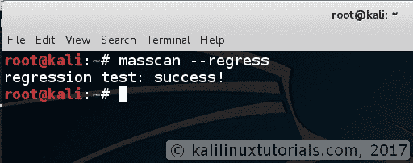](http://kalilinuxtutorials.com/masscan-1/)

Selftesting masscan

现在我们也将测试性能。

```
Command: masscan 0.0.0.0/4 -p80 --rate 100 --offline
```

这将扫描整个 IP 地址子网，但不进入互联网。这不会产生任何有价值的结果，但可以看到当速率为 100 包/秒时扫描所需的时间。

[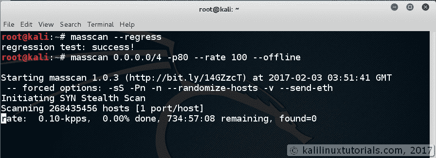](http://kalilinuxtutorials.com/masscan-2/)

masscan-perfomance

现在逐渐将速率增加到 1000，100000，看看你的网络和系统能执行多少。比较所有人所需的时间。

```
Command: masscan 0.0.0.0/4 -p80 --rate 10000000 --offline
```

[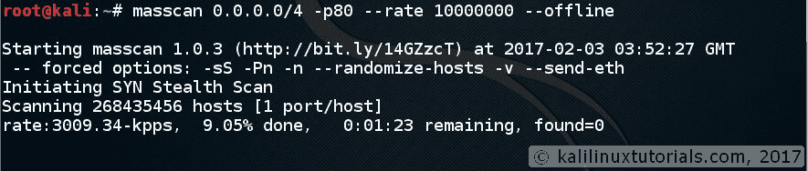](http://kalilinuxtutorials.com/masscan-3/)

masscan-hi-perfomance

注意:不要忘记包括–离线选项，否则你就完蛋了。

## 实验 2:扫描 Google IPs，抓取横幅并输出结果

在这个实验室中，我们扫描了一系列公开的 google IPs。首先，我们找出 google 解析的 IP 地址，然后在端口 80 和 443 的特定范围内执行端口扫描。

```
Command: host google.com
```

这给出了 google.com 网络服务器的 IP 地址。这可能会因您所处的位置而异。

[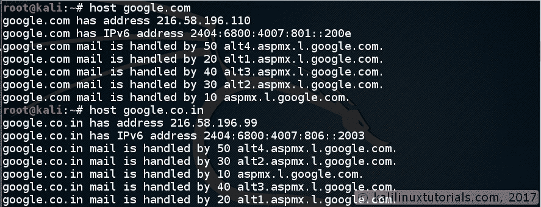](http://kalilinuxtutorials.com/masscan-4/)

google-ip

接下来，我们将找到的 IP 替换为其范围。

例如:如果我们获得的 IP 是 216.58.196.12，我们使用 216.58.196.0/24 来扫描 IP 216 . 58 . 196 . 1-254

```
Command: masscan 216.58.196.0/24 -p80,443
```

[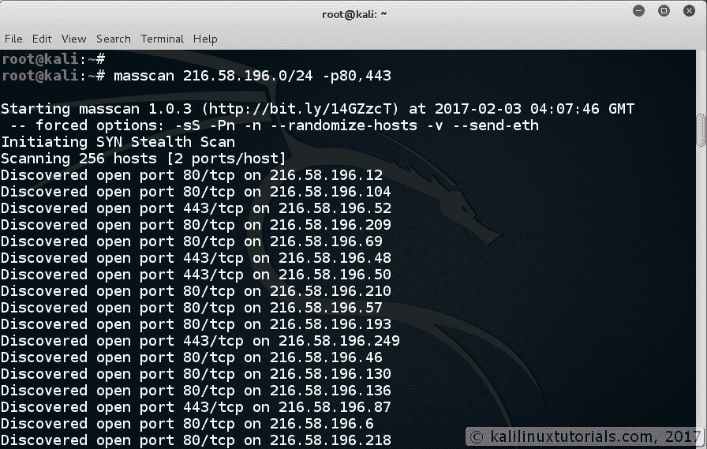](http://kalilinuxtutorials.com/masscan-5/)

masscan-basic-scanning

这是 masscan 中最基本的扫描操作。你可以用它来扫描任何 IP。您可以像在 nmap 中一样给出 IP 范围(216.58.196.1-50 ),而不是给出子网值。

现在，我们试图从我们扫描的 IP 中抓取横幅。为此，我们可能会遇到一个问题。由于 masscan 使用自定义堆栈，操作系统可能会拒绝数据包。这在工具的主页中有很好的解释。所以现在我们需要在同一个子网中指定一个单独的 IP 地址。

目前，我的 kali 的 IP 地址是 192.168.1.4。因此，我们需要在 192.168.1.0/24 范围内指定一个源 IP。

```
Command: masscan 23.92.56.53<replace with tour target IP>  -p 80,443 --banners --source-ip 192.168.1.200
```

[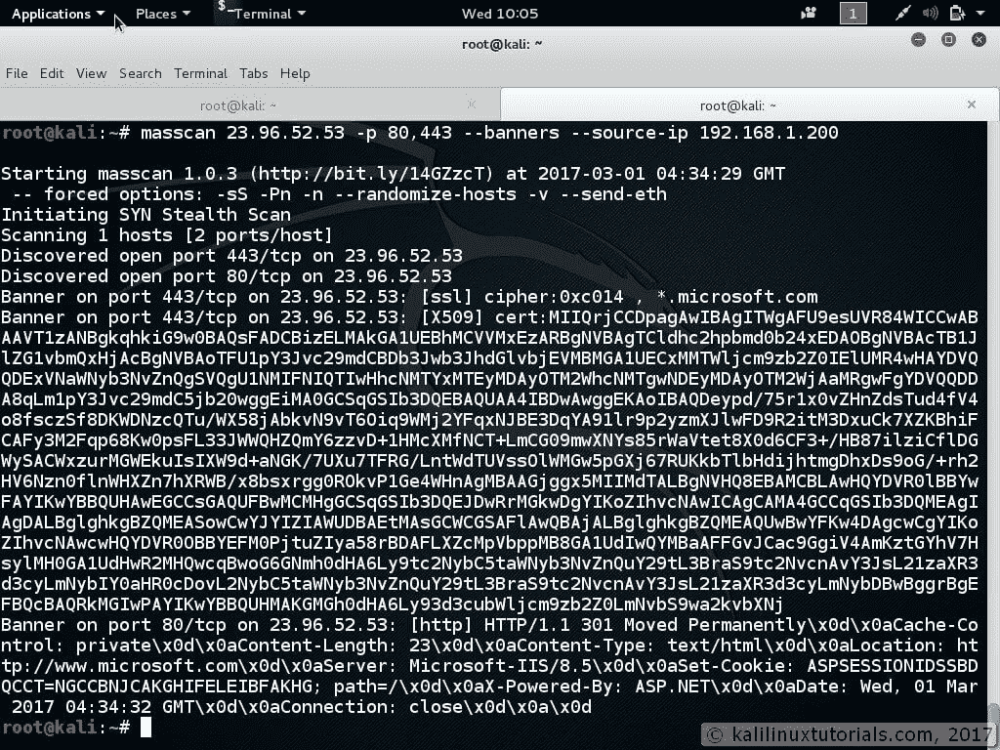](http://kalilinuxtutorials.com/masscan-16/)

Banner Grabbing

您也可以指定 IP 范围。

接下来，我们将结果保存到文件中。这与 nmap 非常相似。

```
Command: masscan 216.58.196.0/24<replace with yours> -p80,443 --output-format=xml --output-filename=google.xml<replace with yours>
```

或者，我们可以简单地指定“-ox”

```
Command: masscan 216.58.196.0/24 -p80,443 -oX google.xml
```

[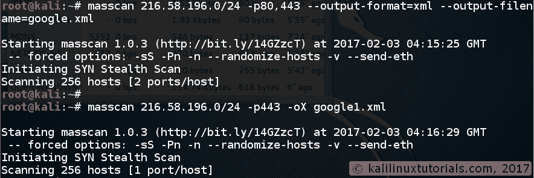](http://kalilinuxtutorials.com/masscan-6/)

XML Output

为了分析这些信息，请将此文件导入任何电子表格包，如 Excel 或 LibreOffice Calc。

[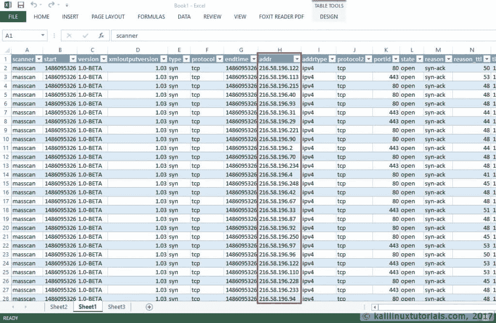](http://kalilinuxtutorials.com/masscan-7/)

XML File imported into Excel

## 实验 3:暂停和恢复扫描

假设您有一个非常大的子网要扫描，并且出于其他目的需要暂停扫描，当您执行“Cntrl + C”时，masscan 会自动暂停扫描。此外，您可以随时从中恢复。

```
Command: masscan 216.58.0.0/16<replace with yours> -p22,23,80,443<replace with the ports you want> -v --rate=1000 -oX output.xml
```

[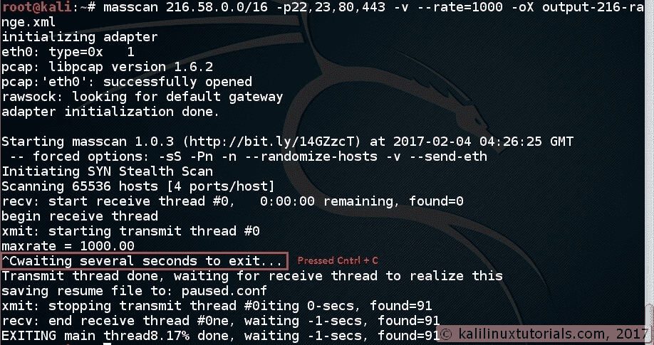](http://kalilinuxtutorials.com/masscan-9/)

Pausing a large scan

要恢复，

```
Command: masscan --resume paused.conf
```

[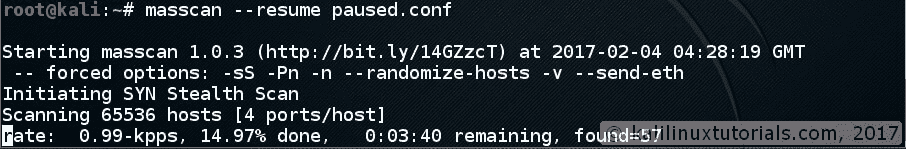](http://kalilinuxtutorials.com/masscan-10/)

Resuming a scan

作为一个有趣和信息的部分，在扫描时可视化交通，以查看地下混乱。

我已经在卡利安装了以太猿来可视化。您可以使用 Wireshark 或任何其他可视化工具。

[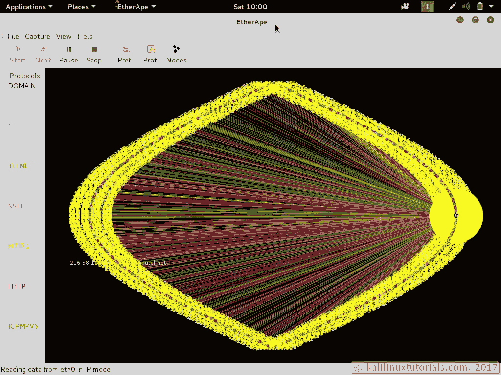](http://kalilinuxtutorials.com/masscan-11/)

Scanning Activity visualized in Etherape

但是，如果您有多个扫描或不同的扫描需要暂停，则会产生冲突。因此，在暂停之后，请确保重命名文件或在不同的文件夹中运行不同的实例。

扫描完成后，您可以将 XML 导入到一些电子表格包中进行分析。

[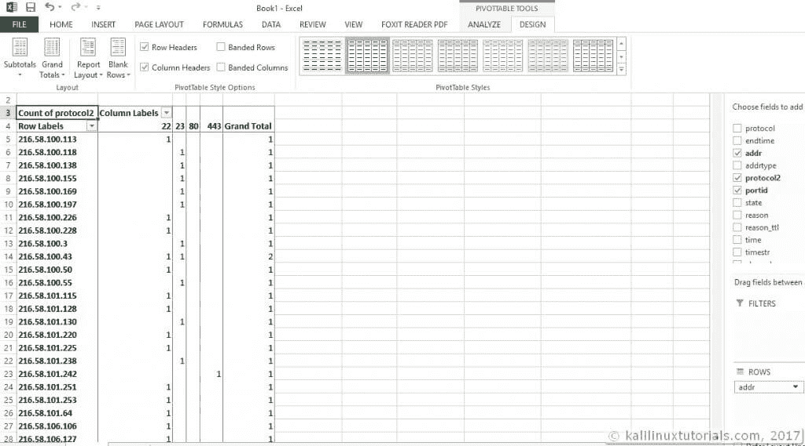](http://kalilinuxtutorials.com/masscan-13/)

Analysis of results using Excel

## 实验 4:排除特定地址和杂项选项

在本节中，我们尝试了–exclude 选项和其他一些杂项选项。

–exclude 选项是非常必要和重要的。当您扫描组织的网络时，可能会有一些不允许您扫描的 IP/范围。更重要的是，当扫描互联网时，你可能不想扫描军队/国防网站，政府网站等。

在这个演示中，我扫描了我自己的公共 IP 地址范围，不包括我自己的 IP 地址。

```
Command: masscan 180.215.0.0/16 --exclude=180.215.122.120 -p22,23,80,443
```

[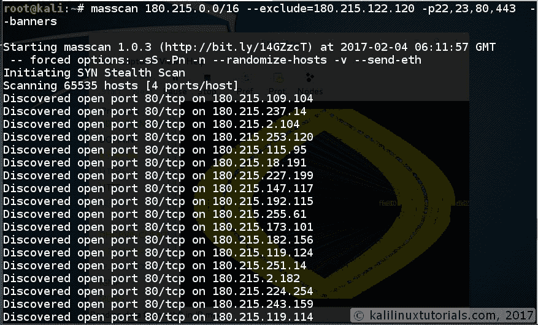](http://kalilinuxtutorials.com/masscan-14/)

Using the exclude option. Notice the display in Etherape in the background.

现在让我们看看一些杂项选项:

**1。碎片**

您可以为相同范围的 IPs 运行多个 masscan 实例。当您将扫描分成多个实例时，正在扫描的 IP 会根据索引号进行区分。例如，如果您运行 3 个实例，第一个实例将扫描索引为 0 的 IPs，第二个实例将扫描索引为 1 的 IPs，第三个实例将扫描索引为 3 的 IPs。此功能可确保 IP 不会在两个扫描实例中重叠和重复。你甚至可以在不同的机器上运行不同的实例。下面是一个小演示:

**环境:**

| **名称** | **OS** | **IP** |
| 攻击者 1 | 卡莉 Linux | 192.168.1.4 |
| 攻击者 2 | 卡莉 Linux | 192.168.1.5 |
| 目标 | – | 172.217.0.0/16 |

```
Syntax: masscan <target> <ports> --shards x/y 
where x = ID of current instance
      y = Total number of instances 
Attacker 1 Command: masscan 172.217.0.0/16 --rate=1 -p80,443 --shards 1/2

Attacker 2 Command: masscan 172.217.0.0/16 --rate=1 -p80,443 --shards 2/2
```

[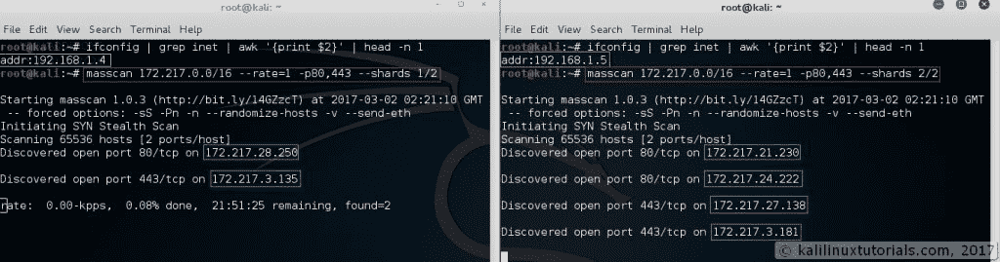](http://kalilinuxtutorials.com/masscan/masscan-17-shards/)

Running multiple instances

**2。乒**

该选项还包括扫描时的 ICMP 回应请求

```
Syntax: masscan <target> <ports> --ping
```

[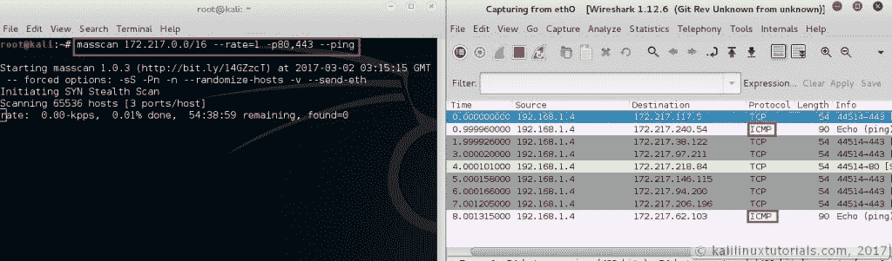](http://kalilinuxtutorials.com/masscan/masscan-19-ping/)

ICMP Request during Scan

**3。速率**

这指定了执行扫描的速率(每秒数据包数)。作者声称范围从 0.1(每 10 秒 1 个包)到 10000000(每秒 1000 万个包)以及更高。作者还声称他在各自的操作系统中实现了以下速率

```
Windows = 250000 (250 Thousand Packets per sec)
Unix = 2500000  (2.5 M Packets per sec)
```

然而，如果你想超越它，你需要一个英特尔 10 gbps 适配器& PF_Ring 驱动程序。作者在[主页](https://github.com/robertdavidgraham/masscan)中有描述。

**链接到适配器& PF_RING:**

**PF _ RING**:http://www.ntop.org/products/packet-capture/pf_ring/

**适配器**:https://www . Amazon . com/Intel-Gigabit-Server-Adapter-e10g 41 at 2/DP/b 002 OE 870 u

```
Syntax: masscan <target> <ports> --rate=x<rate at which you want to scan>
```

**4。适配器 IP**

在多个适配器的情况下使用的适配器和 IP 地址。

```
Syntax: masscan <target> <ports> --adapter-ip <ipaddress>
```

**5。适配器端口**

此选项指定传输数据包的源端口。默认范围是 40000-60000

```
Syntax: masscan <target> <ports> --adapter-port <port/port-range>
```

[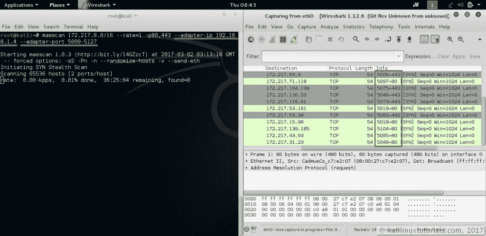](http://kalilinuxtutorials.com/masscan/masscan-18-ip-port-range/)

Specifying adapter IP & port

**注意**:端口范围总和应该是 2 的偶次方。在上面的例子中，5000–5127。所以总共使用了 1028 个端口，包括端口 5000

**6。UDP 扫描**

是的，当然，在 masscan 中可以使用 UDP 扫描。您可以通过在指定端口时添加“U”来运行 UDP 扫描。

```
Syntax: masscan <target> -pU:<port>
```

[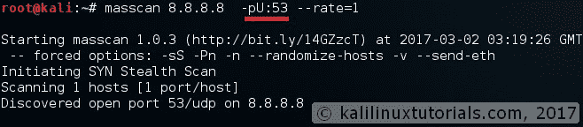](http://kalilinuxtutorials.com/masscan/masscan-20-udp/)

Scanning UDP Ports

## 实验 5:在定制配置中进行整合

现在是时候将所有选项放在一个配置文件中了。为 masscan 编写配置文件非常简单。以下是一些需要注意的要点:

*   选项前的“–”不是必需的，选项后需要“=”
*   对于不需要值(–banners)的选项，使用 option = true
*   一如既往，注释时使用“#”

要使用配置运行 masscan，只需使用“-c”选项

```
Command: masscan -c config
```

这里有一个示例配置文件，它总结了我们在这篇冗长的教程中讨论的所有内容

```
# Adapter
adapter-ip = 10.108.51.130
adapter-port = 5000-5127
rate = 10.00
shard = 1/1

# Targets
retries = 2
ports = 80,443,U:53,U:161
range = 172.217.0.0/16
exclude = 172.217.0.50
exclude-file /root/masscan-exclusion.list

#Output Options
output-format = xml
show = open
output-filename = google.xml

# Scan Options
banners = true
ping = true
```

## 结论

Masscan 实际上是一个非常强大的侦察工具，具有已知的语法和输出选项。Masscan 可用于在 Pentest 的开始阶段枚举大量主机&使用这些结果，我们可以使用 Nmap 进行服务检测，或者使用您最喜欢的工具进行漏洞扫描。无论如何，masscan 是一个有趣的工作工具，因为它可以很快产生结果。但是在扫描公众时要非常小心。明智地使用这个工具，否则你可能会进监狱，我将不负任何责任。

无论如何，希望你从这篇教程中学到了一些东西。如果你确实分享了这篇文章，因为这花了我很多时间和精力来创建一个如此详细的教程。另外，请分享您对此的反馈。

## 参考

[Masscan 主页](https://github.com/robertdavidgraham/masscan)

[手册页](http://manpages.ubuntu.com/manpages/wily/man8/masscan.8.html)

[Defcon Talk](https://www.youtube.com/watch?v=UOWexFaRylM&t=12s)