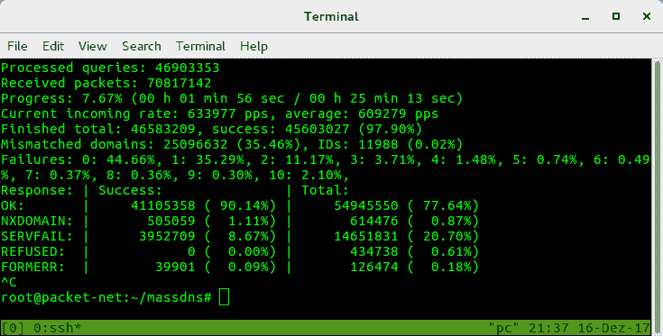

# Massdns:用于批量查找和侦察的高性能 dns 存根解析器

> 原文：<https://kalilinuxtutorials.com/massdns-a-high-performance-dns-stub-resolver-for-bulk-lookups-reconnaissance/>

[](https://1.bp.blogspot.com/-WATPF7AqBHg/XjtfxjvfW7I/AAAAAAAAEuQ/IXxA1P6sQsQemYpr_DtwklVwuTz1JDM8gCLcBGAsYHQ/s1600/massdns_1%25281%2529.png)

**Massdns** 是一个高性能的 dns 存根解析器，用于批量查找和侦察(子域枚举)。

它是一个简单的高性能 DNS 存根解析器，面向那些寻求解析数百万甚至数十亿数量级的大量域名的人。

在没有特殊配置的情况下，MassDNS 能够使用公开可用的解析器每秒解析超过 350，000 个名称。

**主要变化**

这个版本的 MassDNS 目前还处于试验阶段。为了加快解析过程，`ldns`依赖关系已经被一个定制的基于堆栈的 DNS 实现所取代(它目前只支持最常见的 DNS 记录的文本表示)。

此外，epoll 的引入是为了在低并发操作时减轻 CPU 的使用，这可能会破坏与某些平台的兼容性。

还要注意，由于对输出复杂性的批评，命令行界面略有变化。

此外，`-s`和`-i`参数的默认值已经更改。存储库结构也发生了变化。

**编译**

将 git 存储库和`cd`克隆到项目根文件夹中。然后运行`make`从源代码构建。如果你不在 Linux 上，运行`make nolinux`。在 Windows 上，需要`Cygwin`包`gcc-core`、`git`和`make`。

**也可阅读-[Obfuscapk:安卓应用的黑盒混淆工具](https://kalilinuxtutorials.com/obfuscapk/)**

**用法**

```
Usage: ./bin/massdns [options] [domainlist]
  -b  --bindto           Bind to IP address and port. (Default: 0.0.0.0:0)
      --busy-poll        Use busy-wait polling instead of epoll.
  -c  --resolve-count    Number of resolves for a name before giving up. (Default: 50)
      --drop-group       Group to drop privileges to when running as root. (Default: nogroup)
      --drop-user        User to drop privileges to when running as root. (Default: nobody)
      --flush            Flush the output file whenever a response was received.
  -h  --help             Show this help.
  -i  --interval         Interval in milliseconds to wait between multiple resolves of the same
                         domain. (Default: 500)
  -l  --error-log        Error log file path. (Default: /dev/stderr)
      --norecurse        Use non-recursive queries. Useful for DNS cache snooping.
  -o  --output           Flags for output formatting.
      --predictable      Use resolvers incrementally. Useful for resolver tests.
      --processes        Number of processes to be used for resolving. (Default: 1)
  -q  --quiet            Quiet mode.
      --rcvbuf           Size of the receive buffer in bytes.
      --retry            Unacceptable DNS response codes. (Default: REFUSED)
  -r  --resolvers        Text file containing DNS resolvers.
      --root             Do not drop privileges when running as root. Not recommended.
  -s  --hashmap-size     Number of concurrent lookups. (Default: 10000)
      --sndbuf           Size of the send buffer in bytes.
      --sticky           Do not switch the resolver when retrying.
      --socket-count     Socket count per process. (Default: 1)
  -t  --type             Record type to be resolved. (Default: A)
      --verify-ip        Verify IP addresses of incoming replies.
  -w  --outfile          Write to the specified output file instead of standard output.

Output flags:
  S - simple text output
  F - full text output
  B - binary output
  J - ndjson output
```

此概述可能不完整。更多选项，特别是关于输出格式，使用`--help`。

**例子**

使用`lists`中`resolvers.txt`内的解析器解析 domains.txt 内的所有 AAAA 记录，并将结果存储在 results.txt 内:

**$。/bin/mass DNS-r lists/resolvers . txt-t AAAA 域. txt >结果. txt**

这相当于:

**$。/bin/mass DNS-r lists/resolvers . txt-t AAAA-w 结果. txt 域. txt**

**示例输出**

默认情况下，MassDNS 将以文本格式输出响应数据包，如下所示:

**；；服务器:77.41.229.2:53
；；尺寸:93
；；Unix 时间:1513458347
；；- > >表头< < -操作码:查询，状态:NOERROR，id:51298
；；旗帜:qr rd ra 查询:1，回答:1，权限:2，附加:0

；；提问环节:
example.com。在一个

；；回答部分:
example.com。45929 在一个 93.184.216.34

；；权威部门:
example.com。b.iana-servers.net 北部 24852 号。
example.com。a.iana-servers.net 北部 24852 号。** 

包含解析器 IP 地址是为了在检测到某些解析器产生不良结果时，让您更容易过滤输出。

**解析**

存储库包括文件`resolvers.txt`，该文件由[子存储项目](https://github.com/TheRook/subbrute)提供的解析器的过滤子集组成。请注意，使用 MassDNS 可能会给所用的解析器带来巨大的负载，并导致滥用投诉被发送到您的 ISP。

还要注意，所提供的解析器不能保证是可信的。解析器列表目前已经过时，很大一部分解析器功能失调。

MassDNS 的 DNS 实现目前非常零星，只支持最常见的记录。欢迎您通过合作来帮助改变这种情况。

**PTR 记录**

MassDNS 包括一个 Python 脚本，允许您通过将各自的查询打印到标准输出来解析所有 IPv4 PTR 记录。

**$。/scripts/ptr.py |。/bin/mass DNS-r lists/resolvers . txt-t PTR-w PTR . txt**

请注意，`in-addr.arpa`内的标签是反的。为了解析域名`1.2.3.4`，MassDNS 期望`4.3.2.1.in-addr.arpa`作为输入查询名称。

因此，Python 脚本不会按升序解析记录，这是一个优势，因为可以避免 IPv4 子网的名称服务器突然出现大量峰值。

**通过强力子域侦察**

**负责任地执行侦察扫描，并调整`-s`参数，以免淹没权威域名服务器。**

MassDNS 允许您使用附带的`subbrute.py`脚本暴力破解子域:

**$。/scripts/subbrute . py lists/names . txt example.com |。/bin/mass DNS-r list/resolvers . txt-t A-o S-w results . txt**

作为一种额外的侦察方法，`ct.py`脚本通过从 crt.sh 中抓取数据来从证书透明性日志中提取子域:

**$。/scripts/CT . py example.com |。/bin/mass DNS-r list/resolvers . txt-t A-o S-w results . txt**

**截图**



**安全**

MassDNS 不需要 root 权限，因此在以 root 用户身份运行时，默认情况下会将权限授予名为“nobody”的用户。

如果用户“nobody”不存在，MassDNS 将拒绝执行。在这种情况下，建议以另一个非特权用户的身份运行 MassDNS。

可以使用不推荐的`--root`参数绕过特权删除。

还要注意，除了 master 之外，其他分支根本不应该用在生产中。

**实际考虑事项**

**性能调优**

MassDNS 是一个简单的单线程应用程序，专为网络成为瓶颈的情况而设计。它被设计成在具有高上传和下载带宽的服务器上运行。

在内部，MassDNS 利用哈希映射来控制查找的并发性。因此，设置尺寸参数`-s`允许您控制查找速率。如果您遇到性能问题，尝试调整`-s`参数以获得更好的成功率。

**限速规避**

如果 IPv6 解析器的速率限制是一个问题，看看包括`packetrand`在内的 [freebind](https://github.com/blechschmidt/freebind) 项目，这将导致每个数据包从路由前缀的不同 IPv6 地址发送。

**结果真实性**

如果结果的真实性非常重要，您不应该依赖包含的解析器列表。相反，设置一个本地未绑定解析器，并向 MassDNS 提供其 IP 地址。

如果您使用 MassDNS 作为侦测工具，您可能希望首先使用默认解析程序列表运行它，然后使用可信解析程序列表对找到的名称重新运行它，以消除误报。

**演职员表** : Quirin Scheitle

[**Download**](https://github.com/blechschmidt/massdns)