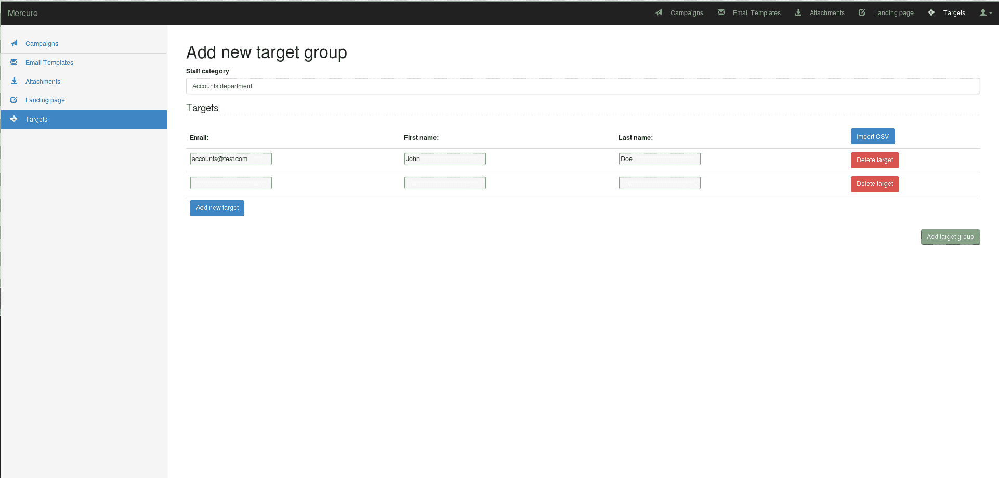
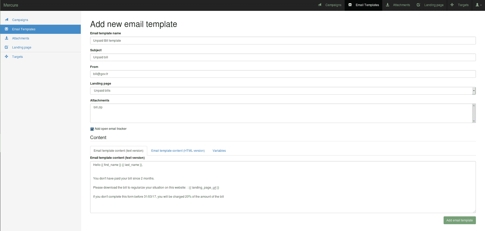
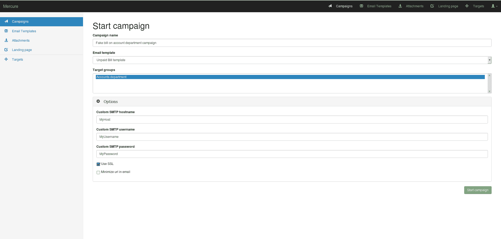
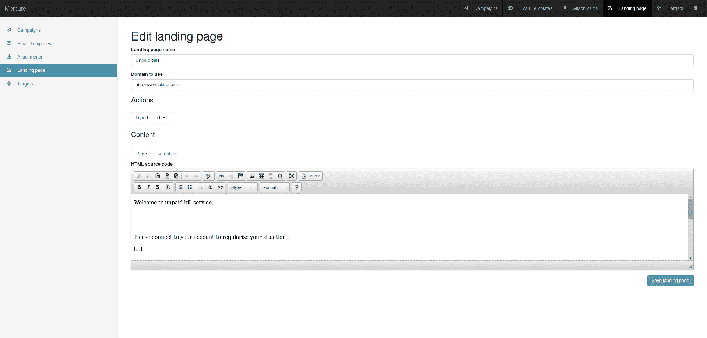
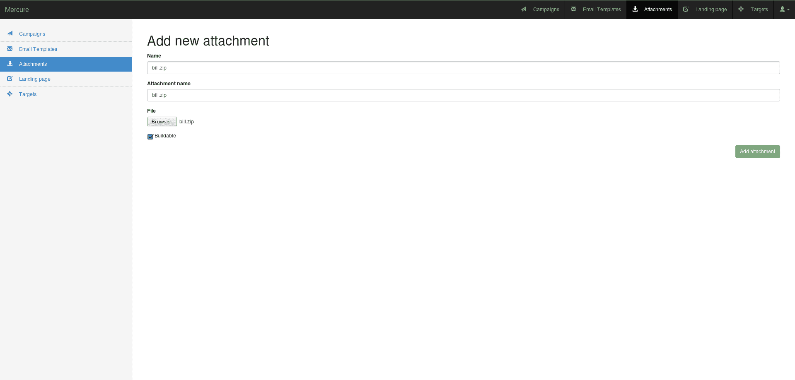

# mercure——为希望培训同事防范网络钓鱼的安全经理提供的工具

> 原文：<https://kalilinuxtutorials.com/mercure-tool-security-managers-phishing/>

Mercure 是安全经理的一个工具，他们希望培训自己的同事防范网络钓鱼。

## 【Mercure 能做什么:

*   创建电子邮件模板
*   创建目标列表
*   创建登录页面
*   处理附件
*   允许您在活动仪表板中跟踪
*   跟踪电子邮件阅读、登录页面访问和附件执行。
*   收获凭据
*   计划活动
*   最小化电子邮件模板中的链接

## 【Mercure 将做什么:

*   显示更多图表(我们喜欢图表！)
*   提供一个 REST API
*   允许多消息活动(又名场景)
*   检查浏览器插件
*   用户培训

**也可阅读[OWTF——攻击性 Web 测试框架伟大工具&让笔测试更高效](https://kalilinuxtutorials.com/owtf-offensive-web-testing-framework/)**

## **样本部署**

编辑坞站复合配置(“T0”)

```
version: '2'

services:
  front:
    image: atexio/mercure
    restart: always
    ports:
      - 8000:8000
    environment:
      SECRET_KEY: '<random value>'
      URL: 'https://preprod.mercure.io'
      EMAIL_HOST:  'mail.example.com'
      EMAIL_HOST_USER: 'phishing@example.com'
      EMAIL_HOST_PASSWORD: 'P@SSWORD'
    volumes:
      - /etc/localtime:/etc/localtime:ro
      - ./data/database:/code/database
      - ./data/media:/code/media
      - ./data/migrations/phishing:/code/phishing/migrations
```

要生成 SECRET_KEY 变量，可以使用以下命令:

```
# generate random SECRET_KEY
cat /dev/urandom | tr -dc 'a-zA-Z0-9' | fold -w 200 | head -n 1
```

SECRET_KEY 用作 Django 密码散列的盐，在 Mercure 上使用后不要更改它。更改密钥后，您可以使用以下命令运行容器:

```
docker-compose up -d
```

接下来，您可以创建一个超级用户来登录 web 界面:

```
# create super user
docker-compose exec front python manage.py createsuperuser
```

## **如何使用 Mercure**

我们可以认为 Mercure 分为 5 个步骤:

*   目标
*   电子邮件模板
*   运动
*   附件
*   登录页面

目标、电子邮件模板和活动是运行基本网络钓鱼活动的最低要求。

*   **首先，添加你的目标**



您需要填写 Mercure 名称，即目标电子邮件。目标第一名和姓氏是可选的，但对登录页面很有用

*   **然后，填写邮件模板。**



您需要填写 Mercure 名称、主题、发送和电子邮件内容。为了提高邮件质量，你必须填充邮件内容 HTML 和文本内容。要获取有关打开的电子邮件的信息，请选中“添加打开的电子邮件跟踪器”,您可以在“变量”类别中获得帮助。

附件和登录页面是可选的，我们将在后面看到。

*   **最后，发起活动**



您需要填写 mercure 名称，选择电子邮件模板和目标群体。您可以选择 SMTP 凭证、SSL 使用或 URL 最小化

*   **可选，添加登陆页面**



您需要填写 mercure 名称，您可以使用“从 URL 导入”来复制现有网站的域名。

你必须通过点击“源”来用文本和 HTML 内容填充页面内容

*   **可选，添加附件**



您需要填写 mercure 名称、出现在电子邮件中的文件名以及文件。例如，如果您需要计算一个文件，您还必须检查该文件是否可构建。

要执行构建，您需要创建一个包含构建脚本(名为“generator.sh ”)和一个可构建文件的 zip 归档文件

[](https://github.com/atexio/mercure)