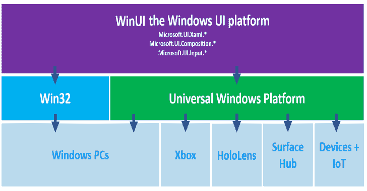
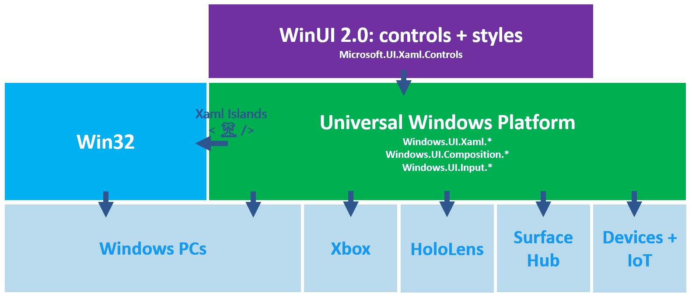
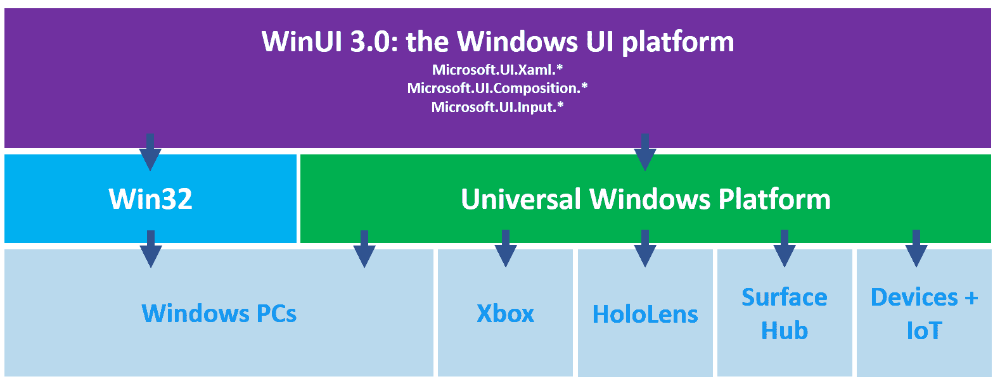

# Microsoft WinUI : Windows UI 库路线图

> 原文：<https://kalilinuxtutorials.com/microsoft-winui-roadmap-2020/>

**WinUI** 是 Windows 10 的原生 UI 平台。本文档概述了新网站从 2019 年到 2020 年的远景路线图。

它正由微软开发人员平台团队积极开发，路线图将根据市场变化和客户反馈继续发展，因此请注意，这里概述的计划并不详尽或有保证。

我们还与 [Uno 平台](https://platform.uno/WinUI-on-Windows7-via-UnoPlatform/)合作，以便开发人员可以将他们的 microsoft-ui-xaml 代码带到 WebAssembly 运行的任何地方——包括 Windows 7。

microsoft-ui-xaml 团队正在进行两项主要工作:

1.  **WinUI 2**:UWP 应用的新增和更新的控件和功能
2.  **WinUI 3**:Windows 10 UI 平台的重大更新

**WinUI 2**

WinUI 2 的下一个版本将是 WinUI 2.4，预计 2020 年在 Q1 发布。

2.4 将是一个增量版本，包括新的 microsoft-ui-xaml 功能和对 Windows 10 上 UWP 应用程序的修复。

有关安装说明，请参见[Windows 用户界面库](https://docs.microsoft.com/uwp/toolkits/winui/getting-started)入门。

**用于 UWP 应用的 WinUI 2 的概念概述:**

WinUI 2 最终将被 WinUI 3 取代。WinUI 3 将包括 WinUI 2 中的所有控件和功能。

**也可阅读-[泽洛斯:综合二进制仿真平台](https://kalilinuxtutorials.com/zelos/)**

**WinUI 3**

**WinUI 3** 将大大扩展 microsoft-ui-xaml 的范围，以包括完整的 Windows 10 原生 UI 平台，该平台现在将与 UWP SDK 完全分离。

我们专注于支持三种主要使用情形:

*   **更新现有的 Win32 应用**
    *   使您能够扩展现有的 Win32 (WPF、WinForms、MFC..)使用即将发布的最新版本 [Xaml Islands](https://docs.microsoft.com/windows/apps/desktop/modernize/xaml-islands) 的现代 Windows 10 UI 应用
*   **创建新的 Windows 应用**
    *   使您能够根据自己选择的应用模式(Win32 或 UWP)和语言轻松创建新的现代 Windows 应用。NET Core 或 C++)
*   **启用其他框架**
    *   为其他框架提供本机实现，比如在 Windows 上运行时， [React Native](https://github.com/Microsoft/react-native-windows)

你可以下载 WinUI 3.0 Alpha 的早期版本来试用——我们很乐意收到反馈，尽管请注意这是一个非常早期的版本，有很多缺失的功能。

**概念概述**

作为操作系统一部分提供的现有 UWP Xaml API 将不再接收新的功能更新。

根据 Windows 10 支持生命周期，他们仍将收到安全更新和关键补丁。

通用 Windows 平台包含的不仅仅是 Xaml 框架(例如，应用和安全模型、媒体管道、Xbox 和 Windows 10 外壳集成、广泛的设备支持)，并且将继续发展。

所有新的 Xaml 特性都将作为 microsoft-ui-xaml 的一部分进行开发和发布。

**好处**

与当前的 UWP Xaml 框架、WPF、WinForms 和 MFC 相比，WinUI 3 将提供许多优势，这将使 microsoft-ui-xaml 成为创建 Windows 应用程序 UI 的最佳方式:

1.  **Windows 的原生 ui 平台**
    microsoft-ui-xaml 是一个高度优化的原生 UI 平台，用于创建 Windows 本身，现在更广泛地供所有开发人员使用以访问 Windows。
    这是一个经过全面测试和验证的 UI 平台，为 8 亿多台 Windows 10 PC、XBox One、HoloLens、Surface Hub 和其他设备的操作系统环境和基本体验提供动力。
2.  最新的 Fluent Design
    Microsoft-UI-xaml 是微软对原生的、可访问的 Windows UI 和控件的主要关注点，也是 Windows 上的 [Fluent Design System](https://www.microsoft.com/design/fluent/) 的权威来源。
    它还将支持最新的低层合成和渲染创新，如矢量动画、效果、阴影和照明。
3.  **更轻松的“按菜单点菜”桌面开发**
    WinUI 3 将让您更轻松地混合搭配以下各项的正确组合:
    *   **语言**:。NET (C#，Visual Basic)，C++
    *   **App 型号** : UWP，Win32
    *   **包装** : [MSIX](https://docs.microsoft.com/windows/msix/) ，微软商店 AppX，未包装
    *   **Interop** :使用 WinUI 3 通过现代的 Fluent UI 扩展现有的 WPF、WinForms 和 MFC 应用
4.  **新功能的向后兼容性**
    新的 microsoft-ui-xaml 功能将继续向后兼容各种 Windows 版本:一旦发布，您就可以立即开始构建和发布具有新功能的应用，而不必等待您的用户更新 Windows。
5.  **原生开发支持**
    微软-ui-xaml 可以配合使用。NET，但不依赖于。NET: microsoft-ui-xaml 是 100% C++的，可以在非托管的 Windows 应用中使用，例如通过 [C++/WinRT](https://docs.microsoft.com/windows/uwp/cpp-and-winrt-apis/) 使用标准 C++17。
6.  更频繁的更新
    microsoft-ui-xaml 将继续每年发布 3 次新的稳定版本，每月发布预发布版本。
7.  **开源开发和社区参与**
    microsoft-ui-xaml 将作为 GitHub 上的开源项目继续开发。
    WinUI 2 在本次回购中已经开源，我们计划添加完整的 WinUI 3 Xaml 框架。
8.  web 和跨平台框架的原生 Windows 目标
    WinUI 3 针对构建的库和框架进行了更好的优化。
    例如，我们计划在 WinUI 3 上实现新的高性能 C++ [React 原生 Windows](https://github.com/Microsoft/react-native-windows) 。

**新功能**

我们对 WinUI 3.0 的主要关注点是分离 UWP UI 框架(Xaml，composition 和 input)，同时保持与现有 UWP API 和行为的高度兼容性，以帮助现有 UWP 应用程序轻松升级到 WinUI 3.0。

这意味着我们不会在第一个 WinUI 3.0 版本中添加很多新功能。

但是，我们正在计划至少一些新功能，包括:

1.  对所有现有功能的下层支持(向后兼容):Windows 2019 年 5 月更新中添加的新 Xaml 和合成功能现在将在 Creators Update 和更新版本上工作！
2.  新的[微软 Edge (Chromium) WebView](https://docs.microsoft.com/microsoft-edge/hosting/webview2) Xaml 控件
3.  [输入验证支持](https://github.com/microsoft/microsoft-ui-xaml/issues/179)
4.  新的 Visual Studio 2019 应用程序模板，适用于应用程序类型(Win32、UWP)和语言(的不同组合。NET、C++)

**更新您的应用程序**

使用新的 Visual Studio 2019 项目模板，创建新的 microsoft-ui-xaml 应用程序将非常容易。

使用 xaml 岛将 microsoft-ui-xaml 视图添加到现有的 Win32 应用程序也应该很简单。

对于现有的 UWP Xaml 应用程序，迁移到 WinUI 3.0 时将需要一些更新。

**WinUI 3.0 时间轴&里程碑**

我们计划在 2020 年发布 WinUI 3.0。

我们目前正在努力实现的下一个重要里程碑是:

1.  **开源**:我们的下一个主要关注领域是在这个报告中将完整的 WinUI 3 Xaml 平台迁移到 GitHub 上进行开源开发
2.  预览版:我们计划在 2020 年上半年发布一个更完整的预览版

[**Download**](https://github.com/microsoft/microsoft-ui-xaml/blob/master/docs/roadmap.md)