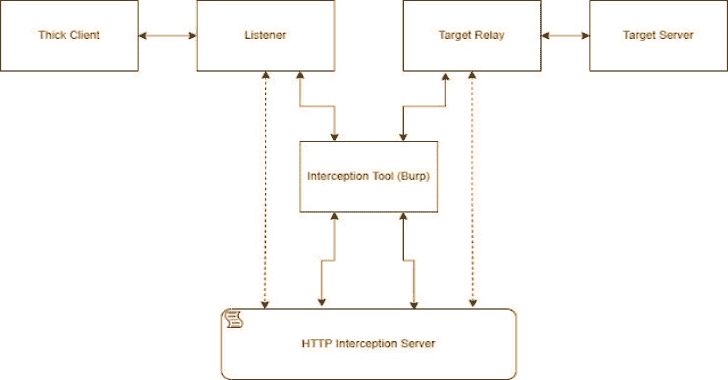
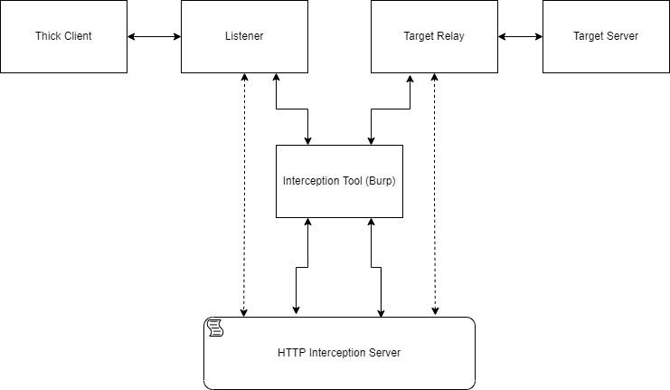

# MITM 拦截:通过 Burp 和其他方式拦截和修改非 HTTP 协议的一种不太黑客的方式

> 原文：<https://kalilinuxtutorials.com/mitm_intercept/>

.png)

**MITM _ 拦截**是一种不太黑客的方式，通过 Burp 和其他 SSL 和 TLS 拦截支持来拦截和修改非 HTTP 协议。该工具面向执行胖客户端安全评估的研究人员和应用渗透测试人员。

神奇的 mitm_relay 项目的改进版本。

## 故事

作为我们在 CyberArk 实验室研究部门工作的一部分，我们需要一种方法来检查 TCP 上的 SSL 和 TLS 通信，并可以随时修改数据包的内容。有很多方法可以做到这一点(例如，已知的 Burp Suite 扩展 NoPE)，但在某些情况下，没有一种方法适合我们。最后我们偶然发现了 mitm_relay。

mitm_relay 是一种通过现有的 HTTP 拦截软件(如 Burp Suite 的 proxy)对任何基于 TCP 的协议执行 mitm 的快捷方式。这对于胖客户端安全评估特别有用。但是它并不完全适合我们，所以我们需要对它进行定制。在大量的定制之后，每一个新的变化都需要大量的工作，我们最终以一种更加模块化的方式重写了一切。

我们希望其他人会发现这个脚本很有帮助，我们也希望添加功能会很容易。

## 它是如何工作的

首先，需要配置侦听器的地址和端口。对于每个侦听器，还需要配置一个目标(地址和端口)。从监听器接收到的每个数据都将被封装到一个 HTTP POST 请求的主体中，该请求的 URL 包含“CLIENT_REQUEST”。从目标接收到的每个数据都将被打包到一个 HTTP POST 请求的主体中，该请求的 URL 包含“SERVER_RESPONSE”。这些请求被发送到本地 HTTP 拦截服务器。

可以选择配置一个 HTTP 代理，使用 burp suite 这样的工具作为 HTTP 拦截工具，并在那里查看消息。这样，通过使用 Burp 的“匹配和替换”、扩展甚至手动(记住，被拦截的协议的超时机制可以非常短)来修改消息是很容易的。

修改消息的另一种方法是使用 python 脚本，HTTP 拦截服务器将在收到消息时运行该脚本。

发送到 HTTP 拦截服务器的消息体将被打印到 shell 中。如果给出了修改脚本，将在更改后打印消息。在所有的修改之后，拦截服务器也将作为 HTTP 响应体回显。

为了解密 SSL/TLS 通信，需要为 mitm_intercept 提供一个证书和一个密钥，客户机在开始与侦听器握手时会接受这个证书和密钥。如果目标服务器需要特定的证书进行握手，那么可以选择提供证书和密钥。

显示典型交通流量的小图表:

## 与 mitm_relay 的区别

mitm_intercept 兼容较新版本的 python 3 (python 3.9)，也兼容 windows (socket。例如 windows 中不存在 MSG_DONTWAIT)。我们保留了使用“STARTTLS”的选项，我们称之为“混合”模式。更新了使用 SSL 密钥日志文件(使用它的内置选项是 python 3.8 中新增的)，并且我们添加了更改 sni 头的选项。现在，管理传入和传出的通信由 socketserver 完成，所有数据都被发送到 ThreadingHTTPServer 的一个子类，该子类处理数据表示和修改。这样，就有可能在响应中看到修改脚本应用的更改(方便使用 Burp)。此外，我们现在可以使用 OpenSSL 密码列表格式更改脚本使用的可用密码

## 先决条件

1.  Python 3.9
2.  请求:`**$ python -m pip install requests**`

## 使用

**用法:mitm _ intercept . py[-h][-m]-l[u | t:]:[[u | t:]:…]:[[u | t:]:…][-LC]
[-lk][-TC][-tk][-w:]
[-p:][-s][–sni]
[-TV][-ci]
mitm _ intercept 1.6 版
选项如果其中一个中继端开始一个
SSL 握手，用 SSL 包装连接，拦截
通信。必须提供侦听器证书和私钥。
-l [u|t:]: [[u|t:]: …]，–listen[u | t:]:[[u | t:]:…]
创建在指定接口
和端口上侦听的 SSLInterceptServer 侦听器。可以创建多个参数之间有空格的侦听器。
在地址前加“u:”会让监听器监听 UDP
协议。TCP 协议是默认协议，但为了简洁起见，添加“t:”是可能的
。侦听器的数量必须与目标的数量相匹配。第 I 个
监听器将中继到第 I 个目标。
-t [u|t:]: [[u|t:]: …]，–target[u | t:]:[[u | t:]:…]
指示每个 SSLInterceptServer 侦听器将通信转发到
目标地址和端口。可以在
参数之间创建多个带有空格的目标。在地址前加“u:”会让目标
用 UDP 协议通信。TCP 协议是默认协议，但添加“t:”表示
清洁度是可能的。监听器的数量必须与
目标的数量相匹配。第 I 个监听器将中继到第 I 个目标。
-lc，–listener-cert
客户端联系监听器时监听器使用的证书。如果客户端接受的话，可以是一个自签名证书。
-lk，–listener-key
监听器证书的私钥路径。
-tc，–target-cert
用于创建与目标连接的证书。如果目标接受，可以是一个
自签名证书。如果
目标不需要特定的证书，则不需要。
-tk，–target-key
目标证书的私钥路径。
-w:，–web server:
指定 InterceptionServer webserver 将
监听的接口和端口。如果省略，默认值为 127.0.0.1:49999
-p:，–proxy:
指定 interception server
web server 和 SSLInterceptServer 之间的代理的地址和端口。可以进行配置，以便通信
将通过一个本地代理，如 Burp。如果省略，通信将
仅打印在外壳中。
-s，–script
拦截服务器 web 服务器执行的脚本的路径。
必须包含函数 handle_request(message ),该函数将在向目标发送
或从
目标接收消息后运行。如无必要，可省略。
–sni 是否需要在与
目标的 SSL 握手中更改服务器名称。如果省略，它将是与
监听器握手时的服务器名。
-电视，–tls-版本
如有需要，可指定特定的 TLS 版本。
-ci，–ciphers
为 TLS 握手设置不同于 python 默认值的密码。它
应该是 OpenSSL 密码列表格式
的字符串(https://www . OpenSSL . org/docs/man master/man 1/ciphers . html)。
为了将 SSL(预)主机密转储到文件，使用
文件路径设置环境变量 SSLKEYLOGFILE。对 Wireshark 有用。**

需要将通信定向到侦听器，以便拦截任意协议。这样做的方式取决于客户端如何操作。有时它使用 DNS 地址，更改 hosts 文件就足以解析侦听器地址。如果地址是硬编码的，那么就需要应用更有创造性的方法(通常是对路由表进行一些修改，给客户端打补丁，或者使用 VM 和 iptables)。

## 修改脚本

HTTP 拦截服务器可以运行一个带有标志 **`-s`的脚本。**这个脚本在收到 HTTP 请求时运行。HTTP 拦截服务器的响应是运行脚本后收到的请求。

当代理被配置时(像 Burp)，请求的修改将发生在脚本运行之前，响应的修改将发生在脚本运行之后。代理或修改脚本对请求和响应的更改将在到达目的地之前更改原始消息。

该脚本必须包含函数`**handle_request(message)**`和`**handle_response(message)**`。当消息从客户端到服务器时，HTTP 拦截服务器将调用`**handle_request(message)**`，当消息从服务器到客户端时，调用`**handle_response(message)**`。

在消息末尾添加空字节的脚本示例:

**def handle _ request(message):
return message+b " \ x00"
def handle _ response(message):
#两个函数都必须返回消息。
返回消息**

[**Download**](https://github.com/cyberark/MITM_Intercept)