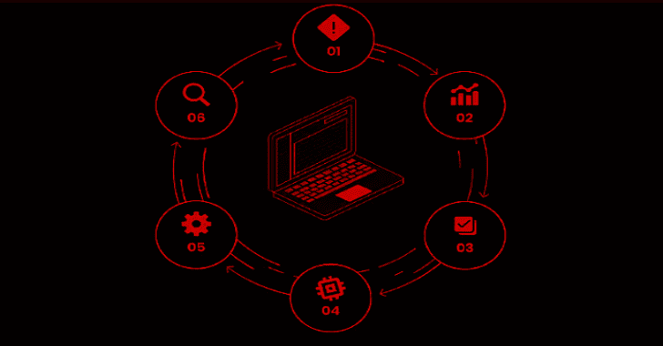
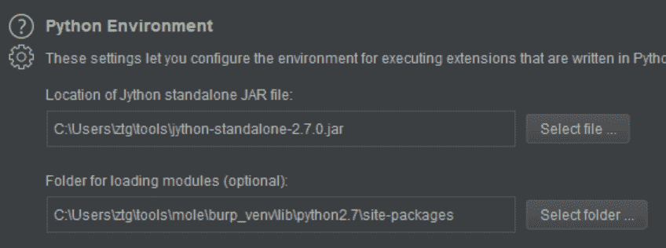
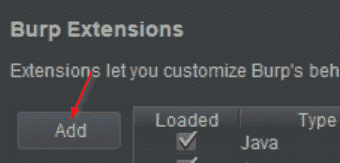
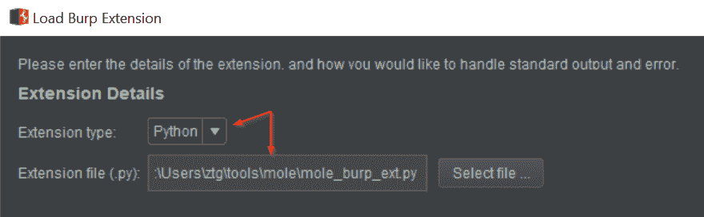
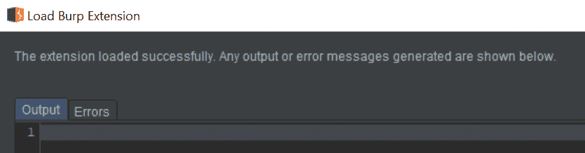

# Mole:一个识别和利用带外应用程序漏洞的框架

> 原文：<https://kalilinuxtutorials.com/mole/>

**Mole** 是一个用于识别和利用带外(OOB)漏洞的框架。

**安装&设置**

**鼹鼠安装**

*   **Python > = 3.6**

【T4`virtualenv -p /usr/bin/python3 venv`
`source venv/bin/activate`
`./venv/bin/pip3 install -r requirements.txt`
`git submodule update --init --recursive`

*   **在`config.yml`中设置一个 API 密钥(客户端和服务器必须相同)**

**DNS 配置**

您需要在您的注册器中配置 DNS 记录以指向您的 mole 服务器。至少，您需要为名称服务器配置一个`A`记录，并配置一个`NS`记录。

可以将 Mole 配置为托管其他配置选项。

*   **Mailgun (Optional)**

邮件枪需要 DNS 条目来启用服务:[https://help . mail gun . com/HC/en-us/articles/203637190-How-Do-I-Add-or-Delete-a-Domain-](https://help.mailgun.com/hc/en-us/articles/203637190-How-Do-I-Add-or-Delete-a-Domain-)

*   **TLS**

目前 Mole 本身不支持 TLS。要实现 TLS，使用一个反向代理，如 [nginx](https://docs.nginx.com/nginx/admin-guide/security-controls/terminating-ssl-http/) 来终止 TLS 连接，并将流量转发到 Mole 服务器。

**打嗝套件扩展**

由于最新版本的 Jython 仅支持 2.7，因此 Burp Suite 扩展需要单独的 Python 2.7 虚拟环境。下面是设置虚拟环境和配置扩展的说明。

*   为 burp/jython 创建一个新的 python2.7 virtualenv

`**virtualenv -p /usr/bin/python2.7 burp_venv**`

*   加载 venv，`**source**`

`**./burp_venv/bin/activate**`

*   安装所需的软件包

`**./burp_venv/bin/pip -r requirements**`

*   通过下载并选择 jython-standalone jar 来配置 Python 环境。
*   将“用于加载模块的文件夹”设置为步骤 1-3 中创建的`**burp_venv/lib/python2.7/site-packages**`的完整路径。

*   单击添加

*   将扩展名类型设置为`Python`，并从 mole 项目目录中选择`mole_burp_extension.py`文件。

*   单击下一步，如果一切顺利，加载屏幕上将不会出现任何错误。

**配置**

**令牌**

*   `domain`–您的自定义域名
*   `length`–令牌长度(默认为 5)
*   令牌字符集是 ascii 大写字母、小写字母和数字。可以修改长度以满足需求，例如有效载荷的受限空间。下面列出了每个长度的令牌数。
    *   1 – 62
    *   2 – 3844
    *   3 – 238328
    *   4 – 14776336
    *   5 – 916132832
*   `ssl`–为`https` vs `http`配置有效载荷
    *   “server `——Mole 令牌服务器的域或 IP
*   `default_tags`–添加到所有令牌的默认标签列表。对于每个项目/客户端令牌非常有用。

**服务器**

*   `api_key`–用于验证对 mole API 的请求的 API 密钥
*   `dns_addr`–用于响应 DNS 查询的 IP 地址
*   `db_conn`–[SQLAlchemy](https://www.sqlalchemy.org/)[数据库 URL](https://docs.sqlalchemy.org/en/13/core/engines.html) 。默认是根目录下的一个 SQLite db`sqlite:///mole.db`
*   `static_responses`–DNS 静态响应密钥/值对列表
*   `web_port`–配置监听网络端口
*   `dns_port`-配置监听 dns 端口

**通知**

所有通知都有一个`enabled`标志，它决定是否在交互时触发通知。每个通知插件都有自己的配置项。

*   `mailgun`–配置`domain`、`to`、`from`、`api_key`启用[邮件枪](https://www.mailgun.com/)邮件通知
*   `slack`–`token`和`channel`
*   `webhook`–通用 POST webhook

**问题/错误**

我相信有很多，请创建一个新的[问题](https://github.com/ztgrace/mole/issues)并尽可能填写模板，以便快速分类。

[**Download**](https://github.com/ztgrace/mole)