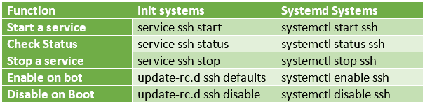

# 卡利萨那的更多核心变化(2.0 版)

> 原文：<https://kalilinuxtutorials.com/more-core-changes-in-kali-sana-v-2-0/>

## **Kali Sana 更多 Linux 核心变化**有待关注。**(也适用于其他最新的 Linux 发行版)**

最近，Linux 架构和内核本身引入了一些核心变化和调整。本文对其中一些进行了介绍。虽然本文主要关注 Kali Linux，但是使用其他 Linux 版本的人也可以使用它。这些更新自 2014 年以来就一直存在，但现在只是在 linux 系统工作方式发生一些重大变化时才投入使用。

在本文中，我们将讨论 3 个核心级别的变化。

1.系统 d 和系统 ctl

2.新网络管理员

3.新闻工作者

## **1 .系统&系统 ctl**

Systemd 是系统管理守护程序的缩写。它取代了在旧版本中作为 unix 系统所有进程的父进程的 init 进程。Systemd 并行启动进程，而旧版本中的 init 是串行启动的。这是为了克服 init 的许多限制，比如内核崩溃。此外，意图是尽可能使事情干净。因此，systemd 的启动速度比 init 快得多。此外，还有一个新的日志记录系统，称为 journald，将在本文的后面介绍。

实际上，核心变化是目标取代了运行水平。此外，所有对象都被分类为目标、套接字和服务。开始一个跑级在意识形态上变成了达到一个目标。

更多阅读:[http://www.tecmint.com/systemd-replaces-init-in-linux/](http://www.tecmint.com/systemd-replaces-init-in-linux/)

https://wiki.debian.org/Debate/initsystem/systemd

## **任务:**

1.用两种方法检查 ssh

2.使用 systemctl 的一些更有趣的事情

下面的表格包含了 init 命令和 systemd 命令之间的比较。在基于 init 的系统中，我们使用服务命令来控制，而在基于 systemd 的系统中，我们使用 systemctl。看看下面的表格，自己试试。

[](http://kalilinuxtutorials.com/kali/more-core-changes-in-kali-sana-v-2-0/attachment/morechanges3/#main)

Comparison

下面是一些截图(点击放大)。

下面是其他 systemctl 技巧的列表

```
systemctl show targets #Shows all targets
systemctl list-units  #Lists all units, use pipe to filter out
systemctl list-unit-files  #Lists all unit files
systemctl list-dependencies  #Lists dependencies to all objects
systemctl get-default #Shows the default target, default-graphical.target in Kali Sana
systemctl set-default <target> #Set the target. try multiuser.target
```

## 2.新网络管理器 NMCLI

Nmcli 和 Nmtui 是新 unix 系统中网络管理器的两个新接口。在 Kali Linux v 2.0 中，可以使用这个新的管理器来管理网络连接。Nmcli 是命令行版本& nmtui 是文本界面之类的诅咒。CentOS/RHEL/Fedora 等其他系统也开始使用 nmcli。

使用 nmcli，我们可以添加、编辑或删除网络连接&每个连接中的每个小细节。此外，创建桥梁和纽带连接(团队聚合)只需几下鼠标。

### 任务

1.  使用 nmcli 查看当前状态
2.  使用 nmcli 启动和停止连接
3.  设置与 nmtui 的连接

### 1.查看当前状态

```
nmcli connection show <connection name> <press tab twice to view all connections>
nmcli con show eth0<replace with yours>
```

下面是一些截图(点击放大)

### 2.开始和停止连接

```
nmcli con show eth0<replace with yours>
nmcli con down eth0
nmcli con up eth0
```

### 3.设置与 nmtui 的连接

为此，我向 VM 添加了一个新的适配器。让我们给新添加的网卡一个静态地址。

NMTUI 是一个交互终端，你可以自己做。

下面是 NMTUI 的截图(点击放大)

参考文献: [红帽](https://access.redhat.com/documentation/en-US/Red_Hat_Enterprise_Linux/7/html/System_Administrators_Guide/s1-Using_the_Journal.html)，[侏儒维基](https://wiki.gnome.org/Projects/NetworkManager/nmcli)，

## 3.日记账

Journal 是一个新的系统，它从 Linux/Unix 系统中的各种来源收集日志数据，包括它们的元数据。日志使用本地 API 从各种来源收集日志，包括 systemd、其他服务守护进程、内核等。它以高效的方式索引收集的数据并进行重构。因此，寻道次数更少。此外，journal 与 rsyslog 等遗留系统并行工作，日志可以在相同的位置(/var/log)获得

日志服务负责收集日志并完成所有的过程。Journalctl 是一个用于查看日志的交互式控制台工具。使用 journalctl，当完整的数据被索引时，可以非常快速地查看和整理日志。所以这有助于更快地解决问题。

### 任务

用 journalctl 查看日志。

```
journalctl
journalctl -xn
```

以下是截图(点击放大)

参考文献: [红帽](https://access.redhat.com/documentation/en-US/Red_Hat_Enterprise_Linux/7/html/System_Administrators_Guide/s1-Using_the_Journal.html)，[数字海洋](https://www.digitalocean.com/community/tutorials/how-to-use-journalctl-to-view-and-manipulate-systemd-logs)

## 结论

把所有这些放在一起，Kali Linux 已经有了一个完整的核心级别的改变。也许这也是开发者从 1.1 版本直接跳到 2.0 版本的原因之一。随着内核、日志系统和网络管理器的改进，Kali Linux 2.0 被证明更加稳定，并成为(或保持)行业标准的笔式测试发行版。